# Memory Chips

---
layout: two-cols
---

## Memory chips

We've made simple memory chips that can hold 4 words with 3 bits each. This structure, being as regular as it is, can also be scaled up to hold more words and more bits fairly easily.

And because integrated-circuit technology is well suited to making chips whose internal structure is repetitive, memory chips are an ideal application for it.

And as we advance in technology, the size of memory chips we can make has also increased

::right::
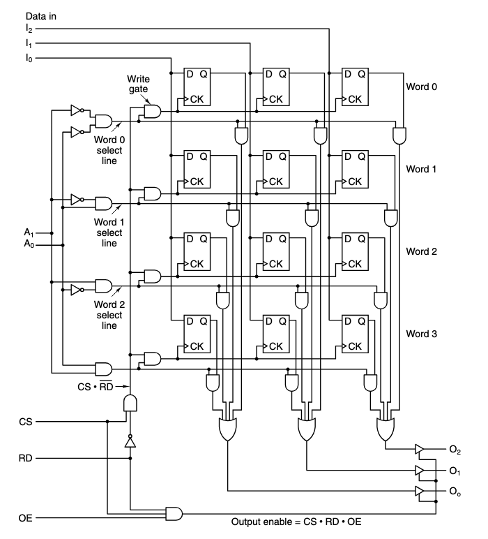

---

## Examples

Here are two ways to get 4Mbit memory chips

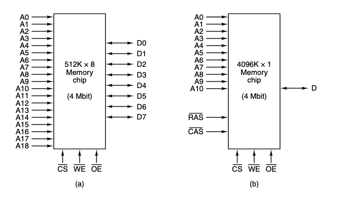

These are organized slightly differently, and they each have their own advantages and disadvantages which the designer must take into account when creating memory. 

---
layout: two-cols
---

## 512Kx8

In this example, we have a memory chip that can hold 512,000 words, each of which is 8 bits wide.

It requires 19 address lines to select one of the 512,000 words, and 8 data lines to read or write the 8 bits of data in that word.

::right::

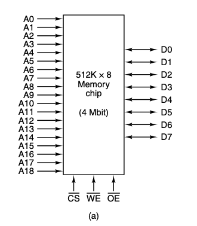

---
layout: center
---

### Terminology

Sometimes the high (1) voltage causes an action to happen, sometimes the low (0) voltage causes an action to happen.

To avoid confusion, the term `asserted` is used to mean that a signal is at the voltage level that causes the action to happen.

Thus, a *signal* named $CS$ is asserted high, but a signal named $\overline{CS}$ is asserted low.

Both mean an action has happened, but the voltage levels are different.

---
layout: two-cols
---

## 4096Kx1

In this memory chip, we have 4096,000 words, each of which is 1 bit wide.

Internally this is organized as a 2048x2048 matrix of 1 bit cells.

And to address the chip, the first row is selected by putting its 11-bit number on the address pin, then the $\overline{RAS}$ (Row Address Strobe) is asserted.

After that, the column number is put on the address pins and the $\overline{CAS}$ (Column Address Strobe) is asserted.

Finally, the data bit can be read or written on the single data pin.

::right::
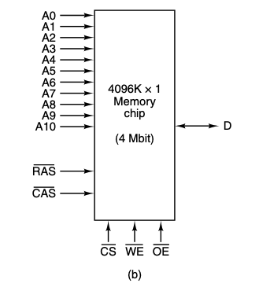

---

## 4096Kx1

Large memory chips are often constructed as $n x n$ matrices that are addressed by row and column.

This reduces the number of address pins needed, but increases the time it takes to access a memory cell since it now requires two steps instead of one.

To increase performance slightly, some memory chips can be given a row address followed by a sequence of column addresses to access consecutive bits.

---
layout: two-cols
---

## Signals

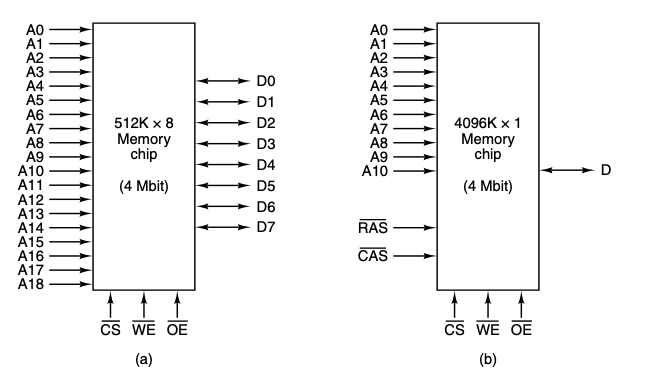

::right::

Both chips include some signals that help them work, such as
1. $\overline{CE}$, the chip select signal to select one of the many chips a computer might have
2. $\overline{WE}$, the write enable signal to indicate if data is being written or being read
3. $\overline{OE}$, the output enable signal, to drive the output signals

---

## More Examples

In this example, we have 2 more memory chips that both have 512Mbits of memory.

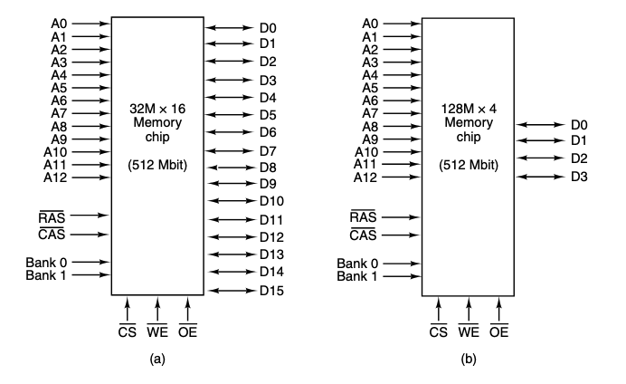

Internally, these chips both have 4 internal memory banks of 128Mbits each, which require 2 bank select lines to choose a bank.

---
layout: two-cols
---

## 32Mx16

In this example, the memory chip is a 32M x 16 design. With 

- 13 lines for the $\overline{RAS}$,
- 10 lines for the $\overline{CAS}$, and 
- 2 lines for bank select

These 25 signals allow each of the internal 16 bit cells to be addressed

::right::

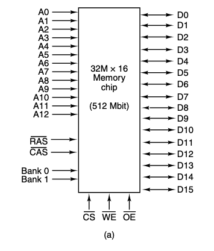

---
layout: two-cols
---

## 128Mx4

In contrast, the 128M x 4 design has

- 13 lines for the $\overline{RAS}$,
- 12 lines for the $\overline{CAS}$, and 
- 2 lines for bank select

Here, 27 signals are required

::right::

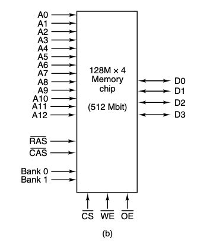

---
layout: center
---

## Memory Chips

These examples illustrate some of the tradeoffs that must be made when designing memory chips.

How many columns and rows? Should the Matrix be square? Does the chip output 1, 4, 8, etc. bits at a time?

Should all the addresses have separate pins? Do you use rows and column strobes?

While we will not be making memory chips ourselves, the decision-making involved in their design will affect how we use them in lower level systems.

---
layout: center
---

# Rams And Roms

---

## Rams and Roms

The memories we've discussed so far can all be *written to*. These types of memories are called `RAM`s (Random Access Memory).

Technically speaking, all memory chips are randomly accessible, but the term RAM is too well established to change now.

There are many types of RAMs all with different characteristics, some being obsolete, and others still being actively used despite their age.

---

## Ram

There are 2 main varieties of RAM

1. Static
2. Dynamic

With their main difference being if they retain data when power is on, or if they need to be refreshed periodically.

---
layout: two-cols
---

## Static Ram

Constructed using circuits similar to the basic D flip-flop, these memories retain their data as long as power is applied. 

They are extremely fast with typical access times on the order of a *nanosecond* or less. Which is why they are often used as CPU cache memory.

::right::

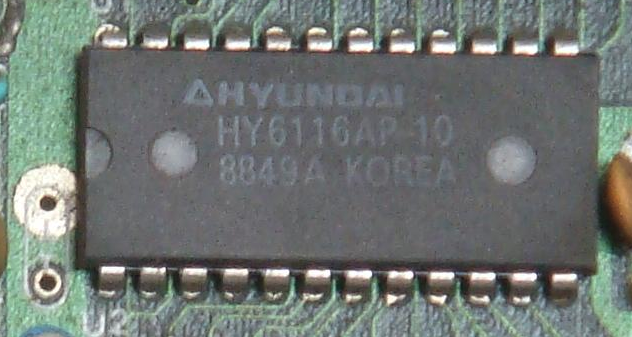

---
layout: two-cols
---

## Dynamic Ram

Dynamic ram, by contrast, uses a single transistor and capacitor to store each bit. This makes them much smaller and cheaper than static ram, but they need to be refreshed periodically since the charge on the capacitor leaks away over time.

This means they require a more complex interface compared to static ones, They are also slower, with typical access times on the order of 10s of nanoseconds.

But they have significantly higher memory densities at similar prices compared to SRAMs

So most computers have both SRAM and DRAM to combine the advantages of both types.

::right::

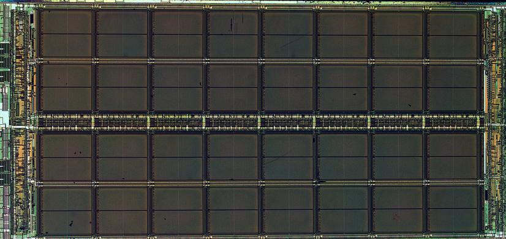

---

## A few other types of dynamic rams 

- FPM (Fast Page Mode) DRAM - on older type of DRAM that allowed faster access to data within a single row.
- EDO (Extended Data Out) DRAM - which allowed a second memory reference to begin before the previous memory reference has been completed
- SDRAM (Synchronous DRAM) - which synchronizes itself with the computer's system bus, allowing faster access to data.
- DDR (Double Data Rate) SDRAM - which transfers data on both the rising and falling edges of the clock signal, effectively doubling the data rate of SDRAM.

And then DDR2, DDR3, DDR4, and now DDR5, each improving on the previous generation in terms of speed, bandwidth, and power efficiency.

---

## Roms

In many applications, such as toys, appliances, and cars, the program and some of the data must remain stored even when the power is turned off.

Due to how RAM is designed using transistors and capacitors, it cannot retain data without power.

Thus, Roms (Read-Only Memory) were created which cannot be changed or erased once written on to during its manufacturing.

Usually, this is done by exposing a photosensitive material through a mask containing the desired bit pattern, then etching away the exposed surface. Because of this, the only way to change the contents of a Rom is to manufacture a new chip.

They are also significantly cheaper compared to RAMs as long as they are produced in large quantities to amortize the cost of creating the mask.

---
layout: two-cols
---

## Proms

ROMs, while useful are inflexible and cannot be updated once manufactured, making the turnaround time for development span weeks or months. And the cost of bugfixes can be very high as a new mask must be created.

To solve this, Programmable Read-Only Memory (PROM) chips were created that could be programmed *once* after manufacturing.

Many PROMs contain an array of tiny fuses inside. And a specific fuse can be blown out by selecting its row and column and then applying a high voltage pulse to a special pin on the chip.

::right::

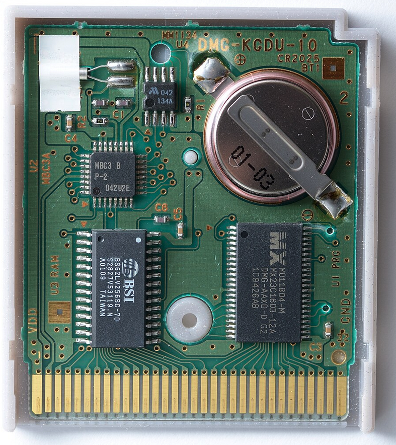

---
layout: two-cols
---

## Eproms

EPROMs (Erasable Programmable Read-Only Memory) can be erased and reprogrammed multiple times were created as a logical extension of PROMs.

It can be field programmed, but also field erased by exposing the chip to strong ultraviolet light for about 15 minutes, which sets all the bits to 1.

If many changes are expected during the design cycle, EPROMs while more expensive, are more economical because they can be reused.

::right::

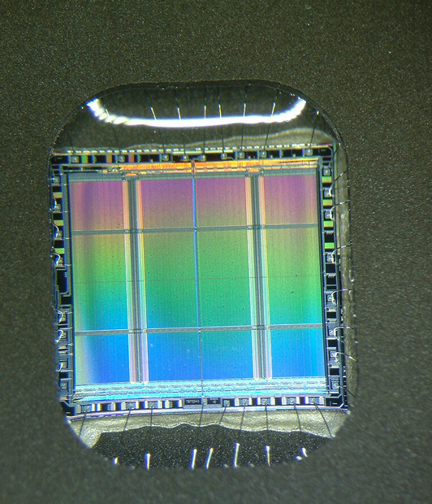

---
layout: two-cols
---

## Eeproms

Finally, EEPROMs (Electrically Erasable Programmable Read-Only Memory) can be erased and reprogrammed multiple times using only electrical signals. Which allow for end users to possible reprogram them if required.

This also means that turn around time, compared to even EPROMs is much shorter, since no special equipment is needed to erase them.

However, this comes at the cost of complexity, size, and price.

They are usually only 1/64th as large as EPROMs and only half as fast. And they are only used in situations where non-volatility is crucial.

A modern example of an EEPROM is the flash memory used in USB drives and SSDs.

::right::

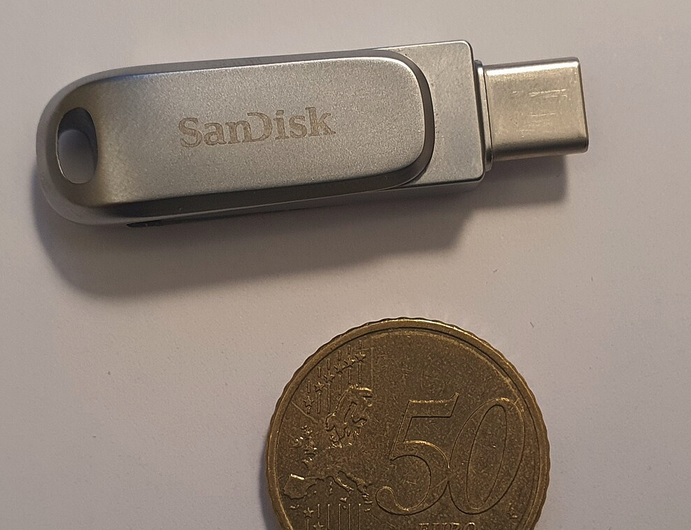

---
layout: center
---

# Field Programmable Gate Arrays

---
layout: two-cols
---

## FPGAs

An application of the programmable logic concepts we've discussed earlier is the Field Programmable Gate Array (FPGA).

These chips allow programmable logic by simply loading the FPGA with appropriate configuration data. It's main advantage being that new hardware circuits can be built in hours, rather than the months required to design and fabricate an IC.

IC's are still significantly faster, smaller, use less power, and cheaper in large quantities, but FPGAs are often used for prototyping, small production runs, or in applications where flexibility is required.

::right::

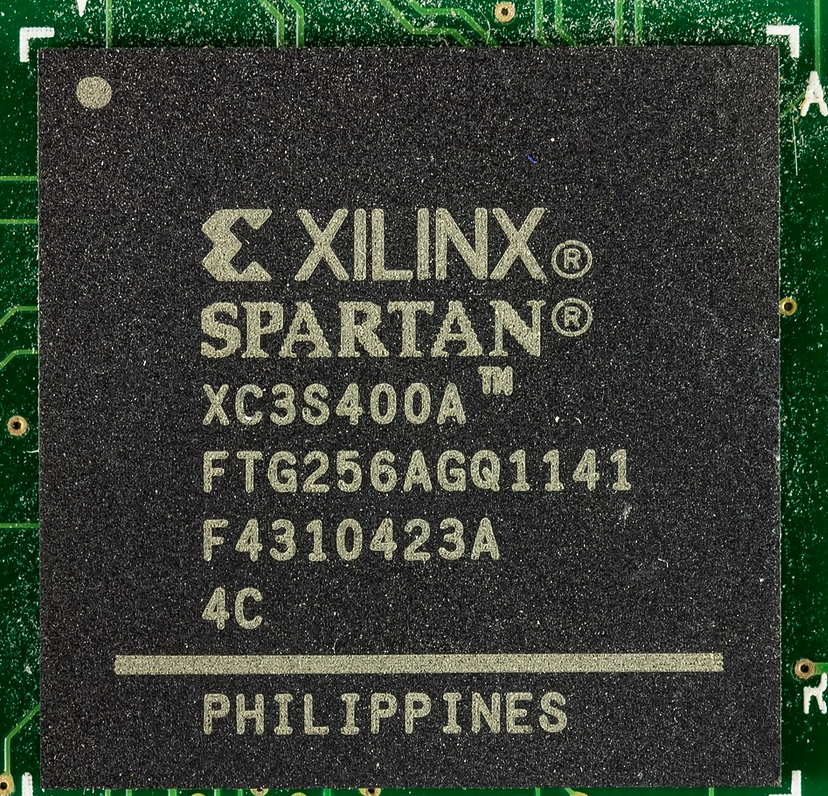

---
layout: two-cols
---

## FPGAs

The way FPGAs work is through two main concepts

1. LUT's (LookUp Tables), and 
2. Programmable interconnects

::right::

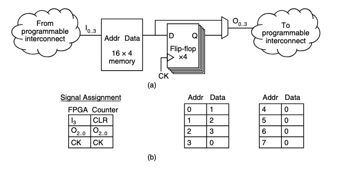

---

## LUTs

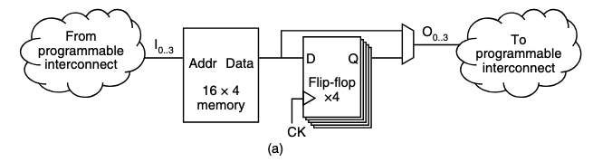

A LUT is a small programmable memory that produces a signal output, which is then sent to the programmable interconnects.

And this memory is used to create arbitrary logic functions. For example, a 16x4 memory LUT can emulate any logic circuit with 4 bits of input and 4 bits of output.

---

## LUTs

It does this by storing the truth table of the desired logic function in its memory.

As an example, if a logic circuit produces the output value $Y$ when given the input $X$, Then the $Y$ value would be written into the LookUp Table at the index X

Concretely, this means we can emulate something like a 3-bit counter with reset using just memory. 

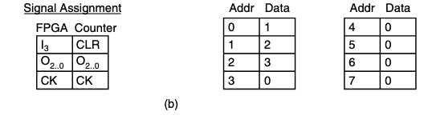

To start, we make the upper 4 values of the LUT all 0, since the counter only counts from 0 to 7 (0111 is 7 in binary). This also means that our most significant bit $I_3$ can represent the CLR input.

And the rest of the bits have the value of $I + 1$ stored in the LUT.

---

## Proper Example

If the current state of the counter is 2 (0010) and the reset (1____) is not asserted, the input address to the LUT in the next cycle will be 0010, which holds the value of 3, and so the current value of the counter will be updated to 3.

Compared to an actual circuit, this is significantly faster to make, at the cost of larger, slower, and more power hungry.

