# CPU and Buses
Putting integrated circuits, clocks, and memory chips together

---

## CPU Chips

All modern CPUs are contained on a single chip, and each of those chips contain a set of pins.

Some of those pins are to *receive* signals to the outside world, and some *accept* signals from the outside world, and some do **both**.

By understanding the function of all the pins, we can learn how the CPU interacts with the memory and I/O devices at the digital logic level.

---

## CPU Pins

The CPU pins can be grouped into 3 main categories:
- Address pins,
- Data pins, and
- Control pins

These pins are connected to similar pins on the memory and I/O devices through a set of parallel wires called a **Bus**

---

## CPU Pins

### Example

For a CPU to fetch and run an instruction from memory, it needs to:
1. *Put* the memory address of that instruction *on its address pins*
2. *Assert\** one or more *control lines* to inform the memory that it wants to read a word
3. The memory *replies* by *putting* the requested word on the *CPU's data pins*
4. The memory *asserts* a signal that it's done
5. The CPU *sees* this *signal* and accepts the word
6. It carries out the instruction
7. This can then repeat for the next instruction

What's important to understand is that the CPU communicates with the memory and I/O devices by presenting and accepting signals on its pins

> No other communication is possible

<small class="float-right">*Assert meaning to cause an action regardless of the level</small>

---

## Control pins

In addition to address and data pins, each CPU has some control pins that regulate flow and timing of data.

They all usually have pins for:
1. Power
2. Ground
3. Clocks

But other control pins vary between CPU architectures, though they are usually grouped into:

1. Bus control
2. Interrupts
3. Bus arbitration
4. Coprocessor signaling
5. Status
6. Miscellaneous

---
layout: two-cols
---

## Control Pins

- The bus control pins are mostly CPU -> bus, for when the CPU wants to read or write
- The interrupt pins are inputs form I/O Devices
- The bus arbitration pins are for regulating bus traffic
- Coprocessor pins are for communicating with things like floating point chips and graphics chips
- and other miscellaneous pins that some CPUs have

::right::

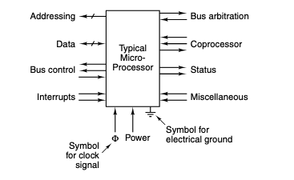

---
layout: center
---

# Buses

---

## Buses

An electrical pathway between multiple devices, usually categorized by their function. They can be used internally inside the CPU to transport data to and from the CPU.

Or they can be external, connecting to memory or I/O devices.

And each has its own requirements and properties

---

## System Bus

Early computers had a single external bus, usually called a *system bus*. It consisted of 50-100 parallel copper wires etched into the motherboard, with connectors for I/O

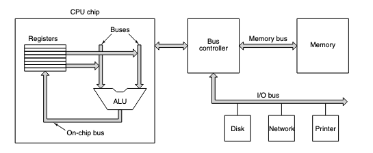

Modern PCs usually have special purpose bus' between the CPU and memory, and the CPU and I/O devices.

---

## Bus Protocols

Designers of the CPU can use whatever bus they want inside. But for external buses, they have to use a bus protocol that is compatible with the memory and I/O devices.

These protocols are a set of well-defined rules, both logically and electrically, that all devices on the bus must follow to be able to communicate.

Though some buses, especially for smaller embedded systems, are custom designed for a specific application since they don't need to deal with compatibility.

---
layout: two-cols
---

## Bus Protocols

The world would be a better place if all but one disappeared, and we all used the same one. However, that's unlikely to ever happen.

Too much money is involved in the design and manufacture of these systems for companies to give up their proprietary designs.

And backward compatibility limits the ability for new designs to take over the market.

::right::
Some popular bus protocols include:
- Omnibus (PDP-8)
- Unibus (PDF-11)
- Multibus (8086)
- VME bus (physics lab equipment)
- IBM PC bus (PC/XT)
- ISA buf (PC/AT)
- EISA bus (80386)
- Microchannel (PS/2)
- Nubus (Macintosh)
- PCI bus (many PCs)
- SCSY bus (many workstations)
- Universal Serial Bus (USB), and
- FireWire (consumer electronics)

---

## Bus Relationships

How buses work can be described in terms of a Master/Slave relationship.

Active buses (masters) can initiate bus transfers whereas passive (slaves) buses wait for requests.

When the CPU orders a disk controller to read or write, the CPU is acting as the master and the disk controller is the slave.

But later, the disk controller may act as the master when it commands the memory to accept the words it is reading from disk

<small class="text-right float-right w-1/2">As a note on terminology, master/slave is being replaced with more neutral terms like controller/target or initiator/responder. But master/slave is still widely used in technical documentation</small>

---

## Bus Relationships

There are several combinations of master and slave relationships possible, with the only rule being that memory can never be a master

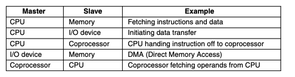

And usually the binary signals that these devices output are too weak to power a bus, which is why most bus masters are connected to the bus by a circuit called a `bus
driver`, which is essentially a digital amplifier.

Similarly, bus slaves are usually connected to the bus by a `bus receiver`

And devices that can do both are connected by a `bus transceiver`

---
layout: center
---

# Bus Design Choices

Bus design is complicated enough to have its own field of study.

But for our purposes, we only need to understand a few basic design choices that affect how a bus works

Primarily the width, the clocking, the arbitration, and the operation

And each of these have a substantial impact on the speed and bandwidth of the bus.

---
layout: two-cols
---

## Bus Width

The most obvious design parameter. More address lines a bus has, the more memory the CPU can address directly.

If a bus has $n$ address lines, it can address $2^n$ memory locations.

However, larger buses need more wires, which both increase the cost, make it take up more physical space, and require bigger connectors.

A system with a 64-line address bus and $2^32$ bytes of memory will cost more than one with a 32-line address bus and $2^32$ bytes of memory.

::right::

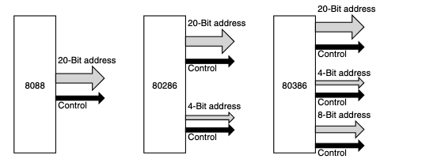

---
layout: two-cols
---

## Bus Width

This led to many designs where the CPU had significantly more complicated architectures, due to the designers not initially starting with a wide enough bus.

In this example, the 8088 CPU had a 20-bit address bus for 1 MB of memory, but the 80286 wanted 16 MB of memory so four more bus lines were added.

And because of backwards compatibility, the original 20 lines were kept, leading to a more complex design.

And was then repeated once more with the 80386

::right::

---

## Bus Width

Not only does the number of address lines grow over time, the number of data lines also tends to grow. Though it grows for different reasons.

There are 2 main ways to increase the bandwidth of a bus:
1. decrease bus cycle time, or
2. increase the data bus width

The first one is possible (but difficult) and leads to more *bus skew*. An effect caused by signals traveling at different speeds down different wires. The faster the bus, the more skew

Another problem with speeding up the bus is *backward compatibility*. Old boards designed for slower buses will not work with faster ones.

The second one is the usual approach, but usually leads to a *multiplexed bus* because super wide buses are expensive. And so the data lines are shared for both address and data, but at different times

This leads to narrower bus widths (and costs) but a slower system.

---

## Bus Clocking

Buses can be divided into two distinct categories depending on their clocking

- A synchronous bus has a line driven by a crystal oscillator
- A asynchronous bus has no clock line

Each type runs on bus cycles, and they can be of any length

---

## Synchronous

A synchronous bus runs on a crystal that usually runs between 5 - 133 MHz with all activities running in sync with the clock

In our example, we'll be using a 100 MHz clock, which gives a bus cycle time of 10 ns. We'll also assume that reading from memory takes 15 ns from the time the address is stable

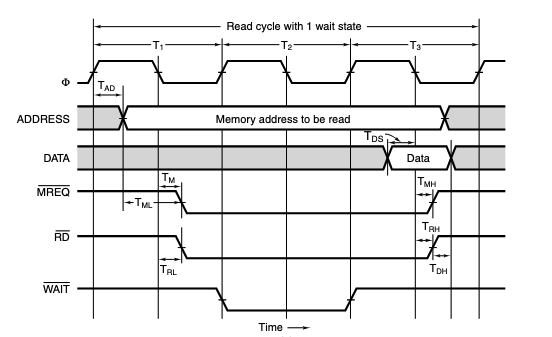

This means that it takes 3 bus cycles to read a word from memory

---
layout: two-cols
---

## Synchronous

In our example (100Mhz clock, 10ns cycle time, 15ns memory read time)

1. The first cycle starts at the rising edge of $T_1$
2. The third one ends at the rising edge of $T_4$

Also note that the electrical signals don't change instantaneously, they take some time to propagate down the wires. Assume this takes 1 ns

::right::

---
layout: two-cols
---

## Synchronous

Order of operations in this bus

1. At the start of $T_1$, the CPU initiates a memory read
2. During the first half of $T_1$, the address the CPU wants to read is placed on the address bus

<small>This is shown as two lines because it's not a single value, where the shaded sections are not important</small>

Note how the data line isn't significant until $T_3$

::right::

---
layout: two-cols
---

## Synchronous

Order of operations in this bus

3. After the address line is stable, $\overline{MREQ}$ and $\overline{RD}$ are asserted

$\overline{MREQ}$ means memory is being accessed, and $\overline{RD}$ means it's a write operation (Because they're negated).

Since our memory takes 15 ns to read, it can't provide the requested data during $T_2$.

4. So the $\overline{WAIT}$ line is asserted at the start of $T_2$

In our example, one clock cycle is in the $WAIT$ state because the memory is too slow

::right::

---
layout: two-cols
---

## Synchronous

Order of operations in this bus

5. At the start of $T_3$, $\overline{WAIT}$ is deasserted, because the bus controller is sure that the memory has the data

6. During the first half of $T_3$, the memory places the requested data on the data bus

7. On the falling edge of $T_3$, the CPU strobes (reads) the data lines and stores it in a register

8. The CPU then deasserts $\overline{MREQ}$ and $\overline{RD}$, and the bus cycle is complete

::right::

---

## Synchronous

This timing chart shows the signals max and min times each operation would take, and is created by the BUS designers to be used by system designers

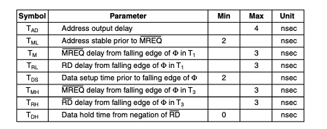

And with this information, we can say that at the worst case, it takes $25 - 4 - 2 = 19$ ns to read a word from memory

Where 10ns would mean responding on $T_3$ the same way 19ns would. But 20ns would mean responding on $T_4$

---

## Asynchronous

Synchronous buses are easier to work with, but they need to work in multiples of the bus clock cycle time.

For example, if the CPU and memory are able to complete a transfer in 3.1 cycles, they would have to wait until the 4th cycle to complete it.

Worse is that once a bus cycle is chosen, and things are built to use it, future improvements become difficult.

For example, imagine if new memories with an access time of 8 ns were invented instead of 15. This would mean it would take only 2 bus cycles to read a word, removing wait time

But if even newer memories with 4 ns access times were invented, it would still take 2 bus cycles because the minimum is 2 cycles

---

## Asynchronous

This lead to the development of asynchronous buses, where instead of a master clock, it types everything with the signals $\overline{MSYN}$ and $\overline{SSYN}$. Meaning Master and Slave Synchronize respectively

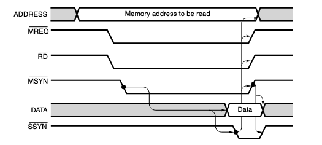

---

## Asynchronous

1. Where to read data, it would assert the address and control lines as usual, then assert the $\overline{MSYN}$ line
2. And once the data is ready, the memory would assert $\overline{SSYN}$ to inform the CPU that the data is ready
3. The PC then deasserts $\overline{MSYN}$ and the other control line to inform the memory that it has accepted the data
4. The $\overline{SSYN}$ would then react and deassert itself

---

## Asynchronous

This is called a **full handshake**

Which consists of:
1. $\overline{MSYN}$ is asserted
2. $\overline{SSYN}$ is asserted in response
3. $\overline{MSYN}$ is deasserted in response
4. $\overline{SSYN}$ is deasserted in response

This is faster, but because of how much easier synchronous buses are to design many Pcs still run in that system.

---

# Bus Arbitration

We have assumed only one bus master so far.

But in reality, there are often multiple bus masters, such as the I/O and the coprocessors' controller.

And the question "What happens if two or more devices all want to become bus master at the same time?" is called *bus arbitration*

---

## Centralized Arbitration

Bus arbitration can be done in two ways, centralized or distributed.

In a centralized system, a single bus determines who goes next, and it's mostly implemented into the CPU.

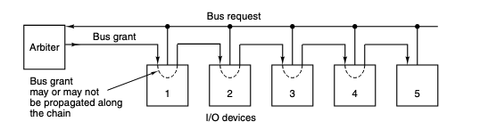

It contains a single wired-OR that can be used for one or more devices to request at any time, then it grants the bus to one of them through the grant line.

And each device checks if they were the ones to send a request, and if not, they send it to the next one, until it finds the one that sent the request. This is called *daisy-chaining*

This means that the device closest to the CPU has the highest priority, and the one furthest away has the lowest

---

## Centralized Arbitration

To get around implicit priorities, some systems use multiple priority levels, and if multiple priority levels are requested, the arbiter issues a grant only on the highest priority level.

Some arbiters also have a third line called the acknowledgment line, Where the device that was granted the bus asserts this line to inform the arbiter that it has accepted the grant. Which frees up the request line for other devices to use. Essentially making requests non-blocking

---

## Distributed Arbitration

Decentralized arbitration is also possible

One way of doing this uses 3 lines, with the first one being a wired-OR line representing the *bus request* line, the second one being another wired-OR line called *busy*, which is asserted by the current bus master.

And the third line is a daisy-chained line that's tied to the power supply and is used as the bus arbiter

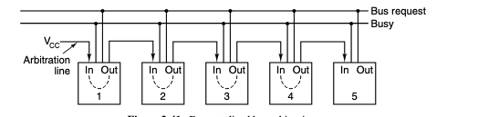

To acquire the bus, a device asserts the request line, then waits for the arbitration line to reach it, then it asserts the busy line to inform other devices that it has acquired the bus

Where the leftmost device has the highest priority, and the rightmost device has the lowest. It's cheaper, faster, and not subject to arbiter failure, but less flexible.

---

# Bus Operation
Other Operations on the bus

The only operation we've discussed so far is reading from memory. There exists other types of operations and bus cycles.

For example, fetching an entire cache line

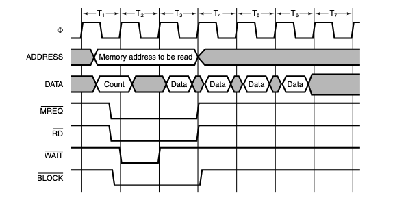

By putting the word count at the start of the line, and the addition of a $\overline{BLOCK}$ control line, the CPU can fetch an entire cache line in 6 bus cycles instead of 12

---

## Bus Operation

Multiprocessor systems often need to have a read-modify-write cycle, where a CPU reads a word from memory, modifies it, then writes it back without releasing the bus.

And another kind of bus cycle is for handling interrupts

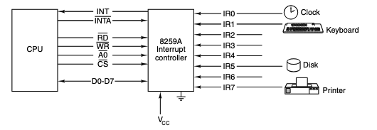

Where devices send to the interrupt controller, which then sends an interrupt request to the CPU, and the controller decides which device gets to interrupt the CPU next

