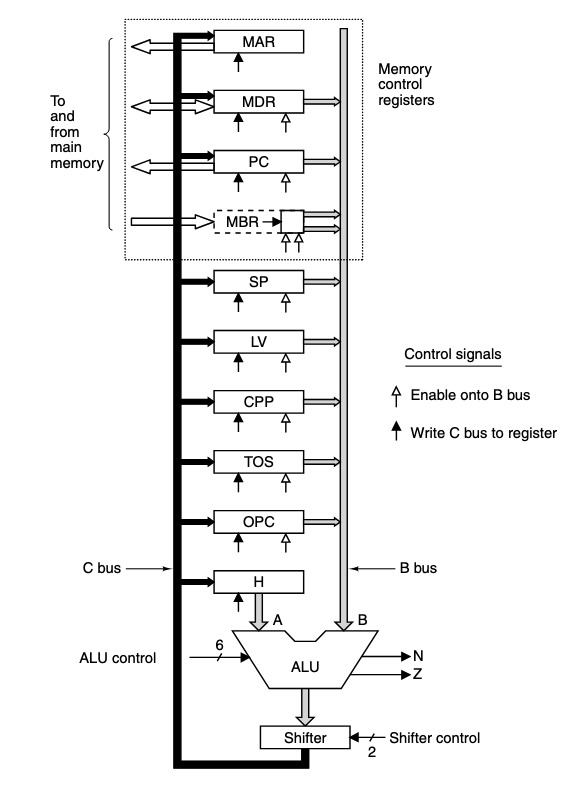

# Microarchitecture level

---

## Microarchitecture level

The main job of the microarchitecture level is to create and implement the Instruction Set Architecture (ISA) using digital logic components.

Where its design is dependent on the ISA and the cost and performance goals of the computer. Many modern ISAs, like RISC have simple instructions that can usually be executed in a single clock cycle.

While more complex ISAs, like the on in the Core i7, have instructions that can take multiple clock cycles to execute.

---

## Example

Because there are no general principles of microarchitecture design, as each ISA has its own unique features and requirements, we will instead look at an example.

Our main example for this section of the course will be a subset of the Java Virtual Machine which only contains integer instructions

We'll name it **IJVM** (Integer Java Virtual Machine).

---

## Example

Our microarchitecture will contain a **microprogram** whose job is to fetch, decode, and execute IJVM instructions.

For example, if in the instruction set level, the line

```
ADD R1, R2, R3
```

Is written, the microprogram will execute a sequence of instructions using digital logic components to perform the operation.

Theoretically speaking, after understanding microarchitecture, you should be able to buy a bag of transistors and a breadboard and build the IJVM physically.

---

## Microprogram

We can think of the **microprogram** as a *programming problem*, where each instructions at the ISA level is a *function* to be called by a master program.

Our microprogram would have a set of variables called **state**. Where each function of our microprogram would change at least some part of the state.

For example, a **Program Counter** is part of the state which indicates the location of the next instruction/function to be executed. And during each instruction, the Program Counter is updated to point to the next instruction.

---

## Microprogram

The IVJM instructions we'll be dealing with are fairly short, usually containing one or two fields.

The first field is the **opcode** which indicates the operation to be performed, like `ADD` or `BRANCH`. And the following fields are usually called **operands**.

Operands identifies which variable, which register, or which memory location the operation is to be performed on.

This model of execution is often called the

```
fetch-decode-execute cycle
```

And is a useful abstraction to the implementation of a microprogram.

---
layout: center
---

# Data Path

---
layout: two-cols
---

## Data Path

The data path is the part of the CPU which has the *ALU, inputs, and outputs*.

On the right is the data path for our example IJVM microarchitecture, which is fairly similar to the data paths of most machines.

It contains a few 32 bit registers with *symbolic names* (MAR, MDR, PC, etc), and most of these can **drive** their contents onto the B bus

The output of the ALU drives the shifter, and the C bus, who's value can be written into one or more registers at the same time.

Note that there is no A bus, we'll ignore that for now


::right::


---
layout: two-cols
---

## Data Path

The ALU itself is identical to the one we saw in the digital logic section of the course. Where the functions are determined by six control lines

2 data lines (F0, F1) and 4 condition lines [ENA (Enable A), ENB, INVA (Invert A), INVB],

Note that addition in this case is arithmetic addition, not boolean addition.


::right::


---
layout: two-cols
---

## ALU

In addition to inputs A and B, **two other control lines** can be used to independently control the output from the ALU. `SLL8 (shift left logical 8)` shifts the contents left by 1 byte, filling hte 8 least significant bits with 0s.

```
1010100010101000  --SLL8--> 1010100000000000
-------|                    -------|
```

and `SRA (shift right arithmetic)` shifts the contents right by 1 bit, filling the most significant bit with a copy of itself.

::right::


---
layout: center
---

# Data Path Timing

---

## Data Path Timing

It's explicitly possible to read and write the registers in one cycle,

For example, you can
- put the contents of the SP register on the B bus
- disable the ALU's left input
- enable the INC signal
- and store the result in SP, incrementing SP by 1

All in a single cycle

To do this without losing data and producing garbage. We perform the operations at different times within the cycle.

This is called **Data Path Timing**

---
layout: two-cols
---

## Data Path Timing

On the right is a timing diagram for the data path of the previous example

1. A short pulse is produced at the start of each clock cycle
2. On the falling edge, the bits that will drive the gates are set up. This takes some time called $\Delta w$
3. The `H` register drives the data into the `B` bus taking $\Delta x$ time
4. The ALU disables the left input, enables the incrementer, and produces the result on the `C` bus taking $\Delta y$ time

::right::


5. And an additional $\Delta z$ time is taken to propagate along the C bus and to the registers so that they can be loaded on the the rising edge of the next pulse if needed

---

## Data Path Timing

This type of process requires *rigid timing*, *long clock cycles*, *a known minimum propagation time*, and *fast loading of the registers*. But with good engineering, the data path can be made to work extremely reliably. And actual machines work the exact same way, with more complex data paths and timing diagrams.


Note that this works through *implicit* subcycles, meaning no additional clocks and sub clocks are needed. It works similarly to asynchronous circuits, but within a single cycle of a synchronous clock.

---
layout: center
---

# If you are reading this on October 14

You have a neo quiz
