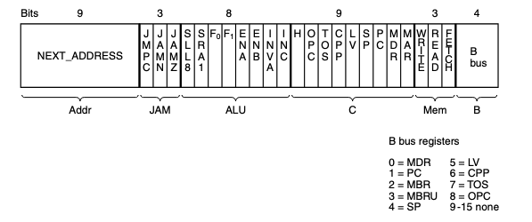

# Microinstruction Control: The Mic-1

---

## Memory operation
- two ways to communicate with memory
- why 2
- hack to convert word address to data
- conversion to byte to word data 

---

## Microinstructions

- signals
- reads at end of cycle
- k + 2
- no read and writes at the same time
- decoder

---

## Microinstruction Control: The Mic-1

> How the machine decides which control signals should be enabled on each cycle

This is determined by something called the **sequencer**.

It steps through, a sequence, of operations for the execution of a single ISA instruction

And produces 2 kinds of information for each cycle
1. The state of every control signal in the system
2. The address of the microinstruction that is to be executed next

---

## The Mic-1 Architecture

---
layout: two-cols
---

## The Mic-1 Architecture

::right::

On the right, there is something called the **control store**, which is a memory that holds the *complete* microprogram.

For our example machine, it holds 512 words, each being 36 bit microinstructions.

---

## The MPC

One important difference between instructions in the ISA and microinstructions in the microprogram is that the microprogram instructions aren't read in a sequential order.

Microinstruction sequences, because of how short they tend to be, usually need more flexibility in the order they are executed.

So in our read-only control store, there exists two important registers
1. The **Microprogram Counter (MPC)**: holds the address of the next microinstruction to be read from the control store
2. The **Microinstruction Register (MIR)**: holds the current microinstruction read from the control store

---
layout: two-cols
---

## The MIR

It holds:
1. Addr and JAM: holds the control for the selection of the next microinstruction
2. ALU: containes the 8 bits that select the alu function and the shift functions
3. C: which registers to load the ALU output from the C bus
4. M: holds memory operations (read, write, fetch)
5. B: Holds the selection of the B bus source, inefficient but reliable

::right::

---
layout: two-cols
---

## Operation Sequence

::right::

---
layout: two-cols
---

## Summary

1. MPC holds data
2. **Load time**
3. MIR is loaded
4. **Propagate time**
5. ALU function is chosen
6. C bus loaded
7. Memory operation is loaded
8. B bus is loaded
10. **Settle time**
9. ALU operation

::right::

10. N and Z are saved
11. **Propagate time**
12. C bus is loaded
13. MPC is loaded again

### In parallel

1. Data reaches MIR
2. Address is sent to the MPC
3. JAM bits is evaluated
