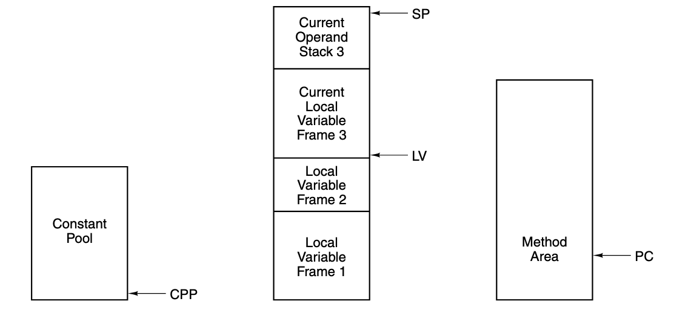

# Stacks

---

## Stacks

The concept of **procedures** (methods or functions) is a universal feature in programming languages.

These procedures have *local variables* that you can't access outside the procedure

So the question is 

> "Where should these variables be kept in memory"

Since the easiest solution of giving each variable an absolute memory address won't work (recursion)

---

## Stacks

So instead, an area of memory called the **stack** is used to store local variables

And it's reserved for variables but individual variables do not get absolute addresses in it, instead it's accessed through registers like the **Stack Pointer (SP)**

This means that when a procedure calls itself or resolves, the new local variables gets stored on different locations in the stack, and you access them **relative** to the *SP*

---

## Stacks

Say we have a program like

```python
def func_a():
    ...
    func_b()
    func_d()

def func_b():
    ...
    func_c()
```

````md magic-move
```bash
SP ->   a3 108 |
        a2 104 |
LV ->   a1 100 |
```
```bash
SP ->   b4 124 |
        b3 120 |
        b2 116 |
LV ->   b1 112 | # remember this address
        a3 108
        a2 104
        a1 100
```
```bash
SP ->   c2 132 |
LV ->   c1 128 |
        b4 124
        b3 120
        b2 116
        b1 112
        a3 108
        a2 104
        a1 100
```
```bash
SP ->   b4 124 |
        b3 120 |
        b2 116 |
LV ->   b1 112 |
        a3 108
        a2 104
        a1 100
```
```bash
SP ->   a3 108 |
        a2 104 |
LV ->   a1 100 |
```
```bash
SP ->   d5 128 |
        d4 124 |
        d3 120 |
        d2 116 |
LV ->   d1 112 |
        a3 108
        a2 104
        a1 100
```
````

---

## Operand stacks

Some, but not all, computers use another stack called the **operand stack** to hold temporary values for calculations

Imagine the code

```c
a1 = a2 + a3;
```

One way of doing this is to push the operands onto the stack, then executing that calculation, and finally popping the result off the stack into the variable a1

````md magic-move
```bash
SP ->   a3
        a2
LV ->   a1
```
```bash
SP ->  |a2|
        a3
        a2
LV ->   a1
```
```bash
SP ->  |a3|
       |a2|
        a3
        a2
LV ->   a1
```
```bash
SP ->  |a2+a3|
        a3
        a2
LV ->   a1
```
```bash
SP ->   a3
        a2
LV ->   a2+a3
```
````

An interesting thing about the operand stack is that it can be **mixed** with the local variable stack, so data in the stack can be used in calculations with data on the operand stack 


Worth noting again that not all systems use an operand stack, but the JVM and IJVM does

---
layout: center
---

# The IJVM Memory Model

---

## The IJVM Memory Model

The IJVM has an array of `4,294,967,296` bytes of memory (2^32) or an array of `1,073,741,824` words (2^30)

And unlike most ISA's the JVM makes **no absolute memory addresses** directly visible to the programmer, the only way to access memory is through registers and **increments** of those registers

These registers are:
1. **the constant pool** (CPP): it can't be written by an IJVM program, and contains constants used by the program
2. **the local variable pointer** (LV): points to the base of the current procedure's local variables in the stack
3. **the operand stack pointer** (SP): points to the top of the operand stack, directly above the local variable frame
4. **the method area** (PC): holds the program itself, and contains the address of the next instruction to be executed

---

## The IJVM Memory Model



Note that all these pointers are pointers to **words**, not bytes and are offset by the number of words

For example, `LV`, `LV + 1` and `LV + 2` point to the first, second and third local variable of the current procedure respectively

But PC (Method Area) is an exception, since it points to **bytes** in the method area, and incrementing it reads results in a fetch of the next byte
