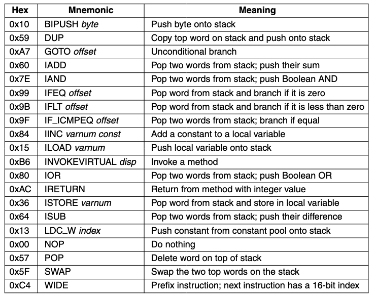
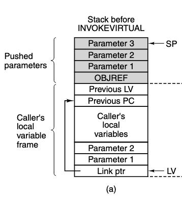
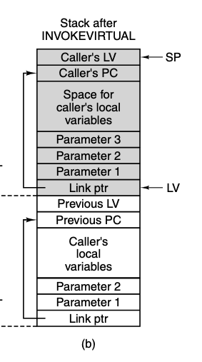
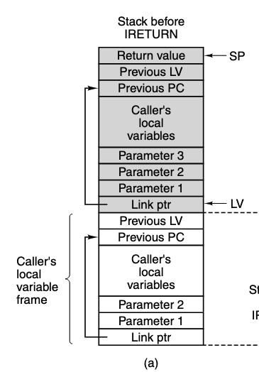
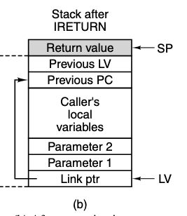

# IJVM Instruction Set

---

## IJVM Instruction Set

Each instruction consists of an opcode and sometimes an operand, 



---
layout: two-cols
---

## Invoke Virtual

`INVOKEVIRTUAL` is an instruction for invoking another method

And `IRETURN` is for exiting the method and returning to the caller

The mechanism for invoking a method is
1. the caller pushes onto the stack a reference (pointer) to the object to be called

This reference is a register with the memory address of the object, in the diagram this is `OBJREF`

2. the caller pushes the method's parameters onto the stack `Parameter 1 2 3`

3. then `INVOKEVIRTUAL` is executed

::right::



---
layout: two-cols
---

## Invoke Virtual

When `INVOKEVIRTUAL` instruction includes a displacement which indicates the position in the constant pool that contains the start address within the method area for the method being invoked

- So here you have the passed parameters
- the local variable frame for the called method is created above the parameters
- the callers program counter (PC) is saved onto the stack so that when the method completes it can return to the correct location in the caller

::right::


---
layout: two-cols
---

## Invoke Virtual



::right::

When the method completes an `IRETURN` instruction is executed

It deallocates the space that was used by the returning method.

Then restores the stack to its former state except `OBJREF` is now replaced with the return value



---
layout: center
---

# Turning Java to IJVM

---
layout: two-cols
---

## Java

```
i = j + k;
if (i == 3)
    k = 0;
else
    j = j - 1;
```

::right::

## IJVM

```
ILOAD j
ILOAD k
IADD
ISTORE i
ILOAD i
BIPUSH 3
IF_ICMPEQ L1
ILOAD j
BIPUSH 1
ISUB
ISTORE j
GOTO L2
L1: BIPUSH 0
    ISTORE k
L2:
```

---
layout: center
---

# Design Of The Microarchitecture Level
no time so we're speeding up

---

## The Microarchitecture Level

Computers have different characteristics you need to balance. Speed, cost, reliability, ease of use, energy requirements, size

But the most important choice is

# Speed vs Cost

There are three basic approaches for increasing speed

1. Reduce the number of clock cycles needed to execute an instruction
2. Simplify the organization so that the clock cycle time is reduced
3. Overlap the execution of instructions

---
layout: two-cols-header
---

## Speed vs Cost

One of the ways to reduce clock cycle time is modifying the encoding and decoding of an operation

The number of clock cycles needed to execute a set of operations is known as the **path length**

We can lower the path length by adding specialized hardware, for example, adding a physical incrementer, and the price is more hardware cost

Another way is to overlap the execution of instructions, known as **pipelining**

And another, most common way, is to create faster circuits which are significantly more complex

::left::
The slowest binary adder is significantly simpler

While the fastest designs of the binary adder are those that use more complex logic to calculate carry bits in advance

::right::

The problem with the faster designs is that they take more *real estate* compared to the simpler designs, which directly translates to cost

And so a balance must be struck between speed and cost

---

## Improving performance

Every manufacturer wants their systems to run as fast as possible, and there are a number of techniques used to improve performance

Roughly it falls into two categories
1. implementation improvements, and
2. architectural improvements

Implementation improvements are new ways of building a new CPU or memory, modifying implementation without changing the architecture means old programs will run on the new machine, which is major selling point.

---

## Improving performance

Some kinds of improvements can be made only by changing the architecture, sometimes these are incremental like adding one or two instructions, and for this reason, software needs to change to take advantage of the new features

Implementation improvements are preferred but the limits of architecture are constantly being hit, which requires starting from scratch again and again.

---
layout: center
---

# Instruction Set Architectures 
The architecture


---

## Instruction Set Architectures

This is the interface between the software and the hardware. And while it might be possible to have the hardware directly execute programs written in C or Java or some high level language, this would **not** be a good idea.

1. Performance gained from compiling would be lost
2. Computers would need only be able to run programs written in one language
3. The cost of hardware would be significantly higher

And so, to let computers run programs written in different languages, we need an intermediate language, known as **machine language** or **machine code**

**All** code written in high level languages is compiled or interpreted into machine code before it is executed by the computer

---

## Instruction Set Architectures


---
layout: two-cols-header
---

## Instruction Set Architectures

Ideally when a new machine is being designed, the architects, the engineer, the hardware designers, the software developers would work together to create a system with **good performance, low cost, and ease of programming**

::left::
In reality, when a new machine comes along, the first question is 

> "Is it compatible with its predecessor?"

And the second question is

> "Can I run my old operating system on it?"

And the third question is

> "Will it run all my existing application programs unmodified?"


::right::

And if any of these are answered no, the designer will need to make a very strong case for why the new machine is worth the cost of switching

This is why ISA tends to be the same between models, or at least backwards compatible with older models, 

This makes them unable to take advantage of new features of the hardware or the architecture when running old programs

---

## Properties of the ISA Level

The ISA level is defined by how the machine appears to a machine-language programmer, or more commonly, the compiler writer.

Some architectures are specified by a formal defining document often proguced by an industry consortium, like the ARM architecture

These documents have things such as 

1. **normative** sections, which impose requirements, and
2. **informative** sections, which are intended to help the reader but not part of the formal definition

In the normative section, phrases such as *shall*, *may not*, and *should* are used to indicate requirements

> Executing a reserved opcode shall cause a trap

A well-written ISA reference is essential for anyone writing compilers, assemblers, debuggers, or other system software

---
layout: center
---

# Assembly Language Level

---

## Assembly Language Level

Programs that convert a user's program written in a high-level language into machine code are called ______

With **source language** and **target language** where each language is defined in a level. Since if a processor can execute both source and target language, there's no need for translation

So translation is used when a processor is available for the target language but not the source language

If done correctly, running the target and source language should have the **exact** same effect

This also means that it's possible to implement new **levels for which there are no processor** by first translating programs written for that level to a target level.


---

## Translation and Interpretation

In **translation**, the original program in the source language is not directly executed, instead, a new program is made, usually called an **object program** or **executable binary program**, whose execution is carried out only **after** the translation is complete

In translation there are two steps
1. Generation
2. Execution

In **interpretation**, only one step exists, which is the execution of the source program. No equivalent program is generated first.

And while it's being executed, each instruction is read, *interpreted*, and executed one at a time

---

## Compilers

Translators can be roughly divided into two categories depending on the relation between the *source* and *target* languages

When the source language is a symbolic representation for a numerical machine language (IADD = 0x60), it's called an **assembler**.

When the source language is a high-level language like C, and the target is *either* a numerical machine language *or* a symbolic representation of a machine language, it's called a **compiler**.

**Assembly** -> **Machine Code** = Assembler

**C** -> **Machine Code** or **Java** -> **assembly** = Compiler

---

## Assembly

A pure assembly language is a language in which each statement produces exactly one machine instruction, a **one-to-one** correspondence.

It's important to note that when talking about *ISA*, it is physically in binary or hex.

Assembly language is a **symbolic representation** of the ISA, which is easier for humans to read and write.

Its main point of difference from high-level languages is that assembly has access to **all** the machine's features, which high-level languages often hide or abstract away.

And that it can only ever run on one family of machine which it was written for.

---

## Why assembly

Assembly is difficult. It takes longer to write, to debug, and to maintain.

> So why would anyone ever want to use assembly directly?

In todays world, the answer is that **you almost never would.**

Compiler writers will make systems that will out-perform any assembly program you would ever write. And unless you plan on working on extremely low-level systems, you will never need to write assembly.

If you do learn and use assembly effectively, it allows you two main advantages
1. Performance - you can write code that is faster and smaller that is critical for systems such as embedded systems
2. Access - you can access low-level system features that are not available in high-level languages such as directly accessing hardware

---
layout: center
---

## Why assembly
It's good for learning

To learn is to struggle, and assembly is a struggle. 
