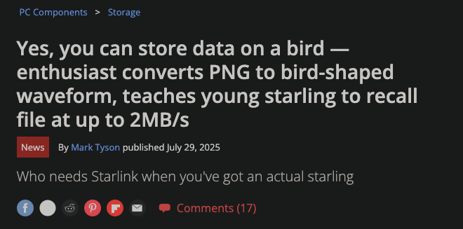
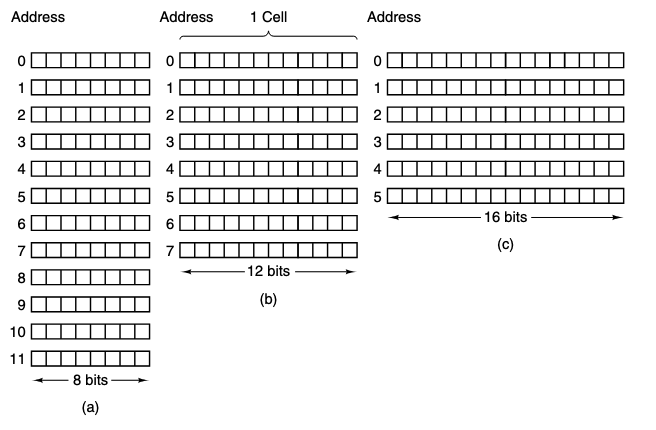
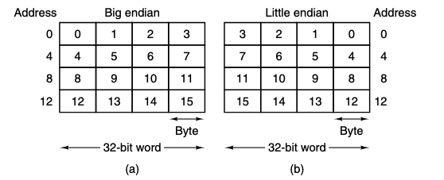
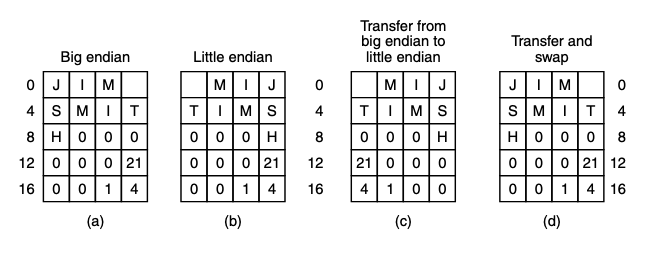
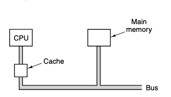
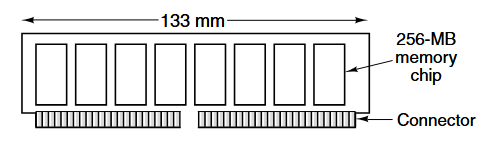
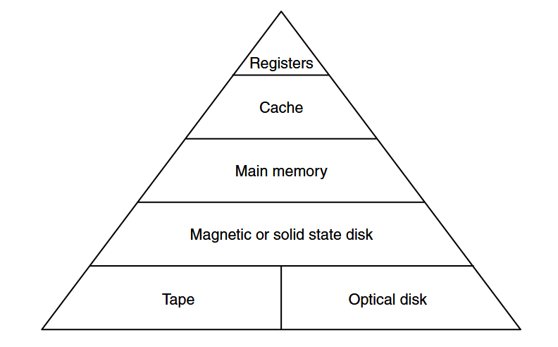
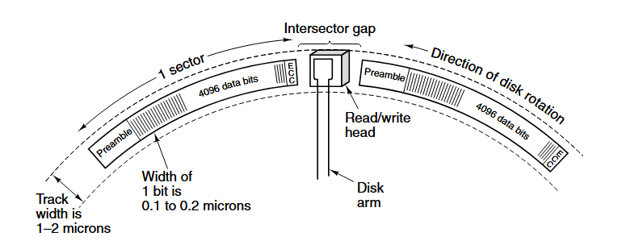
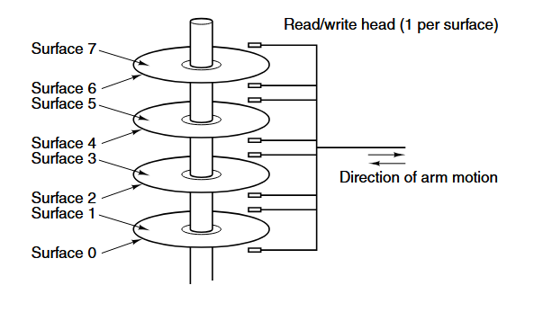

# Memory
Chapter 2

---
layout: center
---

# Primary Memory
Memory is the part of the computer where programs and data are stored

Often called *store* or *storage*, but the term *storage* tends to mean disk storage

---

## Bits

A bit is the basic unit of memory, it can either be a `0` or a `1`, and it's the simplest possible unit

Binary arithmetic is used because it's "efficient" but what that means is that it's easier to distinguish between two states than it is to distinguish between many states

You can store any value in any form of memory, but the way you store it will affect how you access it, and how efficiently and reliable you can access it

---

## BCD

Some computers like old IBM mainframes are advertised to have decimel as well as binary arithmetic.

They do this by using 4 bits to store one decimal digit using a code called BCD (Binary Coded Decimal)

Four bits provide 16 combinations, used for the 10 digits 0-9 plus 6 unused combinations

The number $1944$ in BCD would be

$0001\ 1001\ 0100\ 0100$ and in binary it would be $0000011110011000_2$

Sixteen bits each, but the BCD version can store up to `9999` while the 16 bit binary can store up to `65,536`

---

## Memory Addresses

A memory system consists of *cells* or *locations* which can store a piece of information, and has a unique *address*.

And if a memory has $n$ cells, they will have addresses from $0$ to $n-1$

If a cell consists of $k$ bists, then it can hold any one of $2^k$ bit combinations

Assuming you have 96-bit memory, you can make a storage system:

---

## Memory Addresses

Computers that use the binary number system express memory addresses as binary numbers

And if an address has $m$ bits, the maximum number of addressable cells is $2^m$

For example to represent 11 addresses, you need at least 4 bits, because $2^4 = 16$ and $2^3 = 8$

And it's independent of the size of the cells

A memory system with $2^12$ cells, with 8 bits each, and a memory of $2^12$ cells with 64 bits each would both need 12-bit addresses

---

## Bytes and Words

An 8 bit cell is usually called a *byte*, sometimes called an *octet*

Bytes are grouped into `words`, and a computer with a 32-bit word, has 4 bytes per word while a computer with a 64-bit word has 8 bytes per word

This is important because most instructions operate on entire words, like adding two words together

So a 32 bit machine will have 32 bit registers and instructions for manipulating 32 bit words

But a 64 bit machine will have 64 bit registers and instructions for manipulating 64 bit words

---

## Byte Ordering

The bytes in a word can be numbered from left to right, or from right to left, this has major implications

The left image, where the numbering starts at the "big" end is called *big-endian*

And the right image, where the numbering starts at the "little" end is called *little-endian*

If we only ever represented numbers, it would be easy to convert between the two

00000000 00000000 00000000 00000101

---

## Byte Ordering

But if we have mixes of numbers and characters, like in a string, then the ordering matters

For a single machine, it doesn't matter, but when one machine sends data to another, it can cause problems

Assuming that the big endian system sends the record one byte at a time

The big endians 0 goes to the little endians 0, the big endians 1 goes to the little endians 1, and so on

---

## Error correcting codes

Computer memories aren't perfect, voltage spikes, cosmic rays, and other factors can cause bits to flip

So we need to be able to detect and correct errors, using error-detecting and error-correcting codes

## What is an error?

Imagine a memory word that has $m$ data bits with an added $r$ data bits called redundant/check bits. With the total number of bits being $n = m + r$. This is called a `codeword`

And given any two `codewords` like $100001001$ and $10110001$ it's possible to determine how many corresponding bits differ by using an XOR bitwise operation and counting the ones

This is called the *Hamming distance* between two `codewords`

---

## Hamming Distance

This hamming distance means that if two objects are $d$ distance apart, then they need $d$ amount of errors to happen to convert one into the other

With an $m$-bit memory word, all $2^m$ possible combinations are valid, but only $2^m$ of the $2^n$ `codewords` are actually valid

And if the read turns up an invalid `codeword`, the computer knows that a memory error has occurred, because given the algorithm for computing the check bits, it's possible to construct a complete list of the legal `codewords`.

Then find the `codeword` that is closest to the read codeword, and the distance between those two is the Hamming distance of the complete code

---

## Error Detection and Correction

To do error detecting and correction, we rely on the Hamming distance

To detect $d$ single-bit errors, you need a distance of $d+1$

And to correct $d$ single-bit errors, you need a distance of $2d + 1$

A simple example of an error-detecting code is the *parity bit*, which is a single bit that is added to a word to make the number of ones even or odd

---

## Cache Memory

Historically, CPUs have always been faster than memories

There are two main ways to deal with this imbalance. The simplest way is to just start memory reads when they are encountered but continue executing and stall the CPU if an instruction tries to read the memory word before it arrives

The other solution is to have machines that do not stall but instead require the compilers not to generate code to use words before they have arrived

Both of these stall the PC

---

## Cache Memory

The problem is economics, we can build faster memory, but for it to run as fast as the CPU, it would need to be on the CPU itself. Putting memory on a CPU chip makes it bigger, and that makes it more expensive, so we have to keep that memory small

So we have a compromise, we have a small amount of fast memory on the CPU chip, and a larger amount of slower memory off the chip

---

## The small but fast memory is called *cache*

The cache is given the most heavily used memory words, and if the CPU needs a word, it checks the cache first, 
- if the word is in the cache, it can be read quickly, if not, it has to be read from the slower memory

The way the computer chooses which items to put in cache is called the *locality principle* which is the basis for all forms of caching algorithms

Where data like data in loops, data next to other data, instructions next to other instructions, are sent to cache memory ahead of time

---

## Memory Packaging and Types

SIMM (Single Inline Memory Module) and DIMM (Dual Inline Memory Module) are the two main types of memory packaging

Then there's SO-DIMM(Small Outline DIMM) for laptops and other small devices

---
layout: center
---

# Secondary Memory
The main memory is always too small

---

## Memory Hierarchies

To store a large amount of data, a memory hierarchy is used, which is a set of storage devices with different speeds and sizes

First is registers, second is cache, etc

As you go lower down the hierarchy, three key parameters increase.
- Access time gets longer
- The storage capacity increases
- The number of bits per dollar increase

[Demo](https://planetscale.com/blog/io-devices-and-latency)
[Demo2](https://x.com/i/status/1847310000735330344)

---

## Magnetic Disks

Aluminum platters with a magnetizable coating, which is read by a head that floats above the surface

If a positive or negative current passes through the head, it magnetizes the surface just beneath it. Aligning the magnetic particles on that area.

And when the head passes over a magnetized area, it induces a current on the head, which is converted into data.

---

## Magnetic Disks

- A circular sequence of bits that complete a rotation is called a `track`
- each track is divided up into `sectors`
- each sector starts with a `preamble` to help sync the head and the data
- at the end of the sector is some error correcting code

It's usually called a *hard disk* to differentiate it from a *floppy disk*

And most disks have multiple platters

---

## RAID
Redundant Array of Inexpensive/Independent Disks

striping

raid 0-5

---

## Solid State Disks

Flash memory, harnessed from failing transistors

---

## CD-ROMS

lasers

---

## DVD
