# Mutability, Aliasing, and Cloning
Also an intro to imports

---

# Recap

- Last time we talked about lambda functions for simple functions
- tuples, which are immutable sequences, and
- lists, which are mutable sequences

 
```python
list1 = [1, 2, 3]
tuple1 = (1, 2, 3)
```

---

# Mutability

The ability to change.

```python
L = [1, 2, 3]
L[1] = 5
```

And `L[1]` Becomes `5`

Note that L is still **the same** list object, just modified

---
layout: two-cols
---

## Modifying vs Creating

```python {1,4}
L = [2, 4, 3]
L[1] = 5

t = (2, 4, 3)
t = (2, 5, 3)
```

::right::

What the memory would look like:

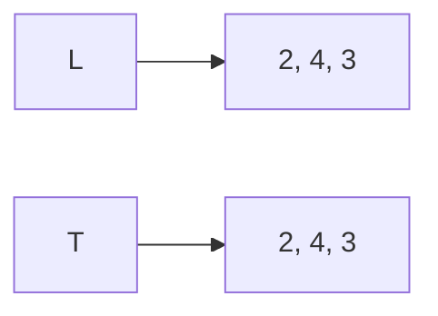

---
layout: two-cols
---

## Modifying vs Creating

```python {2,5}
L = [2, 4, 3]
L[1] = 5

t = (2, 4, 3)
t = (2, 5, 3)
```

::right::

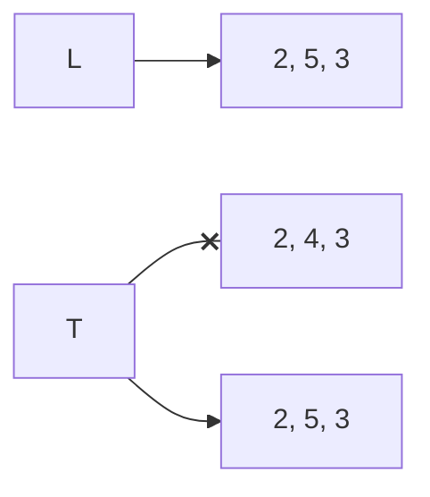

---
layout: two-cols
---

## Operations on lists

An example of how mutability is useful is the function `append()`

```python {1}
L = [1, 2, 3]
L.append(4)
```

::right::

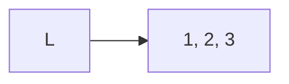

---
layout: two-cols
---

## Operations on lists

An example of how mutability is useful is the function `append()`

```python {2}
L = [1, 2, 3]
L.append(4)
```

This is an example of an "in-place" operation

::right::

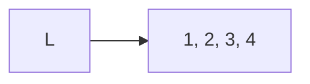

---
layout: two-cols
---

## Operations on lists

An example of how mutability is useful is the function `append()`

```python {3}
L = [1, 2, 3]
L.append(4)
L = L.append(20)
```

Because `append` modifies the list in place


::right::

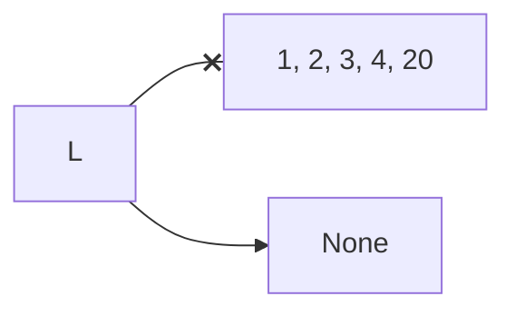

But the actual function returns `None`

---

## Exercise

What is the value of `L1`, `L2`, `L3`, and `L` at the end?

```python
L1 = ['re']
L2 = ['mi']
L3 = ['do']
L4 = L1 + L2
L3.append(L4)
L = L1.append(L3)
```

---
layout: center
---

# Terminology Note

Functions that don't mutate and return anything are called `pure functions`

We only use them for their `side effects` 

Like the `print()` function or the `append()` function

---

## Dot notation

When we call functions that are part of an object, we use `dot notation`

```python
L = [1, 2, 3]
L.append(5)
```

Where the dot represents that 
- the function `append` is part of the object `L`, in this case list
- this means that this `append` function is specific to lists
- it's loosely equivalent to `append(L, 5)`

---

# Exercise

Write a function that meets the specifications

```python
def make_ordered_list(n):
    """
    n: int, a positive integer
    Returns a list containing all ints in order from 0 to n (inclusive)
    i.e. n = 5 returns [0, 1, 2, 3, 4, 5]
    """
```

---

# Exercise

Then write a function that let's you remove an element from a list

```python
def remove_element(L, e):
    """
    L: list, a non empty list
    e: element to remove from L, can be any type
    Removes the first instance of e from L if it exists

    Returns a new list with elements in the same order as L but without 
    any element equal to e

    i.e. L = [1, 2, 3, 2], e = 2 returns [1, 3]
    """
```

---

## Exploring Mutability

Lists have a few different operations that mutate them like

```python
L = [1, 5, 2, 4, 3]
L.sort()
L.reverse()
```

But also functions that don't mutate them, like

```python
L = [4, 2, 7]
new_L = sorted(L)
```

---

## Lists also support iteration

As an example, let's say we want to make a function that squares every element in a list

For example, with the input `[1, 2, 3]`, we want the output to be `[1, 4, 9]`

```python
def square_list(L):
    for elem in L:
        # how would you do L[index] = the square ?
        # elem is an element, not an index
```

Our options are:
1. make a new variable representing the index, starting at 0, and increment it every iteration
2. loop over the index not the element, and use `L[index]` to get the element
3. use `enumerate` to get both the index and the element, i.e. `for index, elem in enumerate(L):` (I leave this as an exercise to you)

---

## Lists also support iteration

```python
def square_list(L):
    for i in _____________:
        L[i] = L[i] ** 2
```

hint: how do you get a list of numbers starting from `0` to the length of `L`

Note that this function mutates the input list `L`, there is no return statement

---

## Lists also support iteration

```python
def square_list(L):
    for i in _____________:
        L[i] = L[i] ** 2

Lin = [2, 3, 4]
print("before:", Lin)
square_list(Lin)
print("after:", Lin)
```

---
layout: center
---

# Note
for when to mutate

When writing a function that mutates the value of a list, it's most likely going to iterate over `len(L)` not `L` itself

---

# Mutation

There are meany advantages to being able to `change a portion` of a list

For example, suppose I have a very long list (like student records) and I want to update one element, without mutation
- I would have to copy the entire list with the one change
- a mutable structure lets me change just that element

But this also introduces some problems

---

# Tricky examples

1. What if we have a loop that iterates over the indices of `L` and mutates `L` each time, adding more elements

```python
L = [1, 2, 3, 4]
for i in range(len(L)):
    L.append(i)
    print(L)
```

Note that `range()` returns something *like* a tuple, but isn't

---
layout: two-cols
---

## Tricky example 1
```python
L = [1, 2, 3, 4]
for i in range(len(L)):
    L.append(i)
    print(L)
```
Question: How many times does this loop run?

::right::

memory:

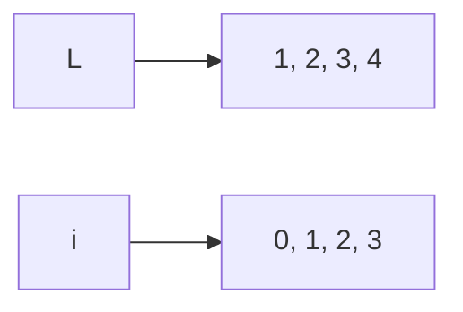

---

## Tricky example 2

What if instead of `range(len(L))` we just did `L`?

So the loop iterates over `L's elements` directly and mutates L each time (adding more elements)

```python
L = [1, 2, 3, 4]
i = 0
for e in L:
    L.append(i)
    i += 1
    print(L)
```

---
layout: two-cols
---

## Tricky example 2

```python
L = [1, 2, 3, 4]
i = 0
for e in L:
    L.append(i)
    i += 1
    print(L)
```
Question: How many times does this loop run?

::right::

memory:

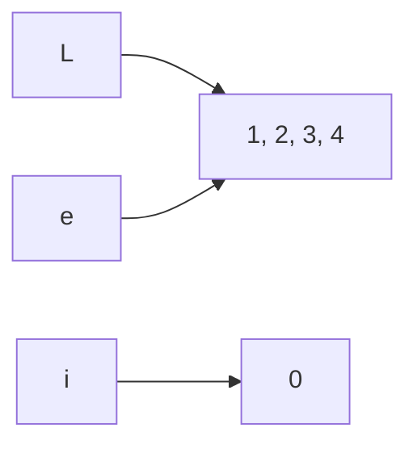

---
layout: two-cols-header
---

## Combining lists

- `Concatenation`, the `+` operator, creates a **new** list, with copies
- `Mutate` lists with `L.extend(some_list)` (copy of `some_list` is added to `L`)

::left::

```python
L1 = [1, 2, 3]
L2 = [4, 5, 6]
L3 = L1 + L2
```

::right::
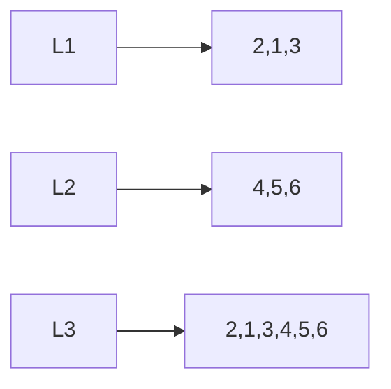

New copy

---
layout: two-cols-header
---

## Combining lists

- `Concatenation`, the `+` operator, creates a **new** list, with copies
- `Mutate` lists with `L.extend(some_list)` (copy of `some_list` is added to `L`)

::left::

```python {4}
L1 = [1, 2, 3]
L2 = [4, 5, 6]
L3 = L1 + L2
L1.extend([0, 6])
```

::right::
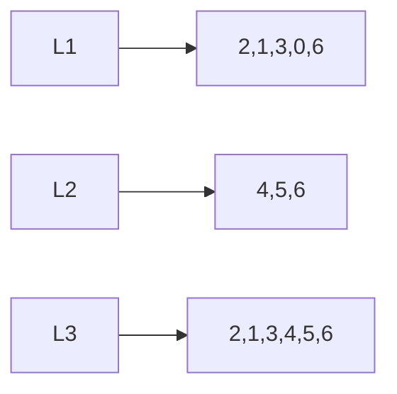

Mutates instead

---
layout: two-cols-header
---

## Combining lists

- `Concatenation`, the `+` operator, creates a **new** list, with copies
- `Mutate` lists with `L.extend(some_list)` (copy of `some_list` is added to `L`)

::left::

```python {5}
L1 = [1, 2, 3]
L2 = [4, 5, 6]
L3 = L1 + L2
L1.extend([0, 6])
L2.extend([[1, 2], [3, 4]])
```

::right::
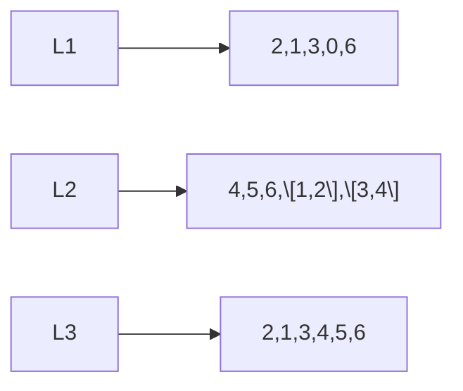

Mutates instead

---

## Tricky example 3

What if we iterate over `L's elements directly` but reassign `L` to a new object each time

```python
L = [1, 2, 3, 4]
for e in L:
    L = L + L
    print(L)
```

---
layout: two-cols
---

## Tricky example 2

```python
L = [1, 2, 3, 4]
for e in L:
    L = L + L
    print(L)
```
Question: How many times does this loop run?

::right::

memory:

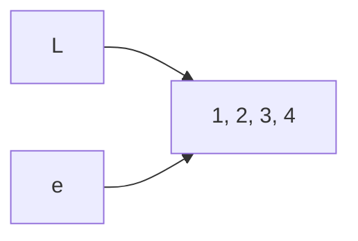

---
layout: two-cols-header
---

## This is memory stuff

Things that you'll need to keep in mind when working with mutable objects, and any more complex data structures

for example:

::left::
```python
L = [4, 5, 6]
id(L)
L.append(8)
id(L)
L.clear()
id(L) # same
```
This means that `L` is still the same list object, just modified

::right::
```python
L = [4, 5, 6]
id(L)
L.append(8)
id(L)
L = []
id(L) # not the same
```
This means that `L` is now a different list object

---

# Imports

Just a quick note on imports

Let's you use code from Python's standard library, or from other files

```python
import math
print(math.sqrt(16))
```

It also lets you import only one specific function

```python
from math import sqrt
print(sqrt(16))
```

It lets you use run code from different files, usually from files you didn't write

---

# Summary

Lists are mutable

- you can modify the object by changing an element at an index
- you can modify the object by adding elements to the end
- lists are useful in dynamic situations

Like a list of daily top 40 songs which change every day
