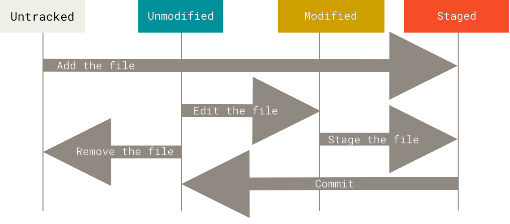

# Git and GitHub

---

# What is Version Control

Version control is a way of **recording** files over time with the goal being the ability to **recall** previous versions.

For example, if you are a student writing code for a project, you might want to save your code in case of data loss or *functionality* loss.

So what are the ways you would do that?

---
layout: center
---

## How do you back up your files?

---

## Local

The simplest method is to simply **copy** the file into another directory or with a different name, maybe even with dates and titles if you were feeling neat.

But this method is incredibly error prone, inconvenient to restore, and could waste a lot of space. 

- what if you write to the backup
- what if you forget to backup your files
- you accidentally delete the backup copy

Because of it's simplicity, this method has been automated by various developers early on in computing history and is the origin of the term **VCS or Version Control System**.


## Centralized

The next major issue is *collaboration*.

Most, if not all, large scale project require multiple developers to work on the same codebase. And all those developers need to
1. have access to a version controlled codebase
2. be able to share their changes with each other

This led to the development of **Centralized Version Control Systems** where a single server would host the codebase and developers would connect to it to get the latest version and upload their changes.


Examples of applications that use this model are *Subversion (SVN)*, *CV**, and *Perforce*.

This makes it easy to share code, and also let administrators have fine control over access permissions.

But it's also a single point of failure

## Distributed

To solve the single point of failure problem, **Distributed Version Control Systems** were created. Example applications include *Git*, *Mercurial*, and *Bazaar*.

Where instead of connecting to a single central server, each client has a full copy of the version controlled codebase, and changes can be shared between any two clients. 


Thus, if any one computer goes down, the codebase is still safe and accessible from other computers.

The downsides of this approach is that it can be more difficult to manage access permissions, and sharing changes can be more complex. And it can also use more disk space since each client has a full copy of the codebase.

---

# What is Git

## History

Git was created in 2005 by Linus Torvalds, the creator of Linux, to help manage the development of the Linux kernel.

It's main goals were
- speed
- simplicity
- strong support for non-linear development (thousands of parallel branches)
- fully distributed
- able to handle large projects efficiently

---
layout: center
---

# How does Git work

---

## Snapshots

Fundamentally, git stores data as a series of **snapshots** of the entire codebase, like a mini filesystem.

Every time you *commit* or save your project, Git takes a picture of **all** of the files and stores them. Though if Git sees that files have not changed, it doesn't store the file again, just a shortcut to the previous identical file it has already stored.


This gives Git some major advantages

## Local

Because every developer has a full copy of the codebase, most operations are local, and don't require network access. This makes Git very fast because it's running on your hardware and don't have to run through a network. And it also means it's possible to work with a fully functional version control system even when offline.

## Integrity

Everything in Git is checksummed* before it's stored and is then referred to by that checksum

<small>*A checksum is an ID generated from the contents of a file or data. Even a small change in the data will produce a completely different ID.</small>

This means it's impossible to change the contents of any file or directory without Git knowing about it. This ensures the integrity of your codebase.

## Only* adds

Almost all actions in Git only add data to the database. This means it's very hard to lose data, and you can always go back to previous versions of your codebase. Which is the main reason version control exists in the first place.

<small>*There are some commands that can remove data, but they are not commonly used and require explicit action.</small>

## Three States

There are three main states that your files can be in Git which are important to understand

1. **modified**
2. **staged** 
3. **committed**

**Modified** means that you have *changed* the file, but it's not inside the Git database yet

**Staged** means that you marked a modified file, *in it's current version*, to go into the next commit

**Committed** means that the data is safely stored in your local database


In here, the working directory is a single *checkout* (meaning one of the versions) of the project. Git takes data from its database, then places it in your disk as normal files that you can edit.

Once you modify a file, it becomes *modified*. But at this point, Git doesn't track it yet so it's not something version controlled and it's something you could lose.

Then, you tell git to include that file, which puts it into the *staged* state. Mechanically, the *staged* state is just a file in Gits database which holds what content should be staged

Finally, when you *commit*, Git takes all the changes in the *staged* state and puts them into the database so you can always go back to it.

## Command line

A note on command line use

There are many ways to use Git. Some of them with GUIs (like GitHub Desktop, SourceTree, GitKraken, etc) or IDE integrations (like in VSCode, PyCharm, etc).

But the most universal way to use Git is through the command line interface (CLI) since it's available on all platforms and is the most powerful way to use Git.

## Installation and Setup

On windows, the easiest way to install Git is through [Git for Windows](https://gitforwindows.org/) which includes both Git and Git Bash, a command line interface for Git.

To configure git, you can use the `git config` command.

```bash
git config --global user.name "Your Name"
git config --global user.email "yourName@example.com"
```

In particular, setting your email and name is important since it's used to identify your commits. So each commit will have your name and email attached to it.

```bash
git config --global init.defaultBranch main
```

Is also an important command to set the default branch name to `main` instead of `master` which is the historical default but is being phased out in most systems.

## Getting help

To get help with git commands, you can use the `git help` command followed by the command you need help with.

```bash
git help <verb>
git <verb> --help
man git-<verb>
```

---

# Working with Git

## Getting a Git Repository

There are two main ways to get a Git repository

1. **init** - use a command to create a new empty repository
2. **clone** - copy an existing repository from somewhere else, usually online but not necessarily

In either case, you'll end up with a Git repository on your local machine that you can work with.

This comes in the form of a folder, with a hidden `.git` folder inside it that contains all the data for the repository. The `.git` folder is what makes the folder a Git repository.

---

### Init

Using the command git init will create a new Git repository in the current directory.

```bash
git init
```

To start version controlling, you can create new files and add them to the repository.

```bash
git add <file>
```

Which adds the file to the staging area.

Then, you can commit the changes to the repository.

```bash
git commit -m "Initial commit"
```

Which saves the changes to the repository with a message describing the changes.

---

### Clone

To copy an existing repository, you can use the git clone command followed by the URL of the repository.

```bash
git clone <repository-url>
```

for example
```bash
git clone https://github.com/sininen-blue/github-tutorial.git
```

this will create a new folder with the name of the repository and copy all the files and history from the remote repository to your local machine.

---

## Recording Changes

Once you have a Git repository, *and* a checkout or *working directory*, you can start tracking changes to a file.

At a higher level, there are two states a file can be
1. tracked
2. untracked

Tracked files are files that were in the last snapshot or commit, while untracked files are files that were not in the last snapshot.

And only tracked files can be modified, staged, and committed.



---

## Status

The main tool to figure out which files are in which state is the `git status` command.

And you should see something like this

```bash
$ git status
On branch main
Your branch is up to date with 'origin/main'.
nothing to commit, working tree clean
```

This means you have a *clean* working directory; in other words, no changes have been made since the last commit or version.

Then it tells you which branch you are on, and if your branch is up to date with the remote branch.

---

## Adding

Make a new file in your repository or folder, name it anything, and then run the `git status` command again.

You should see something like this
```bash
$ git status
On branch main
Your branch is up to date with 'origin/main'.
Untracked files:
  (use "git add <file>..." to include in what will be committed)
        newfile.txt

nothing added to commit but untracked files present (use "git add" to track)
```

This means that Git has detected a new file that is untracked. and is giving you a hint on what to do next.

Git won't start tracking this file until you tell it to do so. And so any changes to this file will not be recorded until you add it.

---

## Tracking New Files

To begin tracking that new file, use `git add`

```bash
git add newfile.txt
```

Then run `git status` again
```
on branch main
Your branch is up to date with 'origin/main'.
Changes to be committed:
  (use "git restore --staged <file>..." to unstage)
        new file:   newfile.txt
```

Which means that the file is now **staged** and ready to be committed.

---

## Staging Modified Files

If you change a previously tracked file called `requirements.txt`, and then run `git status`, you should see something like this

```bash
On branch master
Your branch is up-to-date with 'origin/main'.
Changes to be committed:
  (use "git reset HEAD <file>..." to unstage)

    new file:   newfile.txt

Changes not staged for commit:
  (use "git add <file>..." to update what will be committed)
  (use "git checkout -- <file>..." to discard changes in working directory)

    modified:   requirements.txt
```

So while the `requirements.txt` file is modified, it's not yet staged for commit. We can simply stage it by using `git add` again.

```bash
git add requirements.txt
```

Then running `git status` again should show both files as staged for commit.
```bash
On branch master
Your branch is up-to-date with 'origin/main'.
Changes to be committed:
  (use "git reset HEAD <file>..." to unstage)

    new file:   newfile.txt
    modified:   requirements.txt
```

Which means both files are now staged and ready to be committed.

What if we forgot something in our changes to `requirements.txt` and want to modify it again? If we open and edit it and run the `git status` command again, we'll see something different

```bash
On branch master
Your branch is up-to-date with 'origin/main'.
Changes to be committed:
  (use "git reset HEAD <file>..." to unstage)
        new file:   newfile.txt
        modified:   requirements.txt

Changes not staged for commit:
  (use "git add <file>..." to update what will be committed)
  (use "git checkout -- <file>..." to discard changes in working directory)
        modified:   requirements.txt
```

Now `requirements.txt` is listed in both the **staged** and **modified** sections.

This is because Git stages files **exactly** as they are when you run the `git add` command. If we commit the `requirements.txt` file now, it will only include the changes that were staged, not the new changes we just made.

So if we modify a file after running `git add`, we need to run `git add` again to stage the new changes.

Git status can be quite verbose, so it's often useful to use the `-s` or `--short` flag to get a more concise output.

```bash
git status -s
```
This will show a summary of the changes in a more compact format.

## Ignoring

In many projects, there are files that you don't want Git to track, like temporary files, build files, or sensitive information.

To tell Git to ignore these files, you can create a `.gitignore` file in the root of your repository.

In this file, you can list the files or patterns that you want Git to ignore.

For example, to ignore all `.log` files and the `temp/` directory, you can add the following lines to your `.gitignore` file:

```
# in .gitignore
*.log
temp/
```

## Viewing Staged and Unstaged Changes

To see the differences between the staged and unstaged changes, you can use the `git diff` command.

`git diff` primarily answers two questions
1. what have you changed but not staged yet
2. what you staged that you are about to commit

`git status` answers these questions but very generally

while `git diff` shows you the exact lines that were added, removed, or modified.

To see the unstaged changes, simply run

```bash
git diff
```

which will show the differences between the working directory and the staging area.

for example

```bash
diff --git a/requirements.txt b/requirements.txt
index e69de29..b6fc4c6 100644
--- a/requirements.txt
+++ b/requirements.txt
@@ -0,0 +1 @@
 # make sure that these packages are installed
 # note that the versions are important
-numpy==1.20.0
+numpy==1.21.0
 pandas==1.3.0
```

---

## Committing

Once you have staged your changes, you can commit them to the repository using the `git commit` command.

```bash
git commit -m "Update requirements.txt and add newfile.txt"
```

It's good practice to write meaningful commit messages that describe the changes you made.

At this point, the changes are safely stored in your local Git repository and can be recalled later if needed.

---

## Skips

While staging and committing allow for fine-grained control over what changes to include, sometimes you just want to quickly commit all your changes without staging them first.

you can use the `-a` or `--all` flag with the `git commit` command to automatically stage all modified and deleted files before committing.

```bash
git commit -a -m "Quick commit of all changes"
```

Which is especially useful for small changes or when you want to quickly save your work.

---

## Removing and Moving

To remove a tracked file from the repository and the working directory, you can use the `git rm` command. And then run `git commit` to record the change.

This means that the file itself will be deleted from your folder, but it's previous versions will still be available in the Git history.


```bash
git rm <file>
```

---

## History

One of the core commands that you'll be using in git is `git log`, which shows the commit history of the repository.

First head to the folder above your current folder, and clone this repository

```
git clone git clone https://github.com/schacon/simplegit-progit
```

by default `git log` shows a list of commits in reverse chronological order, with the most recent commit at the top.

there are a huge number of options to the `git log` command, but some common ones include

```
git log --patch -2
```

`--patch` or `-p` shows the changes made in each commit, while `-2` limits the output to the last two commits

```git log --stat``` shows a summary of changes made in each commit, including the number of files changed, insertions, and deletions.

```git log --pretty=online``` shows each commit on a single line, making it easier to scan through the history.

in particular `--pretty` is a command that allows you to customize the output format of the log or use predefined formats like `oneline`, `short`, `medium`, `full`, and `fuller`.

---

# Undoing

One core feature of version control systems is the ability to undo changes. Git provides several commands to help you do this.

Let's explore some of the most common ways to undo changes in Git.

## Amend

1. You commit something and realized that you wanted to include something else in that commit

say that you modified `requirements.txt` to add a few new packages, and then you committed it.

But you forgot one extra package and you don't want to make a new commit just for that. Because if you do, it will mean that to reverse that change, you'll have to revert two commits instead of one.

To fix this, you can use the `--amend` flag with the `git commit` command to modify the most recent commit.

```bash
git commit --amend
```

This will open your default text editor with the commit message of the most recent commit. You can modify the message if needed, and then save and close the editor.

## Unstage

2. another common situation is that you staged a file, but then realized that you don't want to include it in the next commit.

To unstage a file, you can use the `git restore --staged` command followed by the file name.

```bash
git restore --staged <file>
```
This will remove the file from the staging area, but keep the changes in your working directory.

Mechanically, this just calls the command `git reset HEAD <file>` which resets the file to the last committed state in the staging area.

But `reset` is a more powerful command that can do many things, `git restore --staged` is a more user-friendly way to unstage files.

## Unmodify

3. If you modified a file but then realized that you want to discard the changes and revert back to the last committed version, you can use the `git restore` command followed by the file name.

```bash
git restore <file>
```
This will replace the file in your working directory with the version from the last commit, effectively discarding any changes you made. Note that this action is **irreversible**, so use it with caution.

Mechanically, this is equivalent to `git checkout -- <file>` which is the older way of doing the same thing.

# Remotes

Remotes are versions of your project that are hosted on the internet or network somewhere. They are the exact same as your local repository, but they are hosted on a server.

## Adding

## Fetching and Pulling

## Pushing

## Renaming

# Branches


