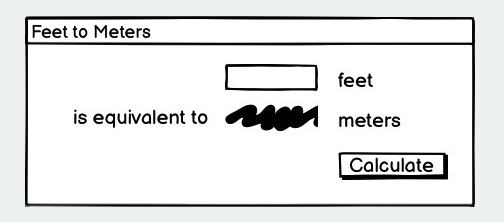
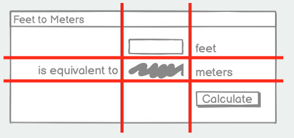
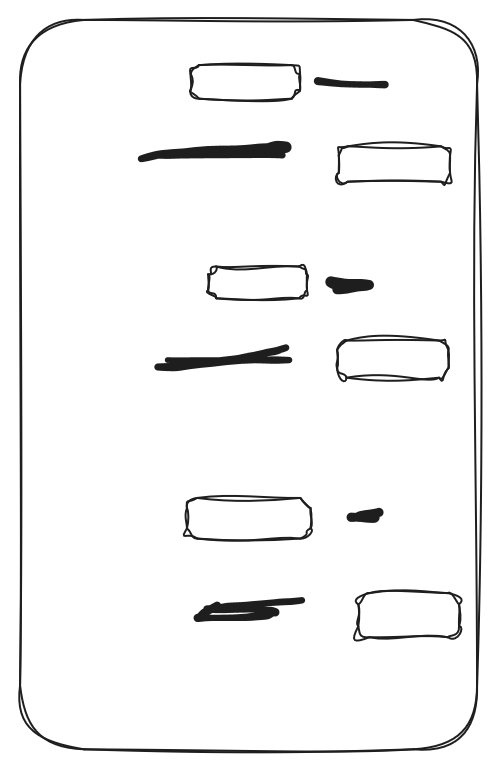
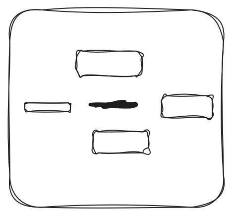

# Tkinter

---

## Tkinter

Tkinter is the standard Graphical User Interface (GUI) library for Python

- It provides a way to create windows, dialogs, buttons, menus, and other GUI elements
- It's installed with most Python distributions, so it's likely you already have it
- It's fairly powerful and easy to use for simple applications

---
layout: center
---

# Today's goal
Assuming we have enough time

Create a simple GUI application using Tkinter which includes:
- buttons
- labels
- text entry fields

After that, your final project will be to convert your pre-existing rock paper scissors game into a GUI application using Tkinter

---

## Hello World

The most straightforward way to learn is to do, so let's make a simple "Hello, World!" application using Tkinter

In Thonny

```python
from tkinter import *
from tkinter import ttk

root = Tk()
ttk.Button(root, text="Hello, World!").grid()
root.mainloop()
```

---
layout: center
---

# A run through of an application

I'll be expecting you to code along

---

## Design

The plan is to make a simple application that takes user input, does a calculation, and displays the result

For this example, we'll create a simple temperature converter that converts Celsius to Fahrenheit

Since we're making a GUI application, we need to think about the layout and components we'll need, and the best way to do that is on paper



---

## Design

Notice how in our design, we have a very clear grid.

Almost everything in GUI design is based on grids, so it's good practice to think in terms of rows and columns when designing your GUI



Programming grids is also pretty straightforward, which is why it's a common choice for GUI design

---

## Importing tkinter

```python
from tkinter import *
from tkinter import ttk
```

The first line imports all core tkinter classes and functions. And the second one imports the themed widget set.

Because tkinter is a very old library, the default widgets look very outdated. The themed widget set provides a more modern look and feel. So we make sure we're using the new buttons by typing

```python
ttk.Button(...)
```

instead of the old button

```python
Button(...)
```

---

## Creating the main window

```python
root = Tk()
```

This line creates the main application window. `Tk()` is a class that represents the main window of a Tkinter application. 

We usually name the main window `root`, but you can name it anything you want.

Then, set the title of the window using

```python
root.title("Temperature Converter")
```

---

## Creating a frame

After that we create something called a **frame**. In concept, a frame is a box that holds all of our buttons, more commonly known as *widgets*.

Since when we create a widget, we need to give it a parent where it will be placed. We don't place everything on the root because it's not themed

```python
mainframe = ttk.Frame(root)
```

Here we're saying, "make a frame, and have its parent be the root variable, which is our main window".

Then we can add some padding to the frame modifying its default variables

```python
mainframe = ttk.Frame(root, padding=(10, 10, 10, 10))
```

---

## Adding that frame

Finally, we need to add that frame to the window. We can do that using the `grid()` method

```python
mainframe.grid(column=0, row=0, sticky=(N, W, E, S))
```

When widgets are created, they aren't put on the application. Tk doesn't know where you want to put them, so we need to tell it. 

The main way of doing that is by using the `grid()` method every widget has, which places the widget in a grid layout

Here, we're saying "put the mainframe in column 0, row 0 of its parent (which is root)". The `sticky` argument tells the frame to expand in all directions to fill the cell it's in.

---

## Adding widgets

Let's make a text input field where the user can enter the temperature in Celsius

```python
celsius = StringVar()
celsius_entry = ttk.Entry(mainframe, width=7, textvariable=celsius)
celsius_entry.grid(column=2, row=1, sticky=(W, E))
```

Here, we first create a `StringVar()` variable called `celsius` to hold the value of the input field.

Then we create an `Entry` widget, which is a text input field. 

We set its parent to `mainframe`, give it a width of 7 characters, and bind it to the `celsius` variable using the `textvariable` argument.

Finally, we place the entry widget in column 2, row 1 of the mainframe using the `grid()` method.

---

## The other widgets

```python
far = StringVar()
ttk.label(mainframe, textvariable=far).grid(column=2, row=2, sticky=(W, E))
```

Note that this is the same as

```python
far = StringVar()
far_label = ttk.Label(mainframe, textvariable=far)
far_label.grid(column=2, row=2, sticky=(W, E))
```

And then the other widgets are just labels and a button

```python
calc_button = ttk.Button(mainframe, text="Calculate", command=calculate)
calc_button.grid(column=3, row=3, sticky=W)

ttk.Label(mainframe, text="C").grid(column=_, row=_, sticky=_)
ttk.Label(mainframe, text="==").grid(column=_, row=_, sticky=_)
ttk.Label(mainframe, text="F").grid(column=_, row=_, sticky=_)
```

---

## Some extra looks

```python
root.columnconfigure(0, weight=1)
root.rowconfigure(0, weight=1)
```

These two lines make sure that when the window is resized, the mainframe expands to fill the window

```python
for child in mainframe.winfo_children():
    child.grid_configure(padx=5, pady=5)
celsius_entry.focus()
root.bind('<Return>', calculate)
```

lines 1-2 add some padding around each widget in the mainframe for better spacing

What does line 3 do?

What about 4

---
layout: two-cols
---

## The calculation function

Finally, we need to define the `calculate` function that will be called when the button is pressed

At the very top of our code, but after the imports, we define the function

```python
def calculate(*args):
    try:
        celcius = float(celsius.get())
        farenheigt = (celcius * 9/5) + 32
        far.set(f)
    except ValueError:
        pass
```

::right::
This works because of the `textvariable` arguments we set earlier when creating the widgets

We specify Celsius as the text variable of the `celsius_entry` widget, 

and so whenever the `celcius` variable is updated, the entry field reflects that change

That's also why we make `celsius` and `far` as `StringVar()` variables, so that they can be linked to the widgets

---
layout: center
---

## Running the application

Finally, at the very end of our code, we need to start the main event loop of the application

```python
root.mainloop()
```

---
layout: two-cols-header
---

## Exercise

Your final project will be to convert your pre-existing rock paper scissors game into a GUI application using Tkinter

Before that, edit this current application to do one of the following:

::left::
1. Below the temperature converter, add widgets to convert meters to feet, and then another set of widgets to convert kilograms to pounds


::right::
2. Make an application that tracks where a player is in x and y, make 4 buttons that move the player

