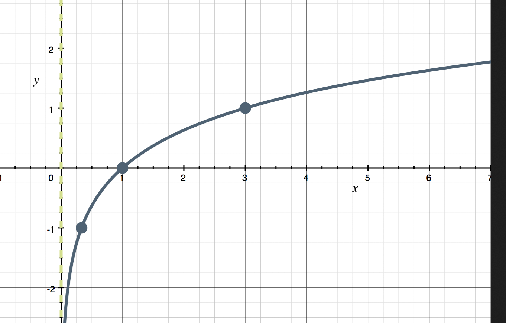
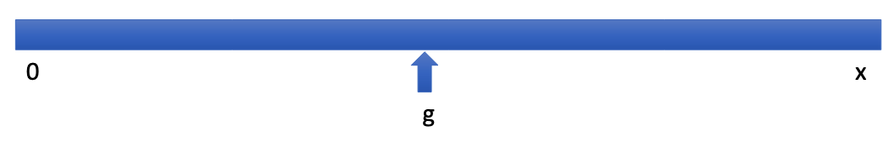
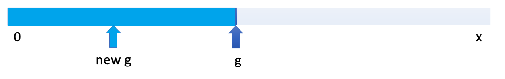
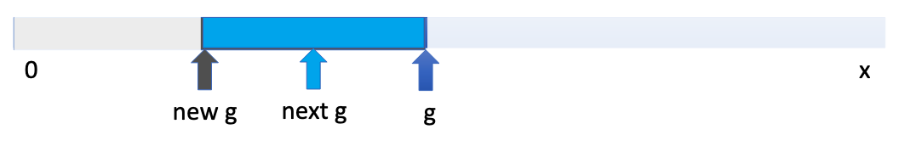
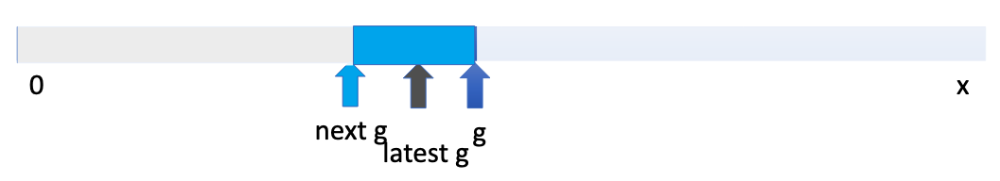

# Bisection Search

---

# Recap
- floating point numbers introduce challenges
- they can't be represented in memory exactly, we lose some data
- guess and check *enumerates* integers one at a time as a solution to a problem 
- approximation enumerates using *increments* and *epsilons*

---

## Exercise

Assume you are given a positive integer named `N`. Write a piece of python code that prints `hello world` on separate lines `N` time. Use either a `while` loop or a `for` loop.

```
N: 3
hello world
hello world
hello world
```

---

## Demonstration of finding the square root of a number

---

## Our previous approximation code

```python {all|1|2|3|4|5|7|8|9|11|12|13|14|15|all|1-5|7-9|11|12-13|14-15|all}
x = 54321
epsilon = 0.01
num_guesses = 0
guess = 0.0
increment = 0.0001

while abs(guess**2 - x) >= epsilon and guess**2 <= x:
    guess += increment
    num_guesses += 1

print('num_guesses =', num_guesses)
if abs(guess**2 - x) >= epsilon:
    print('Failed on square root of', x)
else:
    print(guess, 'is close to the square root of', x)
```

---
layout: center
---

# Bisection Search

---
layout: center
---

## Scenario

- What if I attached 100php to a page of a book
- If you can guess which page the money is on, you get to keep the money
- If you fail, you get a 5.0

<v-click>
<p class="mt-4 w-150">
What if I told you whether you were correct, too low, or too high after each guess?
</p>
</v-click>

---

## Bisection Search

- Applies to problems with an inherent order to the range of possible answers
    - Examples: integers, floating point numbers, words in a dictionary, grades
- Assume we know that the answer lies in between some interval
    - In our square root, what was the start of our interval?
    - What was the end of our interval?

<!-- intervals showcase, skinnier book -->

---

## Bisection Search

Steps:
1. After establishing the interval
2. Get the midpoint of the interval
3. Check if the midpoint is close enough to the answer
4. Check whether the midpoint is too high or too low
5. Change the interval
6. Repeat step 2

- This cuts the set of things to check in half at each stage
    - where exhaustive search (guess and check) reduces them from $N$ to $N-1$
    - bisection search reduces them from $N$ to $N/2$

<!-- Do a 10 item example for clarity -->

---

## Log growth

- Cutting the number of things to check in half at each step is usually called logarithmic growth


- Compared to linear growth which is how the guess and check algorithm works

### Logarithmic growth is much faster than linear growth

---
layout: center
---

## Example

- Imagine you were sitting in alphabetical order 

---

## Bisection search for square root

- Assume we know that the answer lies between 0 and x
- Rather than exhaustively trying things starting at 0, suppose instead we pick a number in the middle of this range



- If you're lucky, that's the correct answer

---

## Bisection search for square root

- if it's not close enough, check if it's too big or too small
- if `guess ** 2 > x`, then we know `guess` is too big, so now search 



---

## Bisection search for square root

- and if, for example,  this new `guess` is such that `guess ** 2 < x`, then we know that `guess` is too small



- at each stage, reduce the range of values to search by half

---

## Bisection search for square root

Keep doing this



---
layout: center
---

## Bisection search takes advantage of the properties of the problem
1. where the search space is ordered
2. we can tell the guess is too high or too low

---

### Question

If you had to guess a random 4 digit telephone number, and the only thing you get each guess is whether on not it's correct, would you be able to use bisection search?

---

### Question

You are playing a guessing game where you have to guess a number exactly, between 0 and 10 in any precision. If you receive feedback on whether your guess is too high or too low, can you use bisection search to find the number?

---

## Slow square root using approximation

```python 
x = 54321
epsilon = 0.01
num_guesses = 0
guess = 0.0
increment = 0.0001

while abs(guess**2 - x) >= epsilon and guess**2 <= x:
    guess += increment
    num_guesses += 1

print('num_guesses =', num_guesses)
if abs(guess**2 - x) >= epsilon:
    print('Failed on square root of', x)
else:
    print(guess, 'is close to the square root of', x)
```

---

## Slow square root using approximation

```python 
x = 54321 # still here
epsilon = 0.01
num_guesses = 0
# code here
# code here
# code here
while abs(guess**2 - x) >= epsilon:
    # code here
    # code here
    # code here


    num_guesses += 1

print('num_guesses =', num_guesses)
print(guess, 'is close to the square root of', x)
```

---

## Slow square root using approximation

```python 
x = 54321
epsilon = 0.01
num_guesses = 0
low = 0
high = x
guess = (high + low)/2.0
while abs(guess**2 - x) >= epsilon:
    # code here
    # code here
    # code here


    num_guesses += 1

print('num_guesses =', num_guesses)
print(guess, 'is close to the square root of', x)
```

---

## Slow square root using approximation

```python 
x = 54321
epsilon = 0.01
num_guesses = 0
low = 0
high = x
guess = (high + low)/2.0
while abs(guess**2 - x) >= epsilon:
    if guess ** 2 < x:
        # code here
    else: 
        # code here

    num_guesses += 1

print('num_guesses =', num_guesses)
print(guess, 'is close to the square root of', x)
```

---

## Slow square root using approximation

```python 
x = 54321
epsilon = 0.01
num_guesses = 0
low = 0
high = x
guess = (high + low)/2.0
while abs(guess**2 - x) >= epsilon:
    if guess ** 2 < x:
        low = guess
    else: 
        # code here

    num_guesses += 1

print('num_guesses =', num_guesses)
print(guess, 'is close to the square root of', x)
```

---

## Slow square root using approximation

```python 
x = 54321
epsilon = 0.01
num_guesses = 0
low = 0
high = x
guess = (high + low)/2.0
while abs(guess**2 - x) >= epsilon:
    if guess ** 2 < x:
        low = guess
    else: 
        high = guess

    num_guesses += 1

print('num_guesses =', num_guesses)
print(guess, 'is close to the square root of', x)
```

---

## Slow square root using approximation

```python 
x = 54321
epsilon = 0.01
num_guesses = 0
low = 0
high = x
guess = (high + low)/2.0
while abs(guess**2 - x) >= epsilon:
    if guess ** 2 < x:
        low = guess
    else: 
        high = guess
    guess = (high + low)/2.0
    num_guesses += 1

print('num_guesses =', num_guesses)
print(guess, 'is close to the square root of', x)
```

---

## Log growth is better than linear

- the regular brute force search for 54321 took over 23M guesses
- the bisection search reduced it to 30 guesses
- We'll talk more about this later, but we say that the brute force search is in *linear in size of problem*, bucaesu the number of steps grows linearly as we increase problem size
- and bisection search is *logarithmic in size of problem*  because the number of steps grows logarithmically as we increase problem size

---

## Some observations

- bisection search radically *reduces computation time*
- the search space always gets *smaller quickly at the beginning* and then more slowly
- works only on problems that have an inherent order

---

## Exercise

Write code to do bisection to find a number between 0 and 1000. Print out the number of guesses you need to get the answer. 

Then output the count and guess

```python
n = input("Enter a number between 0 and 1000: ")
n = int(n)

low = 0
high = 1000
guess = (high + low) / 2.0
count = 0
```

```
Enter a nummber between 0 and 1000: 24
count: 56
guess: 24.0
```
