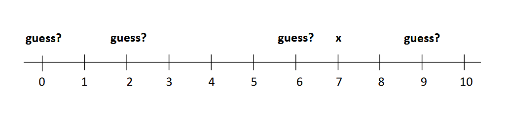
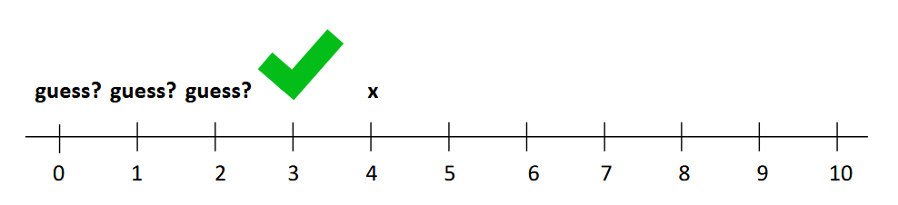
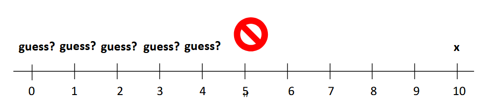
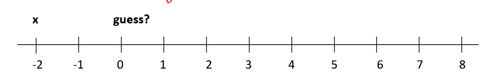
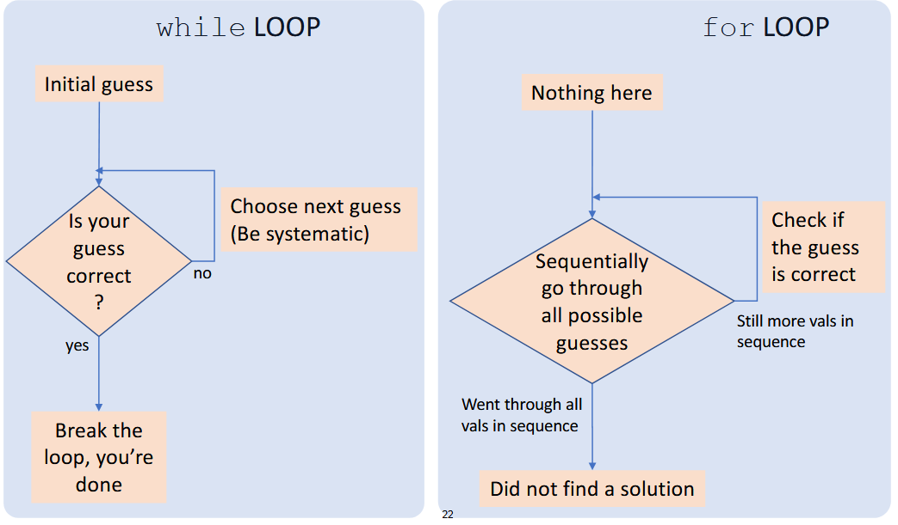

# Computational Thinking, Loops, Guess and Check

---

## Last time

Looping Mechanisms
- `for` loops
- `while` loops

While Loops
- loops as long as a condition is true
- you need to make sure you aren't hitting an infinite loop

For Loops
- loops over values in a sequence one at a time
- can loop over *ranges* of numbers

---
layout: center
---

## Scenario

You've just graduated from FSUU and now have a job. You decide that you want to buy a house so you start saving up for the down payment for your dream house

Your goal is find the number of months it takes to save up for a down payment, the cost of your down payment is calculated by multiplying the total cost of your dream house by the down payment percentage

---
layout: center
---

## Steps

1. `yearly_salary`, `portion_saved`, and `cost_of_dream_home`, which you get from the user
2. `portion_of_down_payment`, which is the percentage of the total cost needed for the down payment of your house, assume this is `portion_down_payment = 0.25`
3. The amount that you have saved up so far is `amount_saved`, which starts at `0`
4. you get an annual rate of return `r`, so at the end of each month you receive an additional `amount_saved * (r/12)` funds for your savings. `Assume r = 0.05`
5. At the end of each month your savings increase by (1) a percentage of your monthly salary, and (2) the monthly return on your investment

---
layout: center
---

## Assumptions

- you get your monthly return at the START of the month
- and you increase your monthly savings at the END of the month
- be careful about values that represent annual amounts versus monthly amounts
- assume the user enters valid inputs

---
layout: center
---

# Computational thinking

A method of solving a problem, primarily through

# Decomposition

Simply breaking down a problem into smaller parts

So let's do some examples

---
layout: center
---

## Let's make a calculator

1. Define the bounds
    - What numbers can we use?
    - What operations can we do?
    - How do we display output?
    - Can we erase characters?
    - Etc

---
layout: center
---

2. Think of a smaller problem
    - How do we add two numbers?
    - How do we subtract two numbers?
    - How do we multiply two numbers?
    - Etc

3. How do we combine these smaller problems?

---
layout: center
---

## Exercise

Give me a run through of how you would use a calculator to add two numbers

In *very* specific steps

---
layout: center
---

## Convert those steps into a flowchart

A simple way to start translating an idea into a computable program is to convert it into a flowchart

---
layout: center
---

## Convert that flowchart into pseudo code

Take each step in the flowchart, and either convert it into a line of code, or decompose it into smaller steps

---
layout: center
---
# Back to regular lessons
---

## Break statement

- immediately exits whatever loop it's in
- skips the remaining expressions in the code block
- **Exists only the innermost loop**

```python
while <condition>:
    while <condition>:
        <expression_a>
        break
        <expression_b>
    <expression_c>
```
Which of these expressions will be executed?

---

## Break syntax

```python
my_sum = 0
for i in range(5, 11, 2):
    mysum += 1
    if my_sum == 5:
        break
        mysum += 1
print(my_sum)
```

What happens in this program

---

## Exercise

Write code that loops a `for` loop over some range and prints how many even numbers are in that range
- `range(5)`
- `range(10)`
- `range(2, 9, 4)`
- `range(-4, 6, 2)`
- `range(5, 6)`

---

## Strings and loops

Here's a program that lets you check for the letter i or u in a string


```python
#s = "demo loops - fruit loops"
for index in range(len(s)):
    if s[index] == "i" or s[index] == "u":
        print("There's an I or U")

for char in s:
    if char == "i" or char == "u":
        print("There's an I or U")

for char in s:
    if char in "iu":
        print("There's an I or U")
```

---
layout: center
---

## The sequence of values in a for loop isn't limited to numbers

---

## Example

```python
letters = "aefhilmnorsxAEFHILMNORSX"
word = input("Enter a word: ")
times = int(input("Enthusiasm level (1-10): "))

for c in word:
    if c in letters:
        print(c * times, end="")
    else:
        print(c, end="")

print("what's that spell")

for i in range(times):
    print(word, "!!!")
```

---

## Exercise

Assume you are given a string of lowercase letters in variable `s`

Count how many unique letters there are in the string

For example

```
s = "abca"
```

Then your code prints 3

## Hint
- go through each character in s
- keep track of ones you've seen in a string variable
- add characters from s to the seen string variable if they aren't already a character in that seen variable

---

## Summary of what we've learned so far
- objects, and the fact that they have types
- expressions, and the fact that they evaluate to values
- branching
    - `if`, `else`, `elif`
    - where the program picks a path based on a condition
- looping
    - `while` and `for` loops
    - where the code executes repeatedly until a condition is met
    - or where the code executes for all values in a sequence

---
layout: center
---

# This is all we need to implement algorithms
What is an algorithm?

---
layout: float-right
image: images/fig1.png
---

## What's a Guess and check algorithm

- This is also called an *exhaustive enumeration algorithm*
- Applies to a problem where
    - You are able to **guess** a value for a solution, and
    - You are able to **check** if that guess is correct
- And you can keep guessing until you either
    - Find the correct solution
    - Run out of guesses

---

## Guess and check square root

Here's a simple example of a guess and check algorithm

- Given an `int` called `x`, we want to check if there exists an `int` that is the square root of `x`

1. start with a guess, and check if it's the correct answer



- Is `0 x 0 = 7`?
- Is `2 * 2 = 7`?
- What about `9 * 9`?

---

## Guess and check square root

2. Be *systematic*, start with a guess, then `guess + 1`, then `guess + 2`, etc

And if `x` is a perfect square, then you will eventually find the answer



---

## Guess and check square root

And if `x` doesn't have a perfect square root, then we'll need to know when to stop guessing

Here we can use algebra, if `guess` squared is bigger than `x`, then we know that the guess is too big, and we can stop guessing



---

## Guess and check square root

```python
guess = 0
x = int(input("Enter a number: "))
while guess**2 < x:
    guess += 1

if guess**2 == x:
    print("The square root of", x, "is", guess)
else:
    print(x, "does not have a perfect square root")
```

---

## Guess and check square root

- Does this work for any integer value of `x`?
- What happens if `x` is negative?



---

## Guess and check square root

```python
guess = 0
is_negative = False

x = int(input("Enter a number: "))

if x < 0:
    is_negative = True

while guess**2 < x:
    guess += 1

if guess**2 == x:
    print("The square root of", x, "is", guess)
else:
    print(x, "does not have a perfect square root")

    if is_negative:
        print("This program does not support negative numbers")
```

---
layout: center
---

## Comparison between a while loop and a for loop



---

## Exercise

1. hardcode a number as a secret number
2. write a program that uses a guess and check algorithm that checks all the numbers from 1 to 10 and prints the secret value if it's in that range
    - and if it's not found it doesn't print anything

- How would you change the program so that if it's not found, it prints that it didn't find it

---
layout: center
---

# You can use booleans as signals that something has happened

We call these *flags*

---

## While loop or for loop

For loops are generally cleaner when iterating over a set amount of items

Consider

```python
cube = int(input("enter an integer: "))

for guess in range(cube+1):
    if guess**3 == cube:
        print("Cube root of", cube, "is", guess)

```

---

Then we can deal with negative numbers like so


```python
cube = int(input("enter an integer: "))

for guess in range(abs(cube+1)):
    if guess**3 == cube:

        if cube < 0:
            guess = -guess

        print("Cube root of", cube, "is", guess)
```

---

And we can even speed it up like

```python
cube = int(input("enter an integer: "))

for guess in range(abs(cube+1)):
    if guess**3 >= cube:
        break

if guess**3 != abs(cobe):
    print(cube, "is not a perfect cube")
else:
    if cube < 0:
        guess = -guess
    print("Cube root of", cube, "is", guess)
```

---

## Another example

1. Alyssa, Ben, and Cindy are selling ticket to a fundraiser
2. Ben sells 2 fewer than Alyssa
3. Cindy sells twice as many as Alyssa
4. 10 total tickets were sold by the three people
5. How many did Alyssa sell?

We could solve this through algebra, but we could also use the guess and check algorithm

This will be your assignment, where you'll be required to use the guess and check algorithm

---

## Summary
- Break statement
    - immediately exits the innermost loop
- Loops can loop over any sequence of values, not just numbers
- Guess and check algorithms 
    - a way to solve problems by systematically 
    - guesses values and checks if they are correct
    - They can be implemented using loops, either `while` or `for`
- Flags can be used to signal when a condition has been met or when a value has been found
- For loops are generally cleaner when iterating over a set amount of items

