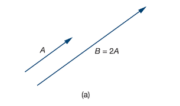

# Math
We're going to be doing a lot of math

---

# Basics
Scalars, points, and vectors

These are the three fundamental types

Note that we will be distinguishing between the `abstract` definition and any `implementation` of these types

---

## Scalars

Real numbers that obey a set of rules that are abstractions of the operations of ordinary arithmetic

i.e. real numbers with addition, subtraction, multiplication, and division

---

## Points

A location in space with neither size nor shape and one of the simplest geometric objects

Useful in specifying geometric objects but not sufficient.

---

## Vectors

Directions with a magnitude and no fixed position. In computer graphics, this is often referred to as a directed line segment

And because vectors have no fixed position, vectors are identical if they have the same direction and magnitude


---

## Vector Operations

Scalar multiplication allows you to take a vector, multiply it by a scalar, and get a new vector with the same direction but a different magnitude



We write that as $B = 2A$

---

## Vector Operations

Vector addition allows you to take two vectors and add them together to get a new vector using the head-to-tail rule


Where we connect the head of the vector $A$ to the tail of vector $C$ which gets us a vector $D$

This is the sum and written as $D = A + C$

---

## Vector Operations

We can also invert a vector by multiplying it with the scalar $-1$


And from that inverse, we can get a *zero vector* by using the head-to-tail rule and adding the inverse to the original vector

---

## Vector Operations

Point Vector addition is the first non intuitive operation we'll be doing

There are no sensible operations for a point-to-point ($P + P$) and point-to-scalar ($Ps$)

But there *is* an operation for point-to-vector ($P + V$) called point-vector addition

This takes a point and a vector and produces a new point


Denoted as $P = Q + v$ where $v$ displaces $Q$ to the new location $P$

---

## Point Vector Operations

Looking at it slightly differently, we can also write it as $v = P - Q$

Where the vector $v$ is the displacement from point $Q$ to point $P$, this is called *point-point subtraction*

And because vectors can be multiplied by scalars, we can suddenly write

$$
2P-Q + 3v
$$

Because $P-Q$ is a vector and vectors can be multiplied by scalars

---

# Coordinate Free Geometry

A box is a box regardless of any coordinate system. 

Thus, we don't need a coordinate system to specify a point or a vector.

I repeat, vectors don't need to have a position and can exist outside a coordinate system

---

## Coordinate Free Geometry


In this example, we have a coordinate system defined by two axes, an origin, and a simple geometric object, a box

Assume that the lower-left of the square is (1, 1) and because the square is orthogonal (has right angles), we can define the other points in relation to that point

And assuming that it's two units wide and tall, we can define the other points as (3, 1), (1, 3), and (3, 3)

---

## Coordinate Free Geometry

What if we removed the axes?

We can no longer specify the points as (1, 1), (3, 1), (1, 3), and (3, 3) because we don't have a coordinate system

However, the relationships between the points remain

The lower-left point is still two units away from the lower-right point and two units away from the upper-left point


It's still a square

---

# Vector, Affine, and Euclidean Spaces

Sets of objects with defined relationships and operations

Mathematical sets each have different ways of manipulating the elements of the set, and by treating points and vectors as elements of different sets, we can use mathematical operations to manipulate them

Primarily, we'll be talking about vector spaces, and their extensions, affine and euclidean spaces.

---

## Scalar field

Before we can define a vector space, we need to define a scalar field

A scalar field is a set of scalars (real numbers) with two operations, addition and multiplication, that obey a set of rules

Essentially regular arithmetic with real and complex numbers

---

## Vector field (linear)

The most important mathematical space we care about is the vector space, often called the linear space

A vector space has two types, vectors and scalars

In addition to the rules for combining scalars within a vector space, we can combine scalars and vectors using scalar multiplication and we can combine vectors using vector addition 

But in linear space, we don't have a way of measuring the quantity of a vector

Because a vector in vector space is simply an algebraic structure that obeys a set of rules

---

## Euclidean Space

To get a measure of a vector, we need to extend the vector space to a Euclidean space.

And in a Euclidean space, the measure of a vector can be measured using its length

---

## Affine Space

And affine space is an extension of a vector space that includes points, it does this by adding operations for point-vector addition and point-point subtraction

While there are no operations between two points or a point and a scalar, in an affine space, we can add a vector to a point to get a new point and we can subtract one point from another to get a vector

---

## Summary of Spaces

In these abstract spaces, vectors in a vector space are defined independently of any coordinate system

They are simply an "arrow" with a direction and a magnitude. Without a coordinate system and a basis, without their implementation, vectors are simply an abstract object that obeys a set of rules

This let's us use these abstract objects to define geometric objects irrespective of any coordinate system, and more importantly,

Allow us to convert between different coordinate systems and representations freely

---

# Abstract Data Types
Type defined by behavior

As computer scientists however, we usually work with these spaces through the creation of Abstract Data Types (ADT)

Abstract data types are types defined by their behavior, the operations that can be performed on them, and the rules that those operations obey. But the implementation of those operations is not defined

For a concrete example, consider a list, a list is an abstract data type that has operations like adding an element, removing an element, and checking if an element is in the list

However, the implementation of those operations can vary widely between modules and programming languages, but they are all called lists 

---
layout: two-cols
---

## Geometric ADT

So as computer scientists, we ideally want to define points and vectors as abstract data types

```c
vector u, v;
point p, q;
scalar a, b;
q = p + a * v;
```

Where each of these has standard operations regardless of their implementation

::right::
In languages like C++, we can use operator overloading to make these operations look like standard arithmetic

But in JavaScript we can simply use the functions you've already been using which implement these operations

```javascript
var p = new Point;
var q = new Point;
var a = new Scalar;
var v = new Vector;
q = p.add(v.mult(a));
```

---

## Geometric ADT

The first step to creating these ADTs is to first look at the abstract mathematical spaces that define the behavior of these types

And from there, we get 3 main types

1. Scalars - real numbers
2. Points - locations in space
3. Vectors - directed line segments

And all of these obey the rules set by an affine space.

---

## Notation

Before we continue however, we need to define some notation that we'll be using for the rest of this section

1. Greek letters $\alpha, \beta, \gamma, ...$ will be used to denote scalars;
2. uppercase letters $A, B, C, ...$ will be used to denote points;
3. lowercase letters $a, b, c, ...$ will be used to denote vectors.

Note that we have not implemented any reference system yet, so this notation is for representing the abstract mathematical objects 

But once we implement these objects, we'll be using boldface notation $\textbf{b}$ to denote vectors with a reference system

---

## Notation

And from that notation, we can define formulas we already know to this format

$$
|\alpha v| = |\alpha| |v|
$$

Which defines the magnitude of a vector $v$ as a real number denoted by $|v|$, used in a scalar operation with a scalar $\alpha$

---
layout: two-cols
---

## Point to Vector

To relate points and vectors, we have the subtraction and addition

$$
v = P - Q
$$

Where the vector $v$ is the displacement from point $Q$ to point $P$, so the points $P$ and $Q$ define the vector $v$

::right::

And 

$$
P = Q + v
$$

Where the point $P$ is the result of displacing point $Q$ by vector $v$


---

## Vector vector

And because $P - Q$ is a vector, this allows us to use the head-to-tail rule to visualize two points being subtracted


Where

$$
P-R = (Q-R) + (P-Q) \\
\text{or} \\
u + v = u + v
$$

---

## Summary

The reason for going into detail for those operations is that these operations are the only operations we can do with points and vectors, and these operations also need to be implemented in our ADTs

These are the basic operations that we will be repeating over and over again in more advanced operations

---
layout: two-cols
---

## LineLines

The sum of a point and a vector leads to the notion of a line in affine space.

Consider all points in the function 

$$
P(\alpha) = P_0 + \alpha d
$$

Where:
- $P_0$ is an arbitrary point
- $d$ is an arbitrary vector (lowercase), and
- $\alpha$ is a scalar (Greek letter)

Given this formula, and the rules set by an affine space, we can see that this formula defines a line

::right::


This is called the parametric form of the line $(P, P\alpha)$, because by varying the *parameter* $\alpha$, we can get all the points on the line defined by point $P_0$ and direction $d$

A *ray* of infinite length, which is incredibly useful in computer graphics

---

## Affine Sums

In affine space, the addition of two vectors, multiplication of a vector by a scalar, and the addition of a vector and a point, are defined

But the addition of two points and the multiplication of a point by a scalar are not 

So we in affine space, there is an operation defined as the affine sum

Where for any point $Q$, vector $v$, and scalar $\alpha$

$$
P = Q + \alpha v
$$

Describes all points on the line from $Q$ in the direction of $v$

---

## Affine sums

And because we can always find a point $R$ such that 

$$
v = R - Q;
$$

(point - point = vector)

We can rewrite the affine sum as

$$
\begin{align*}
P &= Q + \alpha (R-Q) \\
&= \alpha R + (Q - \alpha Q) \\
&= \alpha R + (1 - \alpha) Q
\end{align*}
$$

---
layout: two-cols
---

## Affine sums

thus

$$
P = \alpha_1 R + \alpha_2 Q
$$

where

$$
\alpha_1 + \alpha_2 = 1
$$

::right::


---

## Convexity

---

## Dot and Cross Products

---

## Planes

---

# Three Dimensional Primitives

---

# Coordinate Systems and Frames

---

## Basis Vectors

---

## Origin

---

## Representations

---

## Changing Coordinate Systems

---

## Example: changing representations

---

## Homogeneous Coordinates

---

## Example: Change in frames

---

## Working with Representations

---

# Frames in WebGL

---

# Matrix and Vector Types

