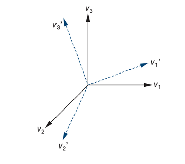

# Three Dimensional Primitives

---

## Three Dimensional Primitives

Due to the added *complexity* of 3D geometry, along with the goal of graphics systems only caring about *efficient* implementations in graphics systems, we only support a certain number of geometric primitives in 3D.

These primitives must have these three features:
1. **Described by their surfaces** and can be thought of as "*hollow*" objects.
2. Specified through a **set of vertices** in three dimensions
3. Can be *composed* or *approximated* by **triangles**

These conditions are set because modern graphics systems are optimized for rendering triangles.

---

## Described by their surfaces

The first condition implies that we need only two-dimensional* primitives. 

> *Two-dimensional in this case meaning that the primitive has two parametric dimensions. A point is zero-dimensional, a line is one-dimensional, and a triangle is two-dimensional. Because a point has no size, a line has length but no width, and a triangle has length and width, but no depth.

Because we make the 3D objects with 2D surfaces, we can use the **same techniques** we used in 2D to describe the surfaces of 3D objects, allowing for simpler and more efficient implementations.

---

## Specified through a set of vertices

If an object is specified by vertices, we can use **pipeline** architecture to *process* tehse vertices at high rates and use the GPU to generate the images only during rasterization.

## Composed or approximated by triangles

Because triangles are always flat, we can use them to **tessellate** an arbitrary polygon into triangular polygon. Allowing us to **approximate** curved surfaces like spheres as long as we assume that a triangle mesh approximation is used

---

## Three Dimensional Primitives

A major exception to this approach is **constructive solid geometry (CSG)**, often found in CAD systems

These objects *volumetric* and allow for operations like union, intersection, and difference to be performed on them.

This model is great for rendering, however they tend to be more difficult to render efficiently in real-time graphics systems.

---

# Coordinate Systems and Frames
Finally using references for the vectors

So far, the vectors we have discussed are purely abstract objects without describing a reference system. But for applications, reference systems must exist, and usually in the form of a **coordinate systems**.

And many of the **manipulations** we perform on *vectors* are actually changes in the *coordinate system*, not on the vectors themselves.

The main way of connecting the abstract vector to their representation starts with the idea of a **basis**

---
layout: two-cols
---

## Basis Vectors

In an $n$-dimensional space, a **basis** is a set of $n$ linearly independent vectors

And given a basis $v_1, v_2, ... v_n$ any vector in the space can be expressed uniquely as

$$
v = \alpha_1 v_1 + \alpha_2 v_2 + ... + \alpha_n v_n
$$

In a three-dimensional vector space, we can represent any vector $v$ unique in terms of any three linearly independent vectors $v_1, v_2, v_3$ as

$$
v = \alpha_1 v_1 + \alpha_2 v_2 + \alpha_3 v_3
$$

The scalars $\alpha_1, \alpha_2, \alpha_3$ are called the **components** of $v$ with respect to the basis $v_1, v_2, v_3$

::right::

and so we can write the **representation** of $v$ with respect to this basis as a column matrix

$$
\bold{v} =
\begin{matrix}
\alpha_1 \\
\alpha_2 \\
\alpha_3
\end{matrix}
$$

Where the *boldface* denotes that $\bold{v}$ is a representation of $v$ in this basis, and not an abstract vector $v$.

---

## Origin

We usually think of the basis vectors $v_1, v_2, v_3$ as defining a **coordinate system**. But for dealing with problems involving points, vectors, and scalars, we need a more general method.

An issue that pops up is shown below

Because vectors have direction and magnitude, **but** lack a *position* attribute, (a) is equivalent to (b) in the image above. Mathematically speaking, it expresses the *same* information as the first figure.

This is why fix a particular reference point, the origin, to be able to represent all points unambiguously.

---

## Origin

The usual convention for drawing coordinate axes is to have them emerging from the origin

This makes sense in *affine* spaces, where both points and vectors have their own representations. 

However, this requires us to know **both** the *reference point* and the *basis vectors*. These two objects together are called a **Frame**.

---

## Frame

With that extension of the coordinate system to include an origin, we can write every vector as

$$
v = \alpha_1 v_1 + \alpha_2 v_2 + \alpha_3 v_3
$$

and points can be written as

$$
P = P_0 + \beta_1 v_1 + \beta_2 v_2 + \beta_3 v_3
$$

Thus, the representation of a particular vector in a frame requires the knowledge of three scalars (vector components) and where the origin is located

Almost every single vector and coordinate system you have seen **implicitly** assumes a particular basis and origin.

And by only using *frames* we can avoid the difficulties caused by vectors having magnitude and direction, but no position. It also allows us to do matrix representations of points and vertices in ways that keep them distinct.

---

## Representations

Given our knowledge of frames

Should be understood as a vector going from a fixed reference point (the origin) to a particular point in space.

We can move the vector around, and as long as we keep its direction and magnitude the same, it is the same vector.

And so the point and the vector are **distinct objects**, even though they may be *represented* by the same coordinates in a particular frame.

---

## Representations

One advantage of working with representations is that they can be manipulated using **matrix algebra**.

Let's represent a vector $v = \alpha_1 v_1 + \alpha_2 v_2 + \alpha_3 v_3$ as a **3-tuple** $[\alpha_1, \alpha_2, \alpha_3]$ This tuple can be used for the components of a three-dimensional row or column matrix

In this form, the basis vectors also need *representations*. Thus

$$
\bold{v_1} = [1, 0, 0]^T \\
\bold{v_2} = [0, 1, 0]^T \\
\bold{v_3} = [0, 0, 1]^T
$$

> Note that $T$ means transpose, which means to convert a row matrix to a column matrix or vice versa.

Knowing that once we have a basis, we can use the representations of that basis to *form row or column matrices*, we are then able to use matrix algebra as the tool for working with **changes in representation** and **transformations**

---

## Changing Coordinate Systems

In graphics systems, we often need to change the basis vectors. For example, we specify our geometry using the coordinate system or frame that is natural for the model.

**The model frame**

Then that model frame is brought into the **object or world frame**, which is usually the natural frame of the application.

Then that object needs to appear in the **camera frame**

So the conversion of these representations from one frame to another, from *world frame* to *camera frame* is a common operation.

This conversion is defined by something called the **model-view matrix**, taking advantage of matrix algebra to perform the conversion efficiently.

---
layout: two-cols-header
---

## Changing Coordinate Systems

Suppose that ${v_1, v_2, v_3}$ and ${u_1, u_2, u_3}$ are two bases. Each basis vector in the second set can be represented in terms of the first basis (and vice versa). So There exists **nine scalar components** ${\gamma_{ij}}$ such that

$$
u_1 = \gamma_{11} v_1 + \gamma_{12} v_2 + \gamma_{13} v_3 \\
u_2 = \gamma_{21} v_1 + \gamma_{22} v_2 + \gamma_{23} v_3 \\
u_3 = \gamma_{31} v_1 + \gamma_{32} v_2 + \gamma_{33} v_3
$$

::left::
Which can be written in matrix form as 

$$
\bold{M} = 
\begin{matrix}
\gamma_{11} & \gamma_{12} & \gamma_{13} \\
\gamma_{21} & \gamma_{22} & \gamma_{23} \\
\gamma_{31} & \gamma_{32} & \gamma_{33}
\end{matrix}
$$

::right::

And so

$$
\begin{matrix}
u_1 \\
u_2 \\
u_3
\end{matrix}
= \bold{M} \space
\begin{matrix}
v_1 \\
v_2 \\
v_3
\end{matrix}
\quad
\text{or}
\quad
\bold{u} = \bold{M} \bold{v}
$$

Where $\bold{u}$ and $\bold{v}$ are column matrices whose components are vectors.

---

## Changing Coordinate Systems

And the **inverse** of $\bold{M}$ gives the representation of the change from ${u_1, u_2, u_3}$ to ${v_1, v_2, v_3}$. And that's what we'll use to convert representations of vectors from one basis to another.

Assume a represented vector $\bold{a}$ in the basis ${v_1, v_2, v_3}$, and assume a represented vector $\bold{b}$ in the basis ${u_1, u_2, u_3}$. Both being representations of the same abstract vector $w$.

And so we get

$$
w = \bold{b}^T
\begin{matrix}
u_1 \\
u_2 \\
u_3
\end{matrix}
\space = \space
\bold{b}^T \bold{M}
\begin{matrix}
v_1 \\
v_2 \\
v_3
\end{matrix}
\space = \space
\bold{a}^T
\begin{matrix}
v_1 \\
v_2 \\
v_3
\end{matrix}
$$

---

## Changing Coordinate Systems

And so

$$
a = M^T b
$$

and the matrix

$$
T = (M^T)^{-1}
$$

So $T$ takes us from $b$ to $a$ by doing the matrix equation

$$
b = Ta
$$

---

## Changing Coordinate Systems

The matrix $\bold{M}$ contains the information to go from one **basis vector to another basis vector**, 

And the matrix $\bold{T}$ contains the information to go from one **representation of a vector to another representation** of the same vector.

So instead of working with abstract vectors, we're working with column matrices of scalars, the *representations* of the vectors. Importantly, however, is that **the representations depend on the basis**.

When working with columns of real numbers as representations of vectors, there is an **implicit** understanding of what the basis is. It's important to keep track of what basis is being used to not end up working in the wrong coordinate system.

---
layout: two-cols
---

## Changing Coordinate Systems

These changes in basis leave the **origin itself unchanged**. So we usually use these for rotation and scaling of a set of basis vectors to derive another basis set

::right::

But translation cannot be represented this way.

This requires something called **homogeneous coordinates**, which we will discuss after an example.

---

## Example: changing representations

Suppose we have a vector $w$ whose represented in some basis as

$$
\bold{a} = 
\begin{matrix}
1 \\
2 \\
3 \\
\end{matrix}
$$

And we denote the three basis vectors as $v_1, v_2, v_3$. And so

$$
w = v_1 + 2 v_2 + 3 v_3
$$

Now suppose that we want to make a new basis from the three vectors $u_1, u_2, u_3$ where

$$
\begin{align*}
u_1 &= v_1 \\
u_2 &= v_1 + v_2 \\
u_3 &= v_1 + v_2 + v_3
\end{align*}
\quad
\text{Which gives the matrix}
\quad
\bold{M} =
\begin{matrix}
1 0 0 \\
1 1 0 \\
1 1 1
\end{matrix}
$$

---

## Example: changing representations

And the matrix that converts a representation in $v_1, v_2, v_3$ to one which uses the basic vertors $u_1, u_2, u_3$ is

$$
\bold{T} 
= (\bold{M}^T)^{-1} 
= \begin{matrix}
1 & 1 & 1 \\
0 & 1 & 1 \\
0 & 0 & 1
\end{matrix}
^{-1}
\space = \quad
\begin{matrix}
1 & -1 & 0 \\
0 & 1 & -1 \\
0 & 0 & 1 \\
\end{matrix}
$$

so, in the new system, the representation of $w$ is

$$
\bold{b} = \bold{T} \bold{a} = \begin{matrix}
-1 \\
-2 \\
3
\end{matrix}
$$

which is

$$
w = -u_1 - 2 u_2 + 3 u_3
$$

---

# Summary

- Graphics systems work with a limited set of 3D primitives designed for efficient rendering
- A basis is a set of n linearly independent vectors that define a coordinate sysetm
- Representing vectors and basis vectors as column matrices lets us use matrix algebra for transformations

Key Points:
- Vectors are abstract; their representations depend on the basis
- Changing a basis re-expresses the same vector in a new coordinate system
- Matrix algebra provides a systematic way to handle these coordinate changes
- These ideas underpin graphics operations like transforming objects from model space to world and camera space.

