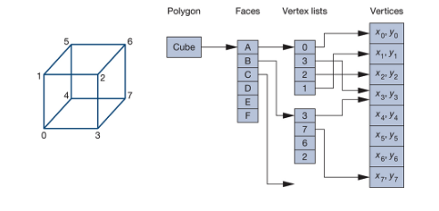

# Modeling a Colored Cube

---

## Modeling a Colored Cube

We now have *most* of the conceptual knowledge required to build a three-dimensional graphical application. 


The goal is to create a rotating colored cube

1. Where we'll first model the cube
2. then introduce affine transformations to rotate it
3. And finally use a model view matrix to view it from a camera perspective.

---

## Define the Cube's Vertices

While we can represent a cube like two-dimensional shapes, simply as a set of vertices in an array

It would make things easier to handle the relationships between vertices, edges, and faces if we used a data structure.

In WebGL, this is typically done through using **vertex arrays**

---

## Define the Cube's Vertices

A cube is one of the simplest three-dimensional object we might need to model and display.

A CSG system would consider it as a **single primitive**, and a hardware process would define it as **8 vertices**

Because we use a *surface-based* model, we can approach the cube as a set of 6 planes, sometimes called *facets*, that comprises its faces.

A carefully designed data structure should support both a **high-level** application specification of a cube and a **low-level** model needed for implementation.

---
layout: two-cols-header
---

## Define the Cube's Vertices

We first start by assuming that the vertices of a cube are available in an **array of vertices**. Either in a vector 3 format, or in vector 4 to factor in the *homogenous coordinates**

Though with `MV.js` there is no difference as it automatically adds the homogeneous coordinate on the `vec3` data type.

::left::
```javascript
var vertices = [
    vec3(-0.5, -0.5, 0.5),
    vec3(-0.5, 0.5, 0.5),
    vec3( 0.5, 0.5, 0.5),
    vec3( 0.5, -0.5, 0.5),
    vec3(-0.5, -0.5, -0.5),
    vec3(-0.5, 0.5, -0.5),
    vec3( 0.5, 0.5, -0.5),
    vec3( 0.5, -0.5, -0.5)
];
```

::right::
```javascript
var vertices = [
    vec4(-0.5, -0.5, 0.5, 1.0),
    vec4(-0.5, 0.5, 0.5, 1.0),
    vec4( 0.5, 0.5, 0.5, 1.0),
    vec4( 0.5, -0.5, 0.5, 1.0),
    vec4(-0.5, -0.5, -0.5, 1.0),
    vec4(-0.5, 0.5, -0.5, 1.0),
    vec4( 0.5, 0.5, -0.5, 1.0),
    vec4( 0.5, -0.5, -0.5, 1.0)
];
```

---

## Homogenous coordinates

When representing a vector in 3 dimensions, there will always be confusing on whether or not it's a point or a vector

Consider what happens when we move from a coordinate system, just basis vectors. To a frame with an origin point.

We would define a point as
$$
P = P_0 + xv_1 +yv_2 + zv_3
$$

Where $x, y, z$ are the components of the point. The problem is that's *really close* the same representation of a vector. And if you read it as purely the representation, it's **exactly** the same

So given $x, y, z$, without added context, it can be read as both a point at $x, y, z$ or a vector from the origin to the location $x, y, z$

---
layout: two-cols
---

## Homogenous coordinates

To avoid this, we simply use a 4 dimensional representation for both points and vectors 

and so $P$ can be represented purely from its components as

$$
P = 
\begin{matrix}
    \alpha_1 \\ 
    \alpha_2 \\ 
    \alpha_3 \\ 
    1
\end{matrix}
$$

Whereas a vector would be represented as 

$$
v = 
\begin{matrix}
    \beta_1 \\ 
    \beta_2 \\ 
    \beta_3 \\ 
    0
\end{matrix}
$$

::right::

This **preserves** already existing transformations, though with **16** scalars instead of 9. But it changes how a translation function (which is usually represented as a 4×4 matrix in homogeneous coordinates) interacts with the object.

A point, with a **4th scalar of 1**, will be affected by a translation. While a vector, with a **4th scalar of 0**, will not

Are we sending points or vectors?

```javascript
var vertices = [
    vec4(-0.5, -0.5, 0.5, 1.0),
    vec4(-0.5, 0.5, 0.5, 1.0),
    vec4( 0.5, 0.5, 0.5, 1.0),
    vec4( 0.5, -0.5, 0.5, 1.0),
    vec4(-0.5, -0.5, -0.5, 1.0),
    vec4(-0.5, 0.5, -0.5, 1.0),
    vec4( 0.5, 0.5, -0.5, 1.0),
    vec4( 0.5, -0.5, -0.5, 1.0)
];
```
---

## Inward or outward pointing faces

The order in which we define our vertices matters.

We used the order **0, 3, 2, 1** for the first face

And **1, 0, 3, 2** would be the same because the final vertex position in a polygon specification is linked back to the first

But the order 0, 1, 2, 3 is different

It describes the same boundary but the face will now point inward rather than outward.

A right hand rule is used to determine the orientation of the face based on the order of the vertices.

---

## Data structures for object representation

We could use

```javascript
let faces = new Array(6);

for (let i = 0; i < faces.length; ++i) {
    faces[i] = new Array(4);
}
```

or

```javascript
var faces = new Array(24)
```

---

## Data structure for object representation

where vertices[i] would contain the x, y, z coordinates of the $i$th vertex in the list.

Both of these methods *work* but they fail to capture the essence of the cubes **topology**, only the *geometry*

If we think of the cube as a *polyhedron*, a 3d figure with flat polygonal faces, we have an object that has 6 faces

- Each of those faces are quadrilaterals that meet at vertices
- each vertex is shared by 3 faces
- pairs of vertices define an edge
- each edge is shared by two faces 

These statements describe the topology of a cube

> A topologist is a person who cannot tell the difference between a coffee mug and a donut

---

## Topology vs Geometry

all are true, **regardless of the location** of the vertices, meaning that they're true regardless of the geometry of the object.

By separating the topology from the geometry, we can create a more flexible and reusable data structure.

We can create this kind of system by defining a *cube* that's *composed* of six faces, where each face consists of four ordered vertices, and each vertex can be specified indirectly through its index



One major advantage of this approach is that each geometric location appears only once, instead of being repeated for each face.

If in a program, the location of a vertex is changed, every instance of that vertex will automatically reflect the change.

---

## Colored cube

We can then define a cube with color attributes by using a function `quad` that takes four vertex indices in outward pointing order and a color as parameters.

```javascript
function colorCube()
{
    quad(1, 0, 3, 2);
    quad(2, 3, 7, 6);
    quad(3, 0, 4, 7);
    quad(6, 5, 1, 2);
    quad(4, 5, 6, 7);
    quad(5, 4, 0, 1);
}
```

---

## Colored cube

and by setting up a `vertexColor` array to hold some colors

```javascript
var vertexColors = [
    [0.0, 0.0, 0.0, 1.0], // black
    [1.0, 0.0, 0.0, 1.0], // red
    [1.0, 1.0, 0.0, 1.0], // yellow
    [0.0, 1.0, 0.0, 1.0], // green
    [0.0, 0.0, 1.0, 1.0], // blue
    [1.0, 0.0, 1.0, 1.0], // magenta
    [1.0, 1.0, 1.0, 1.0], // white
    [0.0, 1.0, 1.0, 1.0] // cyan
];
```

---
## Colored cube

Then finally define the `quad` function to push the vertices and colors into the appropriate arrays

```javascript
function quad(a, b, c, d)
{
    let indices = [a, b, c, a, c, d];
    for (var i = 0; i < indices.length; ++i) {
        positions.push(vertices[indices[i]]);
        colors.push(vertexColors[indices[i]]);
    }
}
```


