# Viewing

---
layout: center
---

# Types of views
The different types of views and why we use them

---

## Classical

Before going into computer graphics systems, let's first look at how we classically view objects

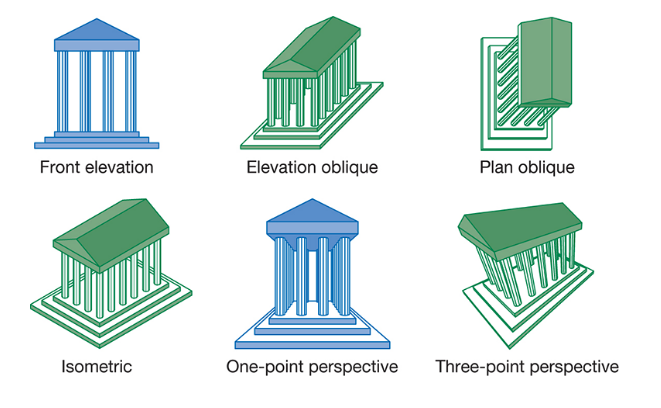

Each classical view is determined by a specific relationship between the object and the viewer. With the underlying object of a **planar face**.

In architecture for example, there are natural *notions* of front, back, side faces, etc. The relationships between these *notions* is what determines the type of view.

---
layout: two-cols
---

### Orthographic

The first classical view is the **orthographic views**.

<div class="flex items-end gap-2">
    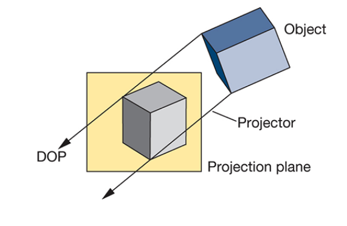
    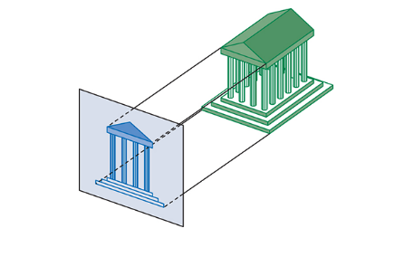
</div>

In all orthographic views, the projectors are **perpendicular** to the projection plane.

This view **preserves both distances and angles** without distortion, which makes it ideal for technical drawings.

::right::


And we usually make **multiple projections** such as front, top, and right, to get a complete understanding of the object.


---
layout: two-cols
---

### Axonometric Projections

If we want to see more principal faces, we must remove *one* of our restrictions in orthographic views.

This gives us **axonometric projections**. It's still *orthogonal* to the projection plane

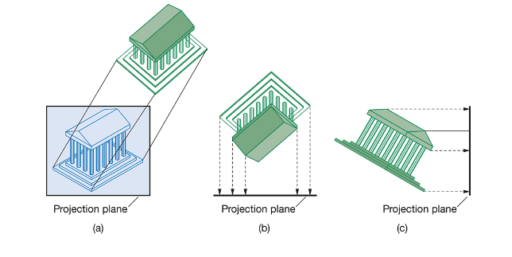

But the projection can have **any orientation** with respect to the object.

::right::

And if the projection plane is placed symmetrically with respect to three principal faces that meet at a corner of a rectangular object

It's called an **isometric projection**.

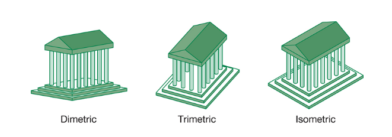

If the projection plane is placed symmetrically with respect to two principal faces, it's called a **dimetric projection**.

And the general case is called a **trimetric projection**.

This causes **distortion**, which is the price we pay to see more than one principal face at a time.

---

### Oblique Projections

The most general type of parallel projection is the **oblique projection**.

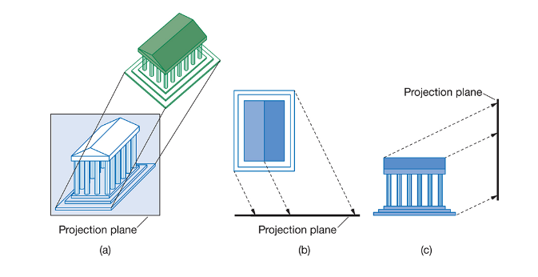

In this type we allow **any arbitrary angle** from the projectors to the projection plane

Oblique projections allow us to view multiple principal faces, but still preserves **distances and angles** along one axis.

They tend to be somewhat unnatural, but are often used in technical drawings to allow for **measurement along one axis**, while still showing the other two axes.

---
layout: two-cols
---

### Perspective Viewing

All perspective views are characterized by diminution of size or **foreshortening**.

The farther away something is, the *smaller it appears*.

This gives perspective views the most **natural** appearance. But, because of this foreshortening, they do not preserve distances or angles.

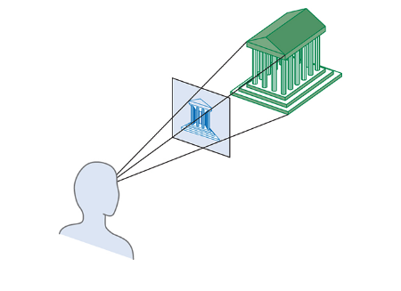

::right::

Usually this comes in the form of **one-**, **two-**, and **three-point perspectives**.

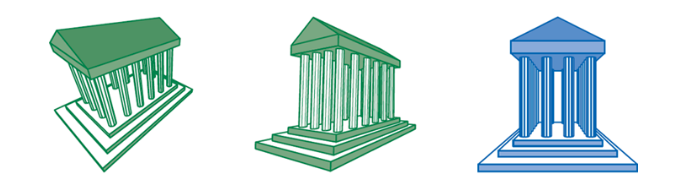

In three point perspective, all three parallel lines of the three principal directions converge to a vanishing point.

In two point perspective, two sets of parallel lines converge to two vanishing points, while the third set remains parallel.

And in one point perspective, one set of parallel lines converges to a single vanishing point, while the other two sets remain parallel.

---

## Viewing with a computer

There is a fundamental difference between viewing classically, and through a computer graphics system.

In classical viewing, the views are based on a **relationship** between objects, viewer, and projectors. While in computer graphics, there is an **independence** to the object specifications and the camera itself

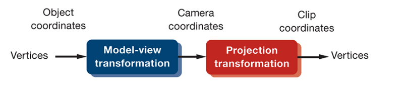

Where instead of a unique relationship between a object, viewer, and projectors defining the projection. 

We have independent objects and cameras whose projection is defined purely through a series of **transformations**.

---
layout: center
---

# Threejs
Because we don't have time 

We'll be exploring these new concepts, as well as retreading old concepts with Threejs

Now with some knowledge of how it technically works under the hood

---

## An introduction to Threejs

**Threejs** is a library that tries to make it as easy as possible to get **3D content on a webpage**. Either in the form of a static image, an animation, or an interactive application.

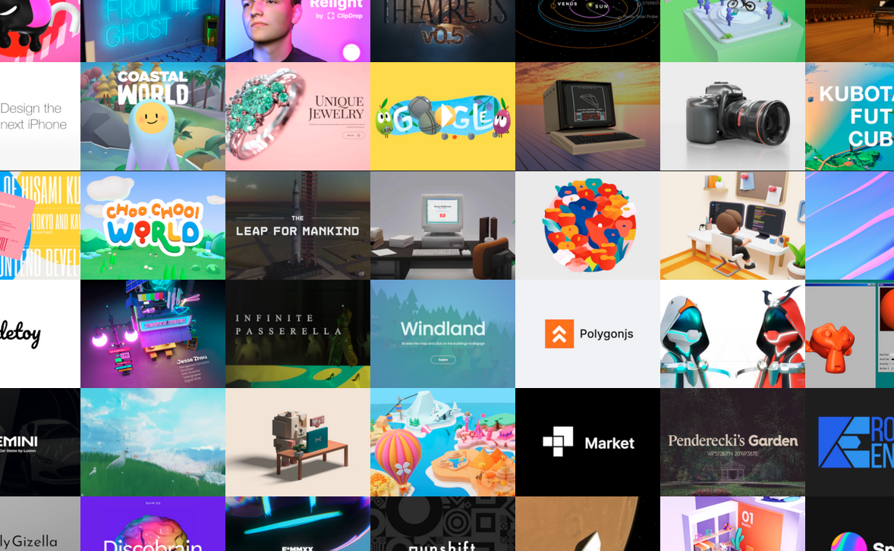

And it *often*, but *not always*, uses **WebGL under the hood** to do so.

While it would take a large amount of WebGL knowledge to build a 3D application from scratch, Threejs **abstracts away** much of that complexity.

---
layout: two-cols
---

## The structure of a Threejs application

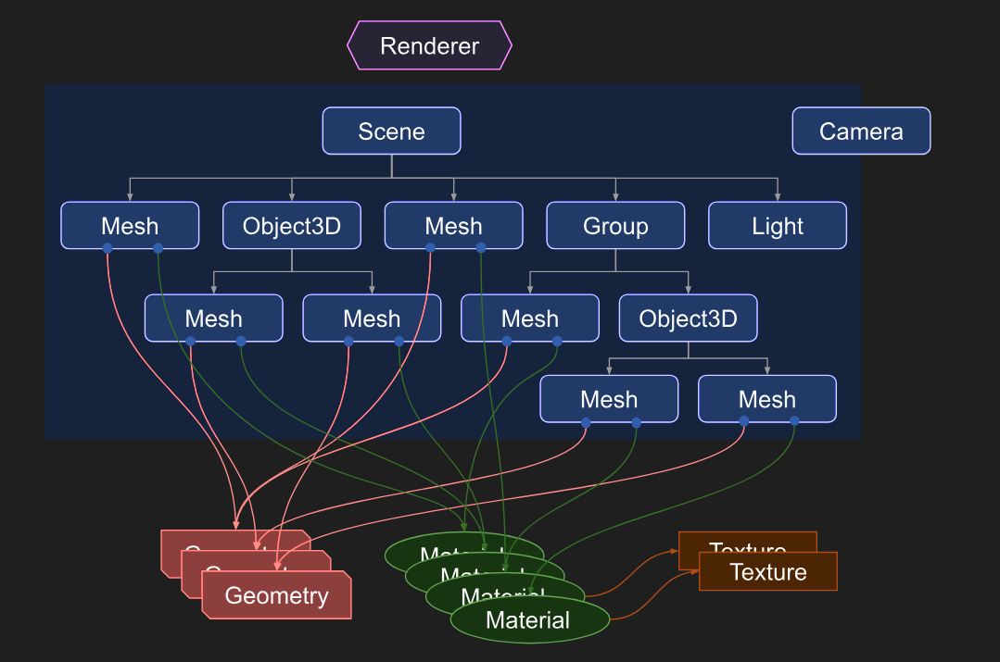

Threejs uses an **object oriented** approach, arranged in a **graph structure**, to represent a 3D application.

Some important objects being:

::right::

1. the **Renderer**, the main object of threejs, and by passing a `scene` and a `camera`, it produces the final image

Think of the `render` function we implemented in `WebGL`

2. the **Scenegraph** which holds a **Scene** object, this holds all the objects in the 3D world

Note how they are in a *hierarchic* order, which allows for relative and global positioning

3. Various objects such as **Geometry**, **Material**, **Mesh**, and **Light** objects

These define the shapes, colors, and lighting of the objects in the scene (ver)

---
layout: center
---

# Hello Cube
As tradition dictates

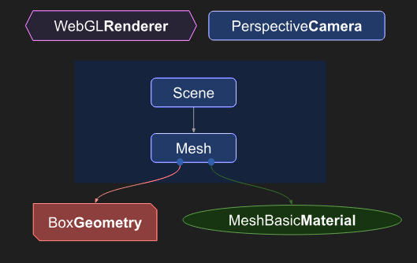

---
layout: two-cols
---

## CodeSandbox

So that we don't have to set up a local environment, we'll be using **CodeSandbox** to run our Threejs code

Step 1 is to open [codesandbox.io](https://codesandbox.io) in your browser, create an account

Step 2 is to import `sininen-blue/threejs-template` in github import on the top-right, 

Use the pico runtime to make sure you don't run out of credits

::right::

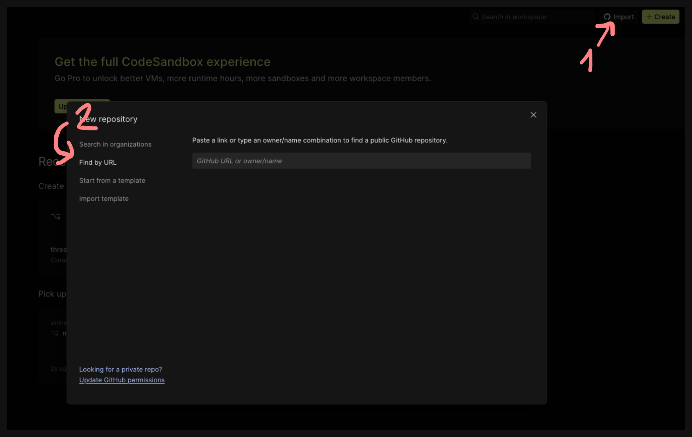

This will give you a basic Threejs template to start from

---
layout: center 
---

## CodeSandbox Setup

1. In your code sandbox you have 2 files, `index.html` and `main.js`
2. Index holds your HTML structure, while `main.js` holds your JavaScript code
3. When prompted to `Configure microVM environment` Select Universal template and keep pressing next 
4. Disable `Code completion by Codeium` on step 5
5. and `skip project setup` on step 6

---
layout: center
---

## Canvas

Like with WebGL, Threejs uses an HTML `<canvas>` element to render the 3D content

Create a canvas with an id inside your `<body>` tag in `index.html`, make sure it's above the script tag

---
layout: center
---

## JS

Insider your `main.js` file, under the import statement which imports Threejs, we can start coding our application

```js
function main() {
    const canvas = document.querySelector('#your-canvas-id');
    const renderer = new THREE.WebGLRenderer({antialias: true, canvas});
}
main();
```

Here we find your canvas, then use it to create a `WebGLRenderer` object

Technically, if you don't pass a canvas, Threejs will create one for you, but it's good practice to create your own

---
layout: two-cols-header
---

## Perspective Camera


On the very top of your `main` function, add the following code:
```js
const fov = 75;
const aspect = 2;
const near = 0.1;
const far = 5;
const camera = new THREE.PerspectiveCamera(fov, aspect, near, far);
```

::left::
For our first major departure from WebGL, we'll be using a prebuilt **Perspective Camera** instead of defining our own projection matrix

This defines our cameras **field of view**, **aspect ratio**, and **near** and **far clipping planes**

And at the bottom of that

```
camera.position.z = 2;
```

::right::

<div class="flex items-end gap-2">
    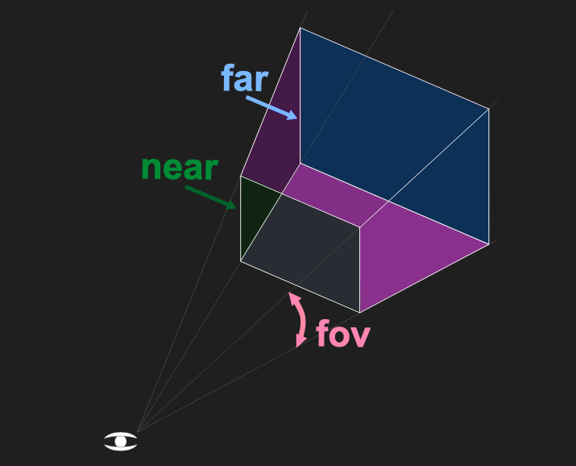
    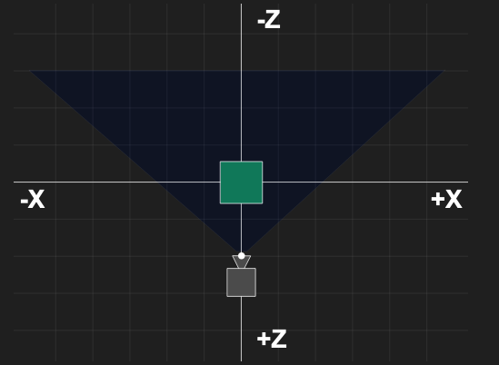
</div>

The camera defaults to **looking down -z** with +y as up, so move it forward a bit

---

## Scene and box

Next is to make a **scene** to hold our box

Below the camera code, but still inside the main function, add:
```js
const scene = new THREE.Scene();
```

And for the box, define it by
```js
const boxWidth = 1;
const boxHeight = 1;
const boxDepth = 1;
const geometry = new THREE.BoxGeometry(boxWidth, boxHeight, boxDepth);
```

And finally, define a material for the box so we can see it
```js
const material = new THREE.MeshBasicMaterial({color: 0x44aa88});
```

This nets us a **list of vertices** that define a box with that width, height, and depth. And a **basic material** with a color

---
layout: two-cols-header
---

## Mesh, adding, and rendering

Now we can combine the geometry and material into a **mesh** that we can add to the scene

```js
const cube = new THREE.Mesh(geometry, material);
scene.add(cube);
renderer.render(scene, camera);
```

You'll notice that you don't actually have a browser to view yet

## Running threejs in codesandbox

::left::
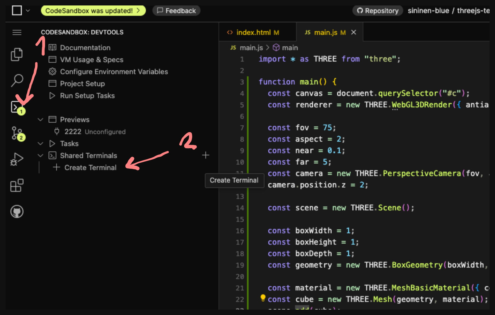

::right::
Create a terminal and write

```sh
npm install --save three
npm install --save-dev vite
```
and then

```sh
npx vite
```

When prompted to open a preview, click yes

---
layout: center
---

# Result

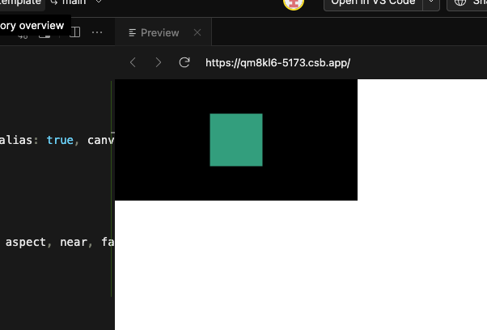

Doesn't look like a 3d box, but it is

---

## Rotate it

To rotate it, we can use the built-in rotation properties of the mesh

Still inside your main function, and below the `scene.add(cube);` line, add

```js
function render(time) {
    time *= 0.001;  // convert time to seconds

    cube.rotation.x = time;
    cube.rotation.y = time;

    renderer.render(scene, camera);
    requestAnimationFrame(render);
}
```

And below that, replace the previous `renderer.render` call with

```js
requestAnimationFrame(render);
```

---
layout: center
---

## Result

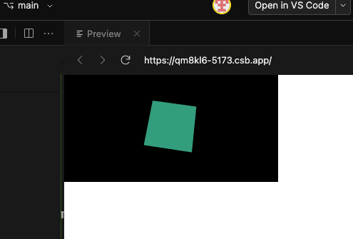

Not the best looking cube, but it's rotating

---

## Lights

To make it look more 3d, add let's lights

Above the `render` function somewhere, add

```js
    const color = 0xFFFFFF;
    const intensity = 3;
    const light = new THREE.DirectionalLight(color, intensity);
    light.position.set(-1, 2, 4);
    scene.add(light);
```

And replace the material of the cube from

```js
const material = new THREE.MeshBasicMaterial({color: 0x44aa88});
```
to
```js
const material = new THREE.MeshPhongMaterial({color: 0x44aa88});
```

Here, we're using a **Phong** material, named after the inventor of the Phong reflection model

---
layout: center
---

# Cube
Cube

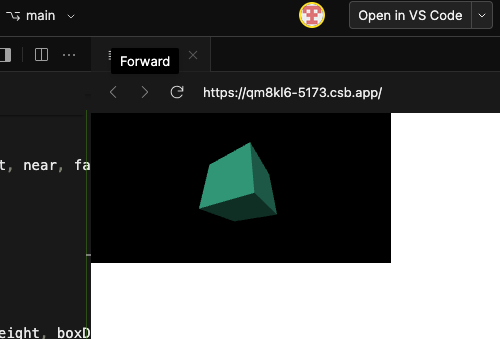

Cube

---
layout: center
---

## Exercise

1. Change the color, intensity, and position of the light
3. Change the position of the camera
3. Change the color of the cube
4. Add another cube

Once you're done, raise your hand
