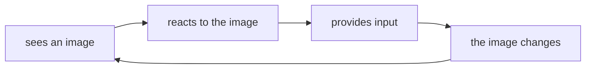
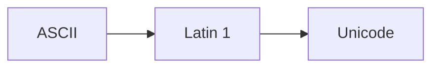
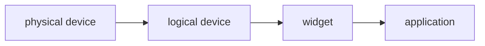
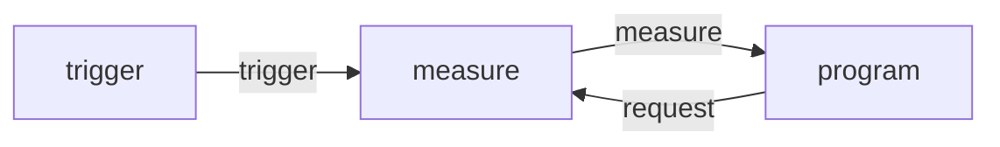

# Interaction

---

## Interaction

One of the most important advancements in computer technology was the invention of interaction.

Primarily pushed by Ivan Sutherland's Sketchpad, his project launched the current era of *interactive* computer graphics

His model of how interaction worked was deceptively simple, but so generalized that it's still being used today

---

## Interaction

Because rendering is the primary concern of OpenGL, and thus WebGL, interaction is not directly supported

The main reason for this is *portability*, because OpenGL and WebGL don't have standard APIs for handling events and user input, it can be placed in any environment without modification.

This means that interaction must be *handled* by the application or the environment, usually through a third party library in the case of OpenGL, where the library changes depending on the system it's on. Both for input and also window handling.

---

## Interaction in WebGL

Because WebGL is embedded in a browser, we can both use the browser's built in event and window handling, as well as the variety of third party libraries available for the web.

We will mainly be using vanilla JavaScript to handle interaction without using any higher level packages.

---

## Input Devices

Before handling interaction, we need to understand the different types of input devices

There are two main ways of understanding input devices:
1. Physical
2. Logical

---

## Physical Model

In the physical model, we think of an input device in terms of it's physical properties

- A mouse has a laser, two buttons, and a scroll wheel.
- A trackball mouse has a ball, and two buttons, and sometimes a wheel.
- A keyboard has a set of keys, each with a switch and a label.

All these devices have different physical properties, and thus different ways of interacting with them. And from a purely physical perspective, they are not interchangeable.

---

## Logical Model

In the logical model, we think of an input device in terms of the *events* it generates

A black box with an input and output

In terms of computer graphics, we *prefer* the logical model

- A mouse has `mousemove`, `mousedown`, `mouseup`, and `wheel` events
- A trackball mouse has `mousemove`, `mousedown`, and `mouseup` events
- and a keyboard has ______

This allows us to use the same physical device in multiple ways, but also lets the program work without modification if the physical device changes, as long as the logical events are the same

---

## Physical input devices

From a physical perspective, each input device has properties that make it better for certain tasks for others

Historically, however, there are two main categories of input device
1. *pointing* devices, to indicate position
2. *keyboard* devices, to return character codes

---

## Keyboards and keyboard codes

A mouse, from a logical perspective, can be thought of as a keyboard as long as at least one of its buttons generates and sends a character code

A keyboard, from a logical perspective, is just a set of buttons that generate and send character codes

For many years, the standard for character codes was ASCII, American Standard Code for Information Interchange. And it contained only 127 codes, which was then expanded to a larger 8-bit character set known as Latin 1 which can represent most European languages

Then Unicode was developed as a 16-bit code that's capable of supporting almost every written language 

Note that Unicode is a superset of Latin 1, which is a superset of ASCII

---

## Mouse and Trackball

A mouse is a physical device that turns the motion of a ball or the feedback of a laser, into a vector of motion which is then translated into a change in position of a pointer on the screen

This usually takes the form of an optical sensor or a mechanical motion sensor

Motion, usually in two independent axes, is the primary output of a mouse, and is interpreted by a decoder which is then sent to the computer

In most cases, this means that they provide *relative positioning*, where the motion of the mouse is relative to the current position of the pointer

---

## Tablets, touch pads, and touch screens

Data tablets provide *absolute positioning*, where rows and columns of wires or a capacitive layer can determine the exact position of a stylus or finger on the surface of the tablet

Touch pads in particular are a common feature on laptops, and provide a small surface for relative positioning, but through the lens of a logical model, they can be treated as an absolute positioning device

These devices also allow for more complex gestures, such as *multi-touch*, pinching, and swiping, which while still under the purview of a pointing device, can be thought of as a completely different class of input

---

## Multidimensional input devices

Finally, we have multidimensional input devices, which are usually specialized devices for specific applications, though usually not as common as two-dimensional input devices

But recent technology has made these devices slightly more common, especially with the rise of augmented reality and virtual reality

Examples of this include
- kinect
- virtual reality
- robotics
- wii remote
- mocap suits
- phones

---

## Logical devices

From a logical point of view, an input device has two main characteristics
1. the *measurements* the device returns to the user program
2. the *time* when the device returns those measurements

Historically, APIs defined six classes of logical input device, like a `locator device` which would provide a position in object coordinates, a `pick device` would provide an identifier for an object, etc

---

## Logical devices

However, because modern window systems cannot always be disassociated completely from the properties of the physical device, most systems no longer use these classes.

Instead they use a layer in between, usually in a display such as a pop-up menu or a button, also known as a `widget`

---

## Input modes

From a device to an application we have two main entities

1. the measure, which is what the device returns
2. the trigger, which is what the device uses to send the measure

For example
> A keyboard has a measure (a character code) and a trigger (a key press)

And the application has two modes of getting that measure defined by the relationship between the measure process and the trigger

Once a measure process is started, the measure is taken and placed in a buffer, and depending on the mode, the application can either get the measure when it wants, or when the device wants to send it

---

## Request Mode

In this mode, the measure is not given to the program until the device is triggered. For example, 

in a C program that requires user input, we use the function _____

This stops the program, and lets the user type,

We can take as long as we like, and that data is placed in a buffer, and only when a specific trigger is given, such as pressing the `enter` key, is the data sent to the program

---

## Request mode

A characteristic of request-mode inputs is that the user must identify which device is to provide the input.

This means that we ignore any other information from other input devices other the one specified.

Request mode is useful for situations inwhich the program guides the user,
