# Graphics Computing

Introduction to Graphics Programming

---
layout: image-right
image: images/sierpinski_triangle.png
---

## The Sierpinski Triangle

The Sierpinski triangle is an object that can be defined recursively and randomly, with proporties that aren't themselves random

It's an interesting shape, and we'll start trying to create a 2D version of it

---
layout: float-right
image: images/fig2.jpg
---

## Imagine we start with three points in space

As long as the points are 
- non-collinear, meaning they don't all lie on a straight line
- they are the vertices of a unique triangle, 
- and also define a unique plane

We can start creating a Sierpinski triangle

---
layout: float-right
image: images/fig2.jpg
---

For now, we'll assume ignore the z coordinate and assume $z = 0$

So when specified in some coordinate system, our three points are:
1. $(x_0, y_0, 0)$
2. $(x_1, y_1, 0)$
3. $(x_2, y_2, 0)$

---
layout: float-right
image: images/fig2.jpg
---

## To start creating the image
1. pick an initial point, $p = (x, y, 0)$, at random inside the triangle
2. select one of the three vertices at random
3. find the point $q$ halfway between $p$ and the randomly selected vertex
4. display $q$ by putting some sort of marker, like a circle
5. replace $p$ with $q$
6. repeat steps 2-5, a number of times

---
layout: center
---

## Exercise

Try creating a Sierpinski triangle using the steps above on paper

---
layout: two-cols
---

## Immediate mode graphics

A possible implementation in WebGL would be

This type of graphics programming is called **immediate-mode graphics** and was the standard for many years especially when interactive performance was needed

In this implementation, we don't store any data to the GPU

So redrawing the points would require us to send the data again to the GPU, which is a slow process

::right::
```javascript 
function sierpinski() {
    initializie_the_system();
    p = find_initial_point();

    for (some_number_of_points) {
        q = generate_a_point(p);
        display_the_point(q);
        p = q;
    }
    cleanup();
}
```

---
layout: two-cols
---

## Retained mode graphics

If we want to be able to display the points again without doing that we can use something like

1st we compute all the points, then we put them into the GPU

And because we know where all the points are, we can re-display the points significantly faster, unless we change the position of the points

<!-- But this means that if we want to move the objects in a new position, we need to recompute all the points and send them again to the GPU -->

This is called **retained-mode graphics** 

::right::
```javascript 
function sierpinski() {
    initialize_the_system();
    p = find_initial_point();

    for (some_number_of_points) {
        q = generate_a_point(p);
        store_the_point(q);
        p = q;
    }
    display_all_points();
    cleanup();
}
```

---
layout: two-cols
---

## Modern retained mode graphics

And with modern graphics systems, we can create a third version of our program

Since the second program has one major flaw. Moving the objects require sending the data from the CPU to the GPU each time we wish to display a new position 

Now we have the display in two parts. Storing the data on the GPU and telling the GPU to display the data

If we only display the data once, this has no advantage

::right::
```javascript
function sierpinski() {
    initialize_the_system();
    p = find_initial_point();

    for (some_number_of_points) {
        q = generate_a_point(p);
        store_the_point(q);
        p = q;
    }

    send_all_points_to_GPU();
    display_all_points_on_GPU();
    cleanup();
}
```


But if we want to animate the display, since our data is already on the GPU, we just use a function call that alters the location of some spatial data

---
layout: center
---

## Programming 2D Applications

---

For our purposes, we'll regard 2d applications as a special case of 3d

Where we'll view the two-dimensional plane as a subspace of the three-dimensional space

We'll represent a point in the plane $z = 0$ as $p = (x, y, 0)$ in the three-dimensional world or simply $p = (x, y)$

In WebGL, either representation is valid and will use the same representation regardless

---

## A side note on vertices and points

We use the terms *vertex* and *point* slightly differently in computer graphics compared to other fields.

A **vertex** is an object, whose *attributes* is its positiof in space, and we use them to specify the atomic (smallest) geometric primitives that we can draw

The simplest being a point in space, 
- which is specified by a single vertex
- Two vertices can be used to specify two points or a line (another primitive)
- They can also be used to specify a circle or a rectangle 
- Three vertices can be used to specify either a triangle or a circle
- Four for a quadrilateral
- etc

---
layout: float-right
image: images/fig3.webp
---

To turn our third program into a WebGL program, we will ignore a few things for the sake of simplicity

For one, we'll delay the discussion of coordinate systems and how to represent them in WebGL

And instead we'll use something called clip coordinates, where everything outside the clip coordinates will be ignored

This is a cube where its principal diagonal is from $(-1, -1, -1)$ to $(1, 1, 1)$

Later, we'll learn to specify coordinates better, then transform those object coordinates into clip coordinates

---

## Defining a point

To define a vertex we can theoretically use

```javascript
var p = [x, y];
```

But a JavaScript array isn't just an ordered set of numbers like in C, it's an object with methods and properties, like length

This is important because a GPU expects a simple 32-bit IEEE floating point number

There are ways to convert this to a `Float32Array`, such as

```javascript
var p = new Float32Array([x, y]);
```

But it's easier to create an object that has what we need

We'll be using `MV.js` which is provided with the book

---

## Sample Code

```javascript {all|1-2|3-7|9-12|14-18|15|16-17|all}
const numPositions = 5000;
var positions = [];
var vertices = [
    vec2(-1.0, -1.0),
    vec2(0.0, 1.0),
    vec2(1.0, -1.0)
];

var u = mult(0.5, add(vertices[0], vertices[1]));
var v = mult(0.5, add(vertices[0], vertices[2]));
var p = mult(0.5, add(u, v));
positions.push(p);

for (var i = 0; i < numPositions - 1; ++i) {
    var j = Math.floor(Math.random() * 3);
    p = mult(0.5, add(positions[i], vertices[j]));
    positions.push(p);
} 
```

---

## Some questions

But before we start thinking about WebGl, let's answer a few questions

1. In what colors are we drawing?
2. Where on the display does our image appear?
3. How large will the image be?
4. How do we create an area of the display -a window- for our image?
5. How much of our infinite drawing surface will appear on the display
6. How long will the image remain on the display?

All of the code we'll be writing file will be answering these questions

---
layout: center
---

# WebGl And Graphics pipelines

---

# A look into WebGl
A few functions

Our model of a graphics system is something called a *black box*, a term used to say that a system is only described by its inputs and outputs


Some of the basic function calls we'll be using are the following

---

## Primitive functions

This lets us specify low-level objects or atomic entities that we can display

WebGl like most low-level APIs only support things like points, lines, and triangles

More complex shapes that aren't supported require either creating it from scratch or using a library

If the primitives are our *what* then the attributes are our *how*

For example, `vertices` have an *attribute* of `position`.

Other attributes are `color`, `normal` `vector`, `texture coordinates`, etc

---

# Other functions
There are also other functions in Webgl we'll be using

### Viewing functions 

Allow us to specify the attributes of our camera (viewer)

It let's us change the position, orientation, and even objects clip out of view

### Transformation functions

WebGl also provides many transformation functions 

In our case, we'll be using the transformations in `MV.js`

### Input functions

Allow us to take in input from many types of devices, and because WebGl is a web-based API, we can usually input we get through HTML5 or JavaScript

---

## Working with WebGl in abstract

WebGl is a fairly organized system, and we can think of it as a *state machine*

Where our inputs (functions and inputs) change the state of the system, or cause it to produce a visible output

From the perspective of the API, there are only two types of functions: 
1. Functions that change the flow of data inside the state machine
2. Functions that change the state of the machine itself

In our case, we'll likely only ever use one render function, and all other functions will be changing the state of the machine

---

## Coordinate systems

What units are our coordinates in? In our case, those numbers mean whatever we want them to mean

In graphics, we've separated the coordinate systems into several types called *device-independent graphics*

The user's system is known as the *world coordinate system* or *application coordinate system*, on OpenGl, the term *object coordinate system* is preferred

We then need to convert our coordinates into *device coordinates*. Usually we call these *window coordinates*

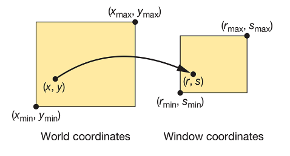

---
layout: center
---

# Primitives and attributes

---

## Primitives

Most GPUs can render only triangles and possible quads

In WebGl, we can separate primitives into two classes: 
- geometric primitives
- image primitives

And these primitives pass through a pipeline

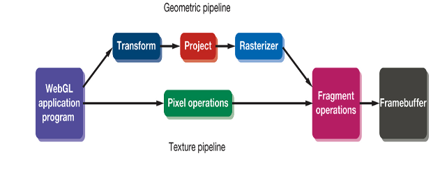

Note that image primitives don't have geometric properties and can't be manipulated in space the same way

---
layout: two-cols
---

## Displaying

In WebGl, if we want to display some geometry, we execute functions whose parameters specify how the vertices are to be interpreted

For example, we can display the vertices in `numPositions` using


There are also many other primitives we can use


::right::

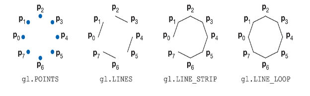

And we can adjust those primitives through

```javascript
gl.drawArrays(gl.POINTS, 0, numPositions);
```

And set their attributes through

```javascript
#gl.pointSize(10.0);
gl.lineWidth(2.0);
```

<style>
.grid-cols-2 {
    grid-template-columns: minmax(0, .7fr) minmax(0, 1fr);
}
</style>

---

## Polygons

To display the exterior of three-dimensional objects, we can use polygons, which is defined as a sequence of vertices

Polygons play a special role in computer graphics because we can display them quickly and use them to approximate any surface

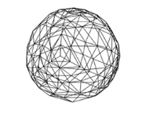

---
layout: two-cols
---

## Polygons

To make sure a polygon renders well, it needs to be simple and convex

## Simple

*Simple* meaning no two edges of a polygon cross each other

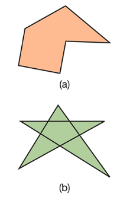

::right::

## Convex

And *convex* meaning all points on the line segment between any two points inside the object are inside the object

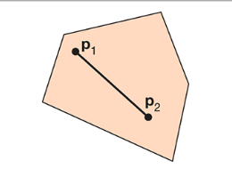

---

## Polygons in WebGl

The only polygons WebGl supports are triangles, along with the primitives points and lines

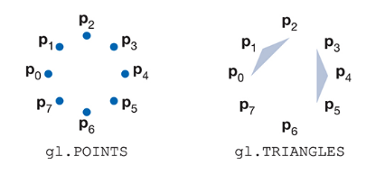

And from this, you can approximate any polygon

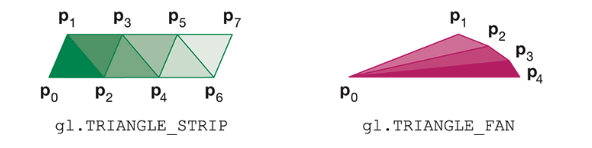

---

## Triangulation

In order to display polygons, we need to *triangulate* them, converting any arbitrary polygon into a set of triangles

And while there are many types of triangulation algorithms

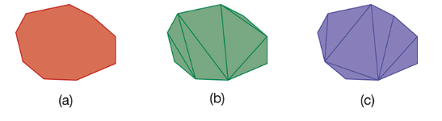

We won't be discussing them too deeply, but each triangulation method does have its strengths and weaknesses

---

## Vertex Attributes

Consider the fact that there are many different ways to render a line or polygon

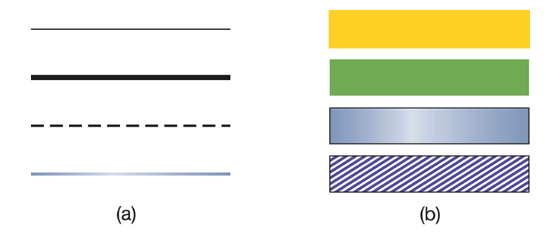

We need to make use of *vertex attributes*

Vertex attributes, like color, are locked or bound to vertices and thus to the geometric object they specify

---
layout: center
---

# Color

---

## Color

A visible color can be characterized by the function $C(\lambda)$ defined for wavelengths from about 350 to 780 nm

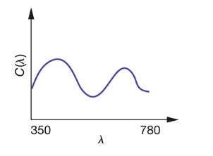

This is accurate for physical color, but not for perceived color

---

## Color

The human visual system has three cones responsible for vision. So our brains can't get the entiretiy of $C(\lambda)$

We only get a tristimulus value, and if two colors produce the same tristimulus value, they are indistinguishable to us

Because of this, when displaying colors, we need to produce the tristimulus value needed for a human observer

We can go about this either through *additive* means or *subtractive* means

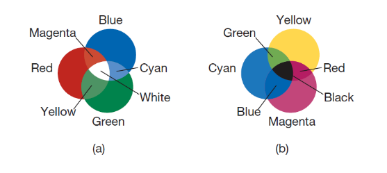

---

## In WebGl

In graphics systems, there are two different ways to represent colors

1. *RGB*: Red, Green, Blue, where each color is represented by a number between 0 and 255
2. *Index color model*: where each color is represented by an index into a color table

We'll only be talking about the RGB model, as it's the most common in modern graphics systems today

---

## RGB

Conceptually, in an additive RGB system, there are separate buffers for red, green and blue

In a `1280x1024` array of pixels, and each pixel having ~`24 bits`, it might be a problem to store and display those colors in the frame buffer

With modern GPUs, having at minimum `4GB` of memory, this isn't a problem

And to define those colors, we can use a vector of three numbers, each between 0 and 1, to avoid having to specify specific amounts of bits

```javascript
var vertexColors = [
    vec3(1.0, 0.0, 0.0),
    vec3(0.0, 1.0, 0.0),
    vec3(0.0, 0.0, 1.0)
];
```

---

If we wanted to add colors to our Sierpinski triangle, we could do something like

```javascript
var colors = [];

for (var i = 0; i < numPositions - 1; ++i) {
    // determine the vertexColor[i] to assign to vertex at positions[i]

    colors.push(vertexColors[i]);
}
```

Or just us a single array that has both colors and vertex locations

---
layout: center
---

# Viewing

---

## Viewing

Assuming that we have specified both the scene and the camera, we can display the scene

Usually this means projecting our view in one way or another, but because our triangle is currently only in 2d, we'll skip this for now

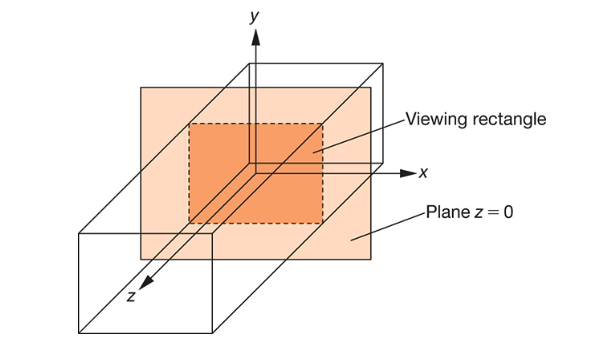

And because we're in 2d, our viewing area is simply a plane with $z = 0$

---

## Viewing

Or we can directly transfer that plane into the camera's coordinate system, otherwise known as the *viewing rectangle* or the *clipping rectangle*

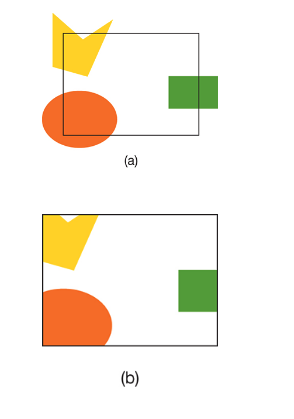

---

## Summary
- Sierpinski Triangle: A recursive pattern generated by repeatedly choosing midpoints between a point and triangle vertices.
- Graphics Modes:
    - Immediate Mode: draw each point directly (slow).
    - Retained Mode: store points first, draw later.
    - Modern: store points in GPU memory for fast redraws.
- 2D in 3D: We treat 2D as the plane z = 0 in 3D space.
- Clip Coordinates: A cube from (-1, -1, -1) to (1, 1, 1) — the visible region in WebGL.
- Primitives: WebGL uses points, lines, and triangles; complex shapes must be triangulated.
- Vertex Attributes: Vertices carry data like position and color.
- Color: We use RGB values like vec3(1.0, 0.0, 0.0) for red.
- Viewing: For now, we draw directly in the clip space without complex camera setup.
