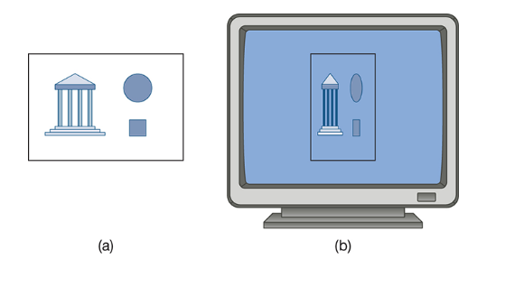
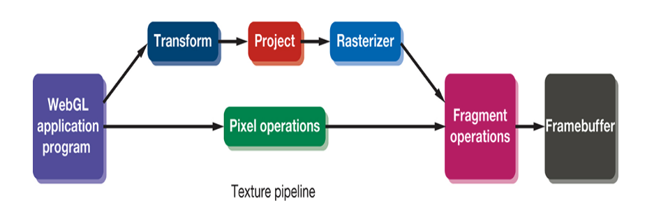

# Actually implementing the Gasket

---

## Canvas

Html5 has a canvas element built to be able to draw, usually this is used for 2d drawings in a pen-plotter model, but is now also used for WebGl

```html
<canvas id="gl-canvas" width="512" height="512"></canvas>
```

It's important to note the width and height, as well as the ID which can be anything, this ID let's us access the canvas in javascript

With this we have an at least 512x512 pixel size framebuffer

---

## Note about position references

References to positions in this window are relative to one corner

- In engineering, this is usually the lower left corner, so (1, 1) means 1 to the right and 1 up
- But raster displays start from the top left corner, so (1, 1) means 1 to the right and 1 down
- But webgl uses the lower left corner as the origin, so (1, 1) means 1 to the right and 1 up

This means mouse input coordinates might need to be flipped

---

# Aspect Ratio and Viewports
The ratio of a rectangle's width to its height

If the camera's parameters are different from the canvas, distortion may occur



Because the entire clipping rectangle is mapped to the canvas

---
layout: float-right
image: ./images/fig2.png
---

## Aspect Ratio and Viewports

One way to avoid it is to always make sure the window is the same as the clipping rectangle

But another more flexible method is to use a *viewport*

It's a rectangular area of the canvas, that by default is the entire canvas

```javascript
gl.viewport(x, y, w,, h);
```

Where `(x, y)` is the lower left corner of the viewport (relative to the lower left corner of the canvas)

And `w` and `h` give the width and height of that viewport

---
layout: center
---

## Application execution

What we want is to have a data structure that contains *all* the geometry and attributes we need

> Then send that to the shaders

Which will then process and display the result

---

## Application execution

So we have a program that gets the points of the triangle, then displays it, what next?
- one thing that could happen is that it exists after finished the execution
    - which could close the image the moment it renders

The mechanism employed by most graphics systems is to use *event processing* 

Which we'll use later on for interactive graphics programs, but in our case, we don't process any events so the image just stays

---
layout: center
---

# Back to the Gasket Program

---

# The html file
Our starting point will *always* be HTML, 

It:

1. Gather the resources we need, like the js, the packages, the shaders, etc
2. Describes the page we will display, in our case, just the canvas and it's size
    - It can also include buttons, sliders, and other interactive elements

---

# Basic HTML

```html
<!DOCTYPE html>
<html>
    <head>
        <script src="initShaders.js"></script>
        <script src="MV.js"></script>
        <script src="gasket.js"></script>
    </head>
    <body>
        <canvas id="some-name" width="512" height="512"></canvas>
    </body>
</html>
```

---

## Sending data to the gpu

```javascript
var bufferId = gl.createBuffer();
gl.bindBuffer(gl.ARRAY_BUFFER, bufferId);
```

`gl.createBuffer()` creates a buffer object in the GPU memory and returns an ID for it

The `gl.ARRAY_BUFFER` indicates that this buffer will be used for vertex attributes

And the `gl.bindBuffer()` makes the buffer the *current* buffer. And all functions that put data in a buffer will use this buffer until we bind a different one

---

## Sending data to the gpu

We now have space inside our GPU, but it doesn't have any data yet

```javascript
gl.bufferData(gl.ARRAY_BUFFER, flatten(positions), gl.STATIC_DRAW);
```

Once data is in the GPU, we can display it once, but in more realistic applications, we might alter the data and re-display it many times

That final argument `gl.STATIC_DRAW` indicates that the data will not change often, so the GPU can optimize for that

> Why do we flatten the data (participation points)

---

## Rendering the points

If we want to render the points we use

```javascript
gl.drawArrays(gl.POINTS, 0, numPositions);
```

Which causes `numPositions` vertices to be rendered starting with vertex `0`

And the first parameter `gl.POINTS`, tells the GPU the data should be rendered as points

So a render function would be

```javascript
function render() {
    gl.clear(gl.COLOR_BUFFER_BIT);
    gl.drawArrays(gl.POINTS, 0, numPositions);
}
```

---
layout: center
---

# But we can't render yet



The pipeline consists of the `vertex shader`, the `rasterizer`, and the `fragment shader` in order to display the points inthe framebuffer

---
layout: center
---

# Vertex shader
Transformations and projection steps

A vertex shader is a program that processes each vertex and figures out what to do with it

That could mean rotating it, scaling it, or just passing it through

---

## Vertex shader

```glsl
#version 300 es
in vec4 aPosition;

void main() {
    gl_Position = aPosition;
}
```

If leave the *color picking* to the `fragment shader`, we can just pass the position through in our vertex shader

- The `#version 300 es` line indicates version
- The `in vec4 aPosition;` line declares an input variable from the buffer
- The `gl_Position` variable is a built-in variable that tells the GPU where to place the vertex in clip space

In general, a `vertex shader` takes in items in *object space* and outputs them in *clip space*, but since we declared our points in clip space, we can just pass them through

---
layout: center
---

# Fragment shader
Per pixel operations

Those vertices, after going through the vertex shader then go through primitive assembly and clipping before it reaches the rasterizer

The rasterizer then converts the vertices into fragments, for each primitive inside the clipping volume

---

## Fragment shader

Each fragment invokes an execution of the fragment shader, at minimum, each execution should output a color

```glsl
#version 300 es
precision mediump float;
out vec4 fColor;

void main()
{
    fColor = vec4(1.0, 0.0, 0.0, 1.0); // RGBA
}
```

All this does is outputs an RGBA color to every fragment recieved

We can then output different colors for different fragments, which is useful for more complex rendering

---

Add the shaders to the *HTML* file

Inside the `<head></head>`

```html 
<script id="fragment-shader" type="x-shader/x-fragment">
    #version 300 es
    precision mediump float;
    out vec4 fColor;
    void main()
    {
        fColor = vec4( 1.0, 0.0, 0.0, 1.0 );
    }
</script>
<script id="vertex-shader" type="x-shader/x-vertex">
    #version 300 es
    in vec4 aPosition;
    void main()
    {
        gl_Position = aPosition;
    }
</script>
```

<style>
    code {
        font-size: 15px;
    }
</style>
---

## Adding the shaders

```html
<script src="./initShaders.js"></script>
```

Make sure you include the `initShaders.js` utility (I'll provide this later)
> it contains the code to compile and link the shaders


Then,

In your `gasket.js` file, you can initialize the shaders

```javascript
program = initShaders(gl, "vertex-shader", "fragment-shader");
gl.useProgram(program);
```

Which returns a program object that contains the compiled shaders and links them together

And you can then use with `gl.useProgram(program)`

---
layout: center
---

## Getting the attribute location

And when we link the program object and the shaders, the names of shader variables are bound to indices in tables that are created in the linking process

So we can use `gl.getAttribLocation` to find those index, and then once we know the index, we need to enable the vertex attributes, and describe the form of the data in the buffer

---

## Getting the attribute location

```javascript
var positionLoc = gl.getAttribLocation(program, "aPosition");
gl.vertexAttribPointer(positionLoc, 2, gl.FLOAT, false, 0, 0);
gl.enableVertexAttribArray(positionLoc);

render();
```

`gl.vertexAttribPointer` tells the GPU how to interpret the data in the buffer
1. is the *index* of the attribute
2. is the number of *things* per vertex (in this case, 2 for x and y coordinates)
3. is the *type* of the data (in this case, `gl.FLOAT` for 32-bit floating point numbers)
4. is whether the data should be *normalized* to a set range (0.0, 1.0)
5. is the stride, step, offset, which is the number of bytes between the start of one vertex and the next (0 means tightly packed)
6. is the offset in the buffer where the data starts (0 means start at the beginning)

---
layout: center
---

# Putting it all together
https://ishortn.ink/day4graphics


---

## Step by step

1. Make your own `[program name].html`

```html
<html>
    <body>
        <canvas id="gl-canvas" width="512" height="512"></canvas>

        <script src="initShaders.js"></script>
        <script src="MV.js"></script>
        <script src="gasket.js"></script>
    </body>
</html>
```

---

## Step by Step

2. Copy and source the `initShaders.js` and `MV.js` files
3. make a `gasket.js` file

---

## Step by step

4. On your `gasket.js`

```javascript {all|1-3|4|6-8|7|10-13|all}
var gl;
var positions = [];
var numPositions = 5000;
init()

function init() {
    render();
}

function render() {
    gl.clear(gl.COLOR_BUFFER_BIT);
    gl.drawArrays(gl.POINTS, 0, numPositions);
}
```

---

## Step by step

5. Add the shaders to the HTML file

```html
<body>
<script id="fragment-shader" type="x-shader/x-fragment">
#version 300 es
precision mediump float;

out vec4 fColor;

void
main()
{
    fColor = vec4(1.0, 0.0, 0.0, 1.0);
}
</script>
```

---

## Step by step


5. Add the shaders to the HTML file
```html
<script id="vertex-shader" type="x-shader/x-vertex">
#version 300 es
in vec4 aPosition;

void
main()
{
    gl_PointSize = 1.0;
    gl_Position = aPosition;
}
</script>
</body>
```

---

## Step by step

6. Make sure your js file is using WebGL 2.0
```javascript
functin init() {
    var canvas = document.getElementById("gl-canvas");
    gl = canvas.getContext("webgl2");
    if (!gl) {
        alert("WebGL 2.0 isn't available");
    }
}
```

---

## Step by step

7. initialize your triangle, and pick the first point

```javascript
function init() {
    ...

    var vertices = [
        vec2(-1, -1),
        vec2(0, 1),
        vec2(1, -1),
    ]

    var u = add(vertices[0], vertices[1]);
    var v = add(vertices[0], vertices[2]);
    var p = mult(0.25, add(u, v));

    positions.push(p);
}
```

---

## Step by step

8. Generate the rest of the points

```javascript
function init() {
    ...

    for (var i = 0; positions.length < numPositions; ++i) {
        var j = Math.floor(3 * Math.random());

        p = add(positions[i], vertices[j]);
        p = mult(0.5, p);
        positions.push(p);
    }
}
```

Describe what this is doing line by line (Participation points)

---

## Step by step

9. Configure webgl

```javascript
function init() {
    ...

    gl.viewport(0, 0, canvas.width, canvas.height);
    gl.clearColor(1.0, 1.0, 1.0, 1.0); // change this  
}
```

---

## Step by step

10. load and initialize the shaders and load the data into the gpu

```javascript
function init() {
...

    var program = initShaders(gl, "vertex-shader", "fragment-shader");
    gl.useProgram(program);

    var bufferId = gl.createBuffer();
    gl.bindBuffer(gl.ARRAY_BUFFER, bufferId);
    gl.bufferData(gl.ARRAY_BUFFER, flatten(positions), gl.STATIC_DRAW);
}
```

---

## Step by step

111. Get the attribute location and enable it, then render

```javascript
function init() {
    ...

    var positionLoc = gl.getAttribLocation(program, "aPosition");
    gl.vertexAttribPointer(positionLoc, 2, gl.FLOAT, false, 0, 0);
    gl.enableVertexAttribArray(positionLoc);

    render();
}
```

---

## Step by step

Run the program, by opening the HTML file in a browser

---

# future lesson

# v2 use polygons
# v3 in 3 dimensions
# v3 in 3 dimensions
# v3 with view port clipping
# Worksheet

Your goal is to use what you've learned to create a WebGL program that 
