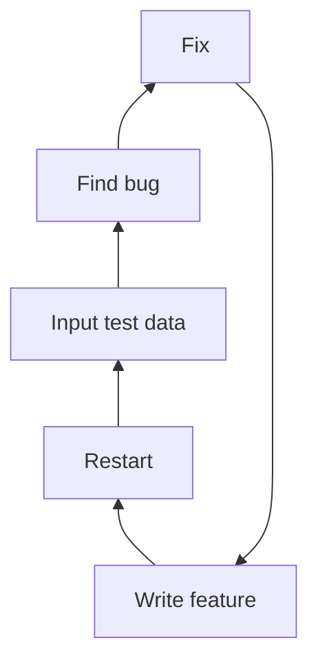

# Testing and Unittest

---

A loop that often happens when you make a program is a constant cycle of making a feature, running that feature, testing it a bit with some test input, then repeating

A slight problem with this approach is that it's slow, often prone to error, and doesn't tend to be as comprehensive as you'd like

---
layout: two-cols
---

## Manual testing
When making a new feature, the standard flow tends to be what's shown on the right

This works, and in smaller codebases don't produce much of a problem, but at larger scales this becomes:
- This is slow
- Prone to missing cases, and
- Tedious for repetitive checks

::right::



---

## Example

You're making a simple CRUD app where you need to create a new entry for a book in a library

You make the feature, the server resets, you input the name of the book and other information.

Your program breaks because the date string didn't get converted when you put in into a database

So you fix it, reset your server, and input all the data again. This time you forgot to make sure that you can only add a unique book.

So you fix it, reset, and input all the data again

And again, and again

---

## Another example

If you've ever made a program, then you've probably wanted to change it at some point, a refactor

The problem with refactoring is that you might be affecting logic you don't expect to affect

For example, you decide to refactor how book IDs are processed in your library system

But this change made your book entry system break since it relied on a specific way of generating IDs

Without testing, you might only find this out after the fact, or even worse, in production

---

## Automated testing

This is where automated testing comes into play

It's code to check your code and creates a system to automatically do that manual process and automates it for faster feedback

And allows you to catch regressions in your code when you refactor

Automated testing gives you the confidence that your program will run as long as you write the tests well, and your program passes them

---

## Unittest

While there exists other testing frameworks, such as `pytest`, we'll be using `unittest` because it's easier to use, part of pythons *standard library*, and is class based which is more consistent with oop

However, all testing frameworks, like programming languages, tend to be similar and the concept of testing is more important than the implementation

This is also the precursor for test driven development (TDD) which is a powerful tool, especially for building large, highly reliable systems

---
layout: center
---

# Core concepts

---

# Test
What is a test?

In the case of a testing framework, a test is a program that verifies behavior

This means that you write code to check if your other code is working as intended

---

## Unit Test
A small test that tests a single "unit"

This unit is a usually a single method or function, and multiple unit tests together is called an *integration test* which is something we might see later

---

## Assertions

The thing that we use to check value

```python
assertTrue(inputString.isupper())
```

This is how we actually make our tests work, we assert that a value *is* another value

This can be in the form of checking if the input is uppercase by using the `isupper()` function, or it can be asserting that the database has a new entry after doing a post request

Other assertions include

```python
assertNotEqual(a, b)
assertIs(a ,b)
assertIsInstance(a, b)
```

Along with many others

---
layout: center
---

# Examples and Unittest basics

---

```python
class BankAccount:
    def __init__(self, initial=0):
        self.balance = initial

    def deposit(self, amount):
        if amount < 0:
            raise ValueError("deposit must be positive")
        self.balance += amount

    def withdraw(self, amount):
        if amount < 0:
            raise ValueError("withdraw must be positive")
        if amount > self.balance:
            raise ValueError("insufficient funds")
        self.balance -= amount
```

Given this simple bank account class

---
layout: two-cols
---

```python
import unittest
from bank import BankAccount

class TestBankAccount(unittest.TestCase):
    def setUp(self):
        self.acc = BankAccount(100)

    def test_deposit_increases_balance(self):
        self.acc.deposit(50)
        self.assertEqual(self.acc.balance, 150)

    def test_withdraw_decreases_balance(self):
        self.acc.withdraw(25)
        self.assertEqual(self.acc.balance, 75)

    def test_withdraw_too_much_raises(self):
        with self.assertRaises(ValueError):
            self.acc.withdraw(200)

    def test_deposit_negative_raises(self):
        with self.assertRaises(ValueError):
            self.acc.deposit(-10)

if __name__ == "__main__":
    unittest.main()
```

::right::
We can create a simple unit test in a different file that defines the tests we'll do to make sure our bank works

---

## Setup

```python
import unittest
from bank import BankAccount
```

This initializes both the `unittest` module from the standard library and the `BankAccount` class from your bank file

---

## Defining a test

```python
class TestBankAccount(unittest.TestCase):
```

This means we're making a class that *inherits* from the `unittest.Testcase` class

We'll go over *inheritance* later on, but for now, know that you'll need to make a class with `unittest.Testcase` as it's argument for python to register it as a test, 

This essentially borrows the features of the base `unittest.Testcase` class

---

## The setup function

```python
    def setUp(self):
        self.acc = BankAccount(100)
```

`setUp(self)` is a unique method you can create in a test. This is similar to the `__init__()` function, where it allows you to *set up* variables you can check in your other test

Note that it's run before every test method, and so all your tests will have a unique instance of `BankAccount(100)`

---

## The actual tests

```python
    def test_deposit_increases_balance(self):
        ...

    def test_withdraw_decreases_balance(self):
        ...

    def test_withdraw_too_much_raises(self):
        ...

    def test_deposit_negative_raises(self):
        ...
```

Notice how all of them have the `test_` as their prefix. This informs python that these are methods that are used for tests.

Any module that doesn't have `test_` as a prefix is ignored

---

## The actual tests

```python
    def test_withdraw_decreases_balance(self):
        self.acc.withdraw(25)
        self.assertEqual(self.acc.balance, 75)

    def test_withdraw_too_much_raises(self):
        with self.assertRaises(ValueError):
            self.acc.withdraw(200)
```

These are two tests, one that makes sure withdrawing 25 means you're withdrawing 25

The second one makes sure the withdraw function raises a `ValueError` if you try to withdraw more than what you have

These both `assert` that a certain value or event, occured

---

## Running the tests

```python
if __name__ == "__main__":
    unittest.main()
```

Finally, the last block provides a command line interface to test the script

It let's you run the tests through

```
python -m unittest test_file.py
```
---

An example of a successful test

```
...
----------------------------------------------------------------------
Ran 3 tests in 0.000s

OK
```

Assuming you have three unit tests, and all of them succeed, you can expect an output like the one above

---

If any fail, you can expect

```
======================================================================
FAIL: test_withdraw_too_much_raises
----------------------------------------------------------------------
Traceback (most recent call last):
    ...
AssertionError: ValueError not raised

----------------------------------------------------------------------
Ran 3 tests in 0.001s

FAILED (failures=1)
```

Which highlights the specific test that failed, 

and the type of failure in the form of an `AssertionError`

---

## Why tests matter

For these simple examples, these tests don't bring us *much value*.

Truthfully, for smaller projects, especially personal ones, tests might not have immediate payoff because you, the developer, likely has a strong enough understanding of the *entire* codebase that tests aren't required

However, for larger projects, more complex projects, and projects where you're working with multiple people

Tests become an invaluable tool to make sure that your changes work as expected, and that you aren't required to learn the entire codebase every time you need to make a change

And the extra effort to set them up will be well worth it

---

## Guided lab

We'll be doing a guided lab once I'm back

We'll be building a *Counter* class and write tests for the increment and decrement methods, a reset method, and preventing negative values


